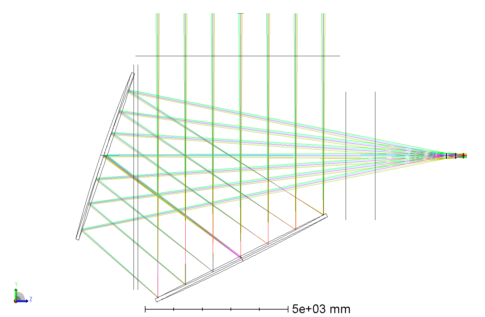
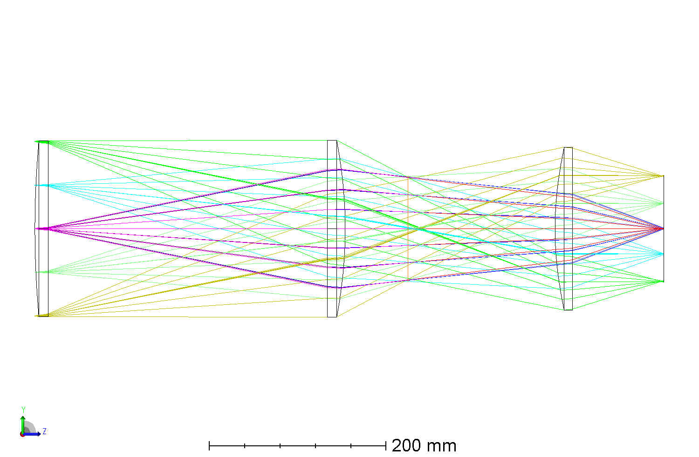
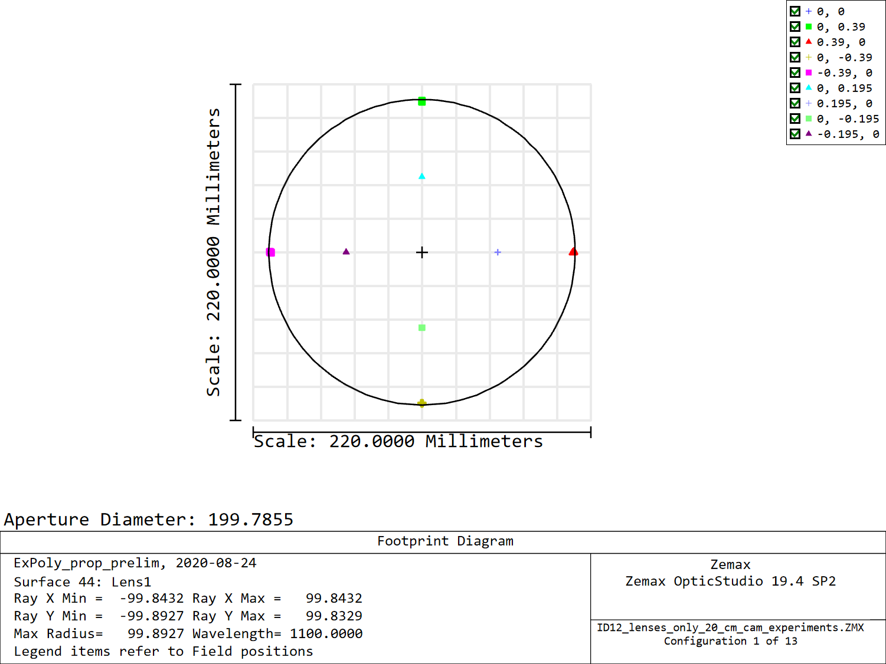
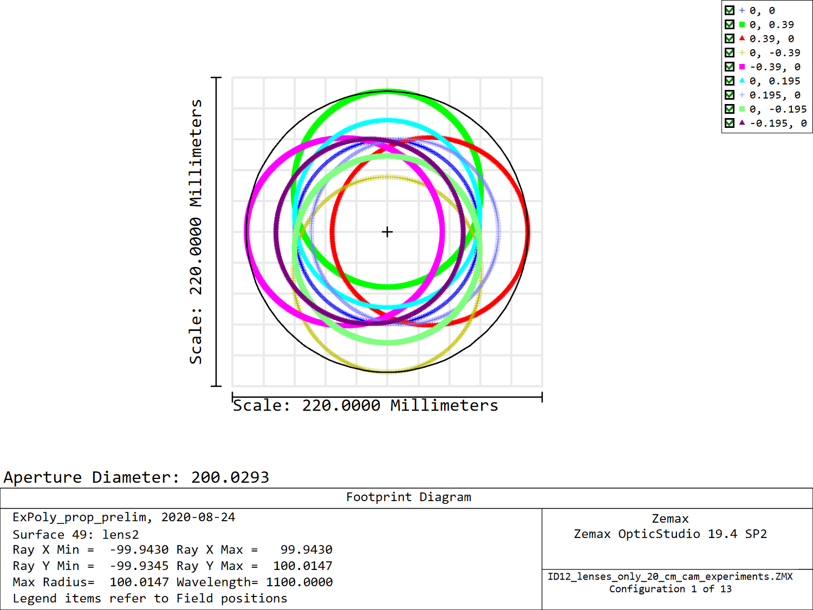
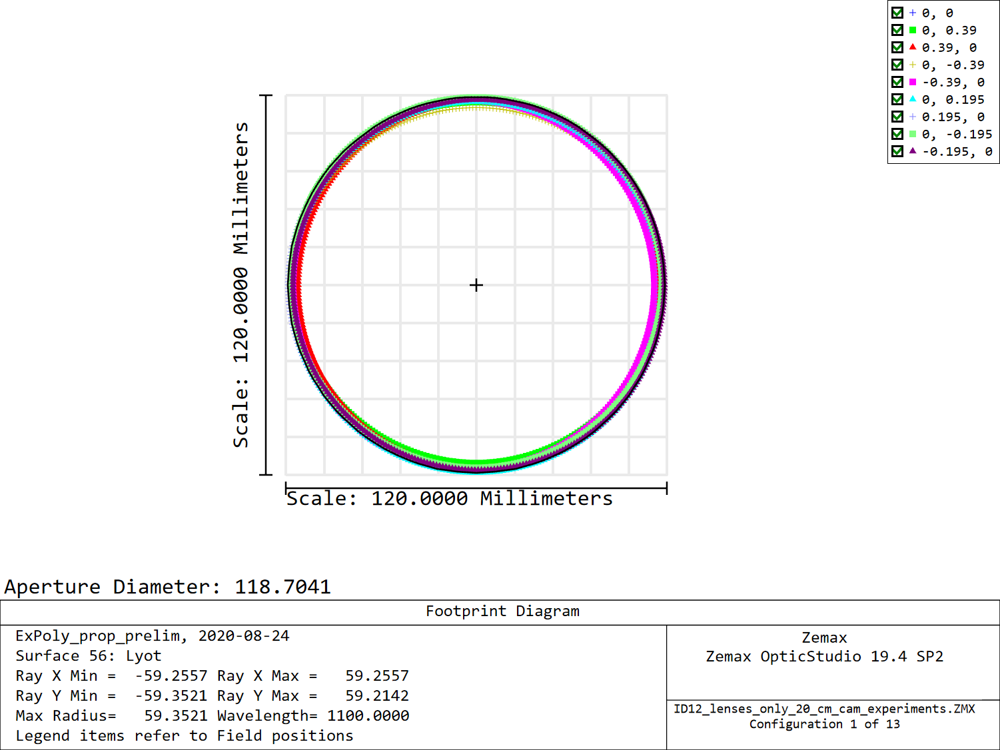
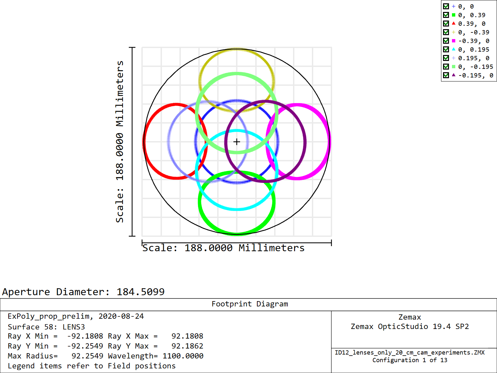
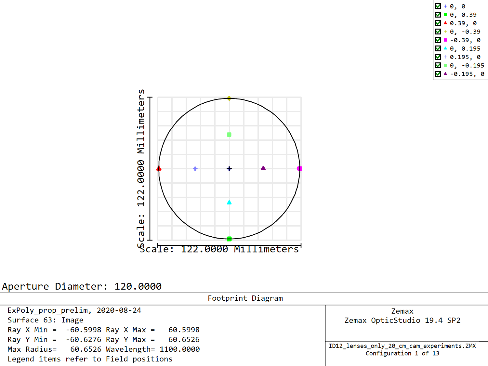
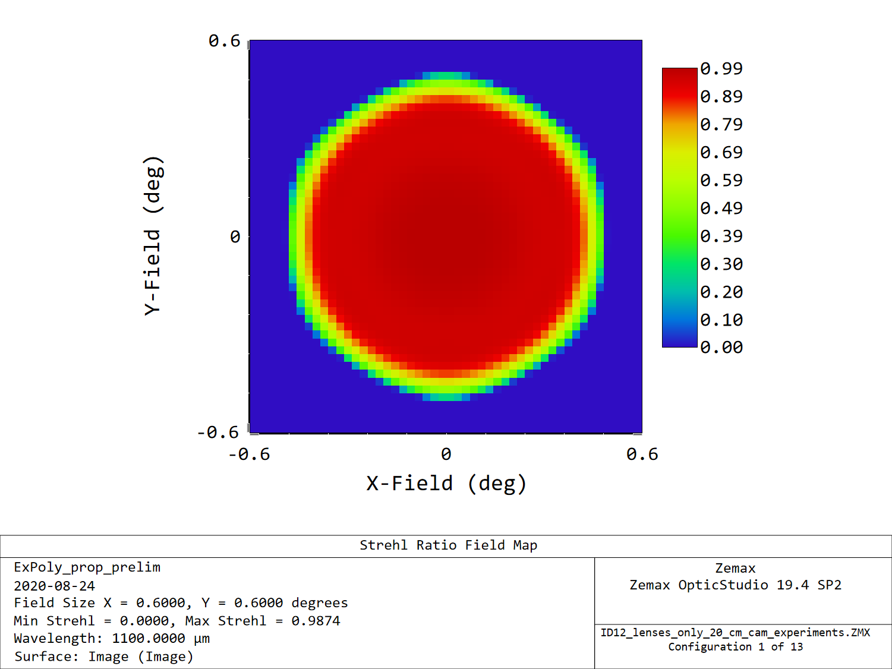
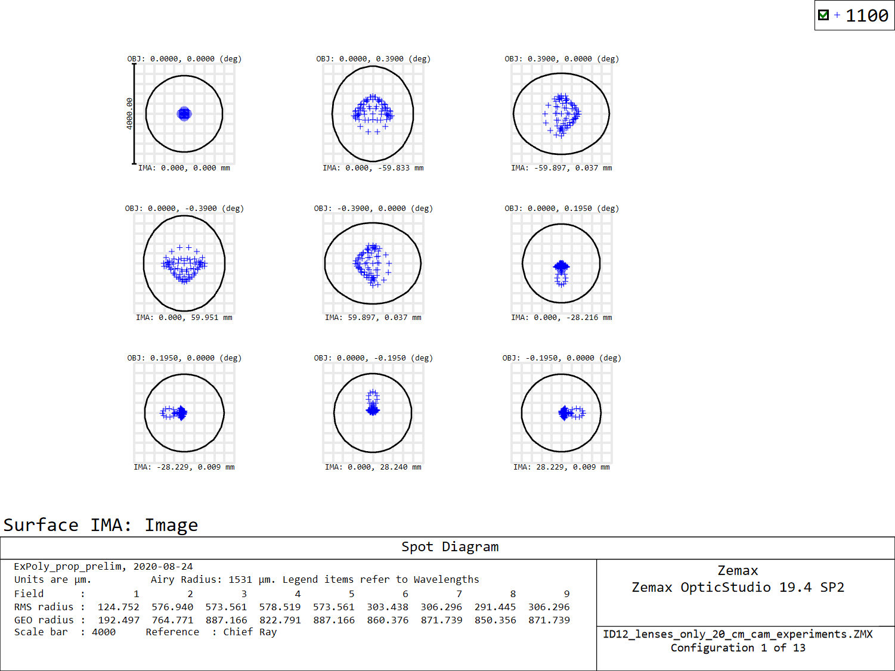

# Center camera

This is my first shot at a camera design for the center tube.

I took the SO LAT design + camera and modified the camera, I removed the filters, window, etc to make the design a bit more easy.

Here are a few screenshots of the current status.

## Layout

## Footprints

## Img qual

