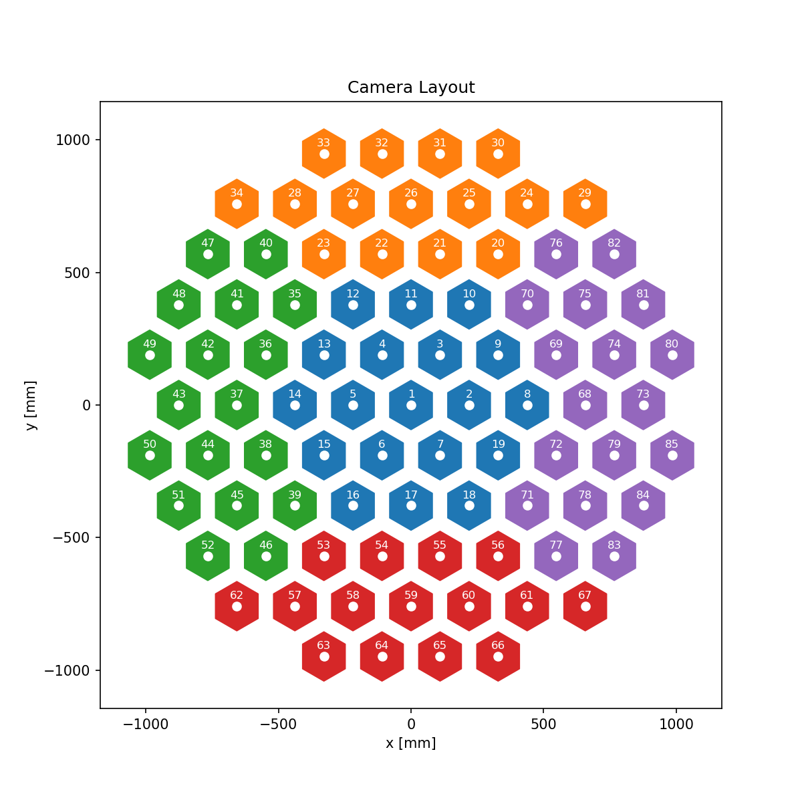

# Sketch of a TMP with 85 cold tubes

This is  a first try to implement a sketch of the 85 camera cryostat on the TMP. The 85 configurations were taken from the CD sketch with aspheres. A few outstanding details still remain, like making these two files compatible for positive thicknesses, etc...

This file was optimized camera by camera, because of compatibility issues I had between the 2 mirror system and the 3 mirror system. In the next days I will work on resolving these.

I am using a very similar merit function to optimize these, trying to keep the camera length at 610 mm, and optimizing for image quality. The camera first lens is 2 inches from the focal "plane". There is a big caveat here, that the TMP design has a more curved focal plane, which means that if we force the cameras to be coplanar at the first lens, then the beam will be entering the cameras at different sections of the cone, which we will have to assess at some point.

# Wedges

## Center tube

## Top tube

## Bottom tube

## Tube numbering

