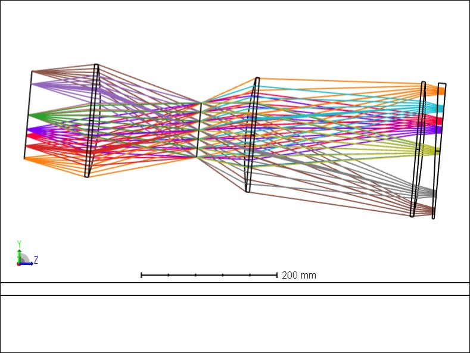
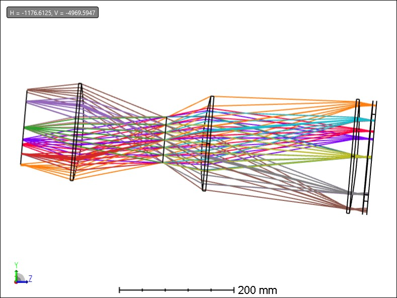

# Sketch of a TMP with 85 cold tubes on TMP Var 4

Added a tilt of 3.4 deg at the focal plane to try to keep the focal points per camera close to this surface.

I am using a very similar merit function than the CD to optimize these, trying to keep the camera length at 610 mm, and optimizing for image quality. 
The camera first lens is 2 inches from the focal "plane". There is a big caveat here, that the TMP design has a more curved focal plane, which means that if we force the cameras to be coplanar at the center camera, then the beam will be entering the cameras at different sections of the cone, which we will have to assess at some point.

# Wedges

## Center tube

## top tube

## bottom tube

## tube numbering

