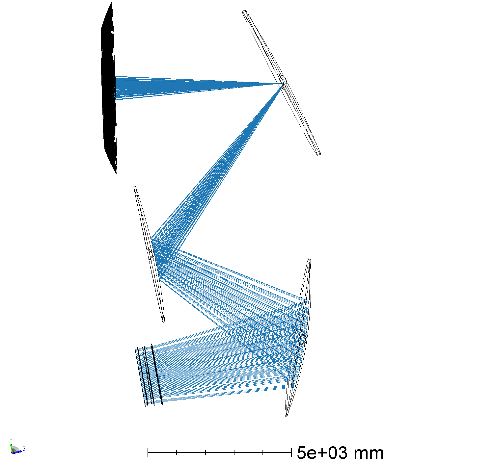
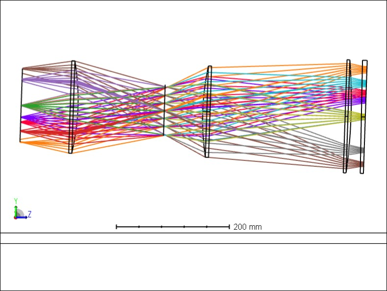

# 85 cameras with focal plane tilt

In an attempt to split the wedge sag between the upper and lower half of the cameras, a tilt of ~3 degrees was added. This reduces the tilt from the upper camera (configuration 32) to be within 10mm peak to peak.

## Center tube

## top tube

## bottom tube

## tube numbering

