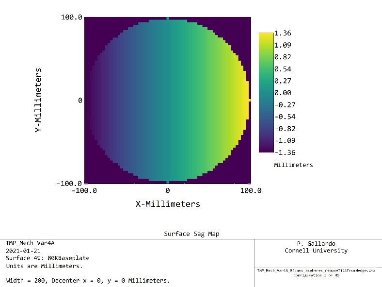

# 85 cameras with camera tilt

In an attempt to split the wedge sag between the upper and lower half of the cameras, a tilt of **~3 degrees** was added. This reduces the sag from the upper camera prism (configuration 32) to be within **10mm peak to peak**.

The down side is that for the lower cameras, now the tertiary focus falls **after** the first lens, this makes it difficult to compare apples to apples.

As a consequence of tilting the camera entrance plane, the fov is reduced due to vignetting. For example, without this tilt, this design yields r=0.38 deg unvignetted at L1, while now with this tilt implemented, the fov is reduced to 0.36 deg in radius. In solid angle this is pi r^2 deg^2 -> 0.454 deg^2 to 0.407deg^2 or **10% decrease in solid angle**.

## Center tube

## top tube

## bottom tube

## tube numbering

