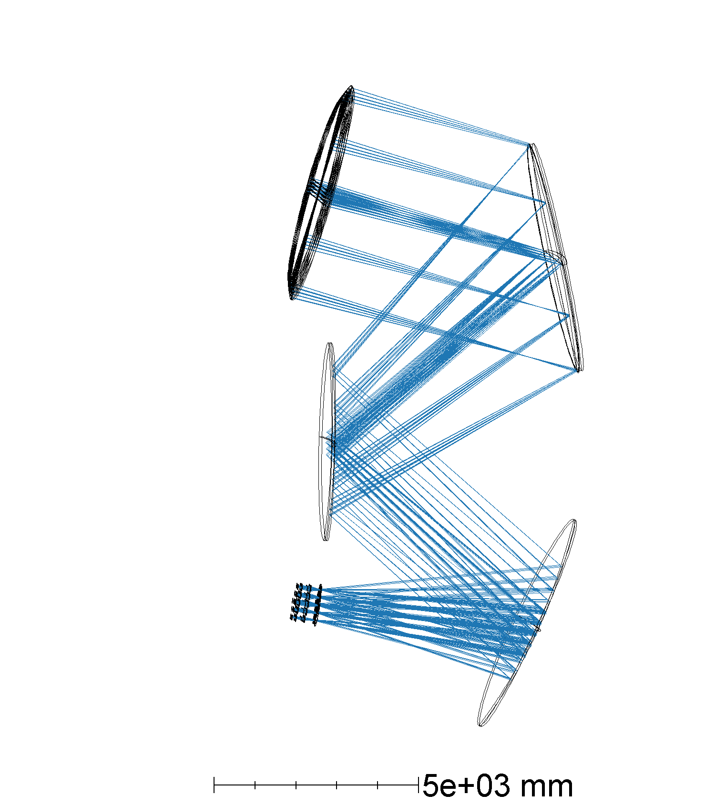
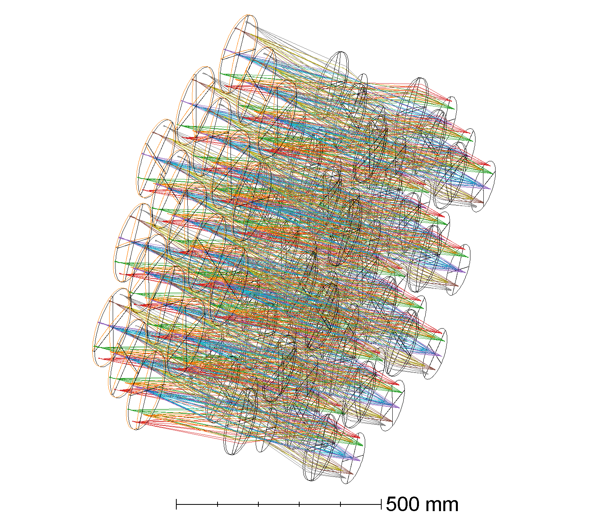
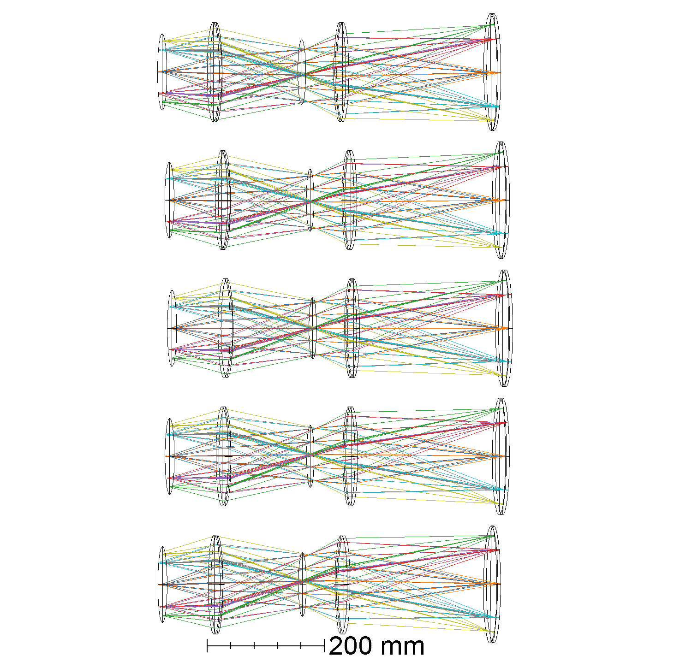
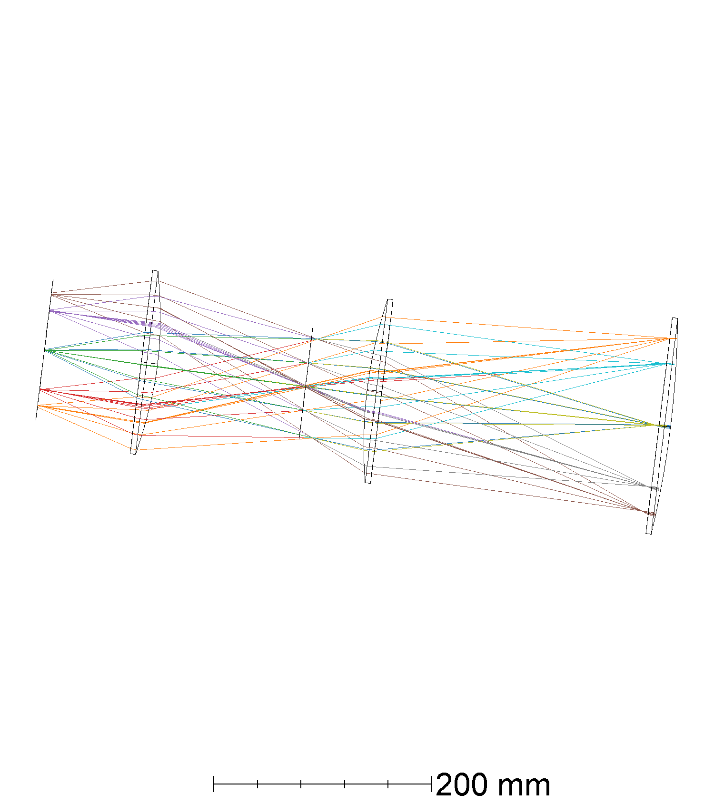

# TMP + 19 cameras

What was done: I generated a center cam based on the CD design. I then replicated this camera around 19 times and optimized the wedges after the first lens to center the chief ray at the stop surface.
Then the lens prescriptions were kept fixed and the distance between lenses was allowed to vary.

I finally took this design and copied to the TMP design.

The signs of the curvature radii, thicknesses and aspheric constants were flipped to compensate for the 3 mirror negative thickness convention.

## Layout

## Strehls

