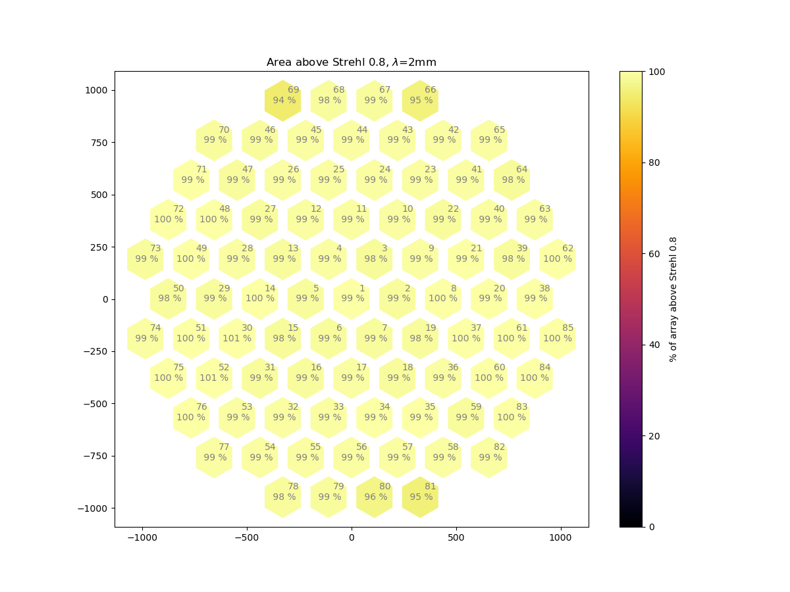
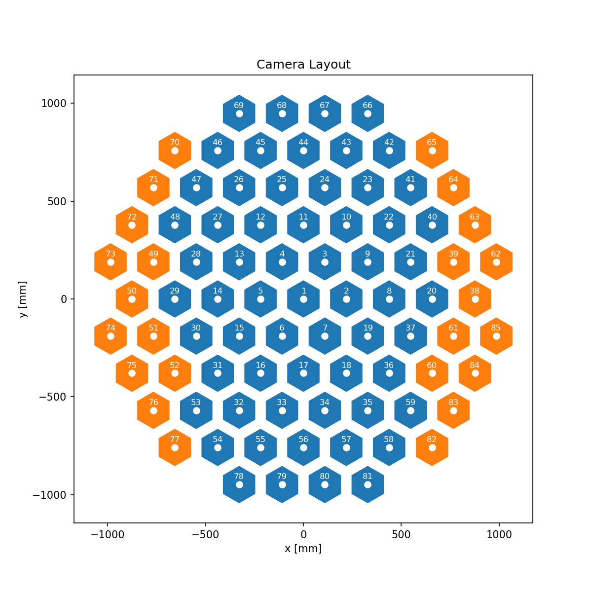
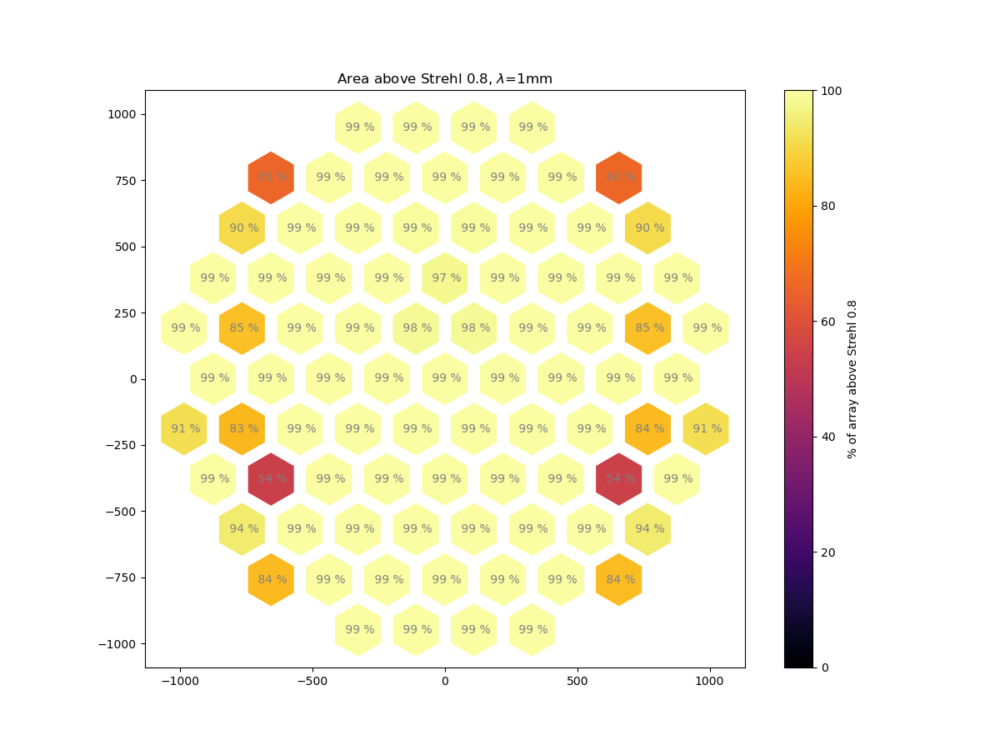

# LAT camera optical design status

# CD
In the time forward sense I have spent some time
tweaking the optimization strategy in order to propose
solutions for the CD with one biconic lens.

I managed to get a slight improvement at the edge cameras.
If all cameras are *optimized independently*, at 2mm Strelh ratios look like this now

This shows the existence of solutions for 2mm cameras at the edges of the field with a cutoff Strehl of 0.8 at 2mm.

*Next steps:*
1. Time reverse the CD (RH's input would be valuable here)
2. Find suitable groups using the biconic L2
3. Set Lyot stop sizes to allow for mirror baffling

# TMA
We have explored somewhat the image quality for two groups of cameras for the TMA, showing we have good enough Strehls to provide the required coverage.

*Next Steps:*
1. Set Lyot stop sizes and explore the need for an elliptical Lyot.

## Next steps for both designs
1. Add front plate curvature
2. Check details for filter stack and define clearances.
