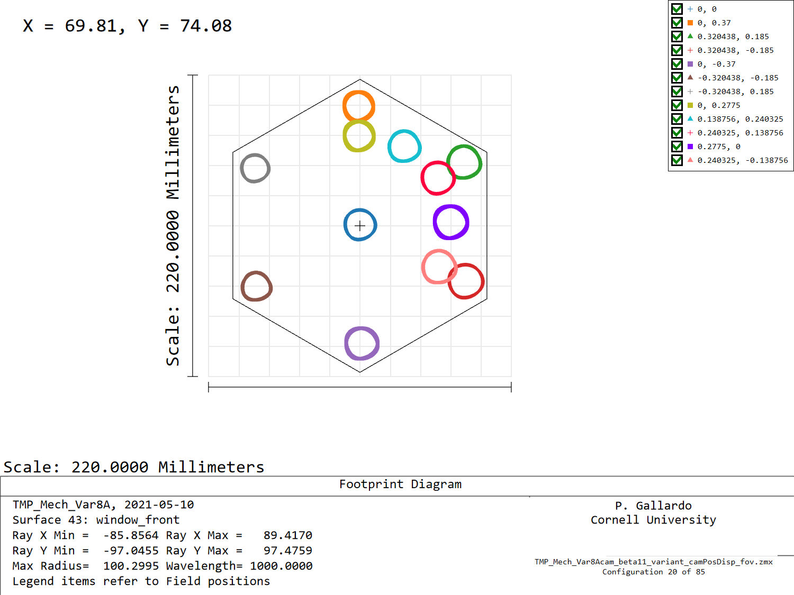
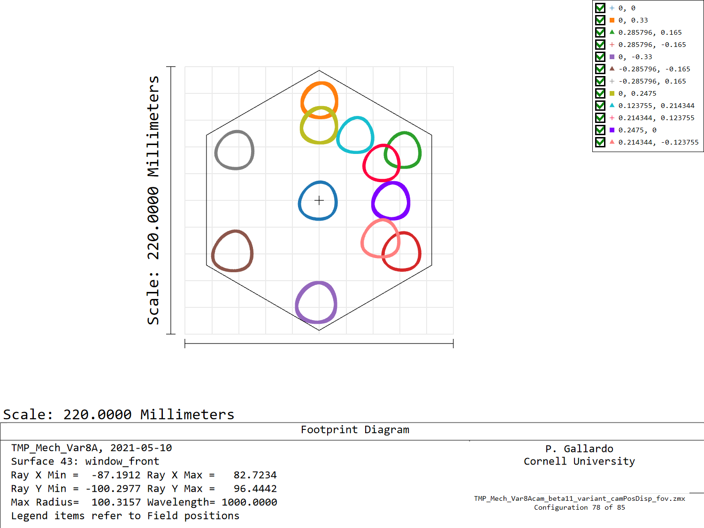
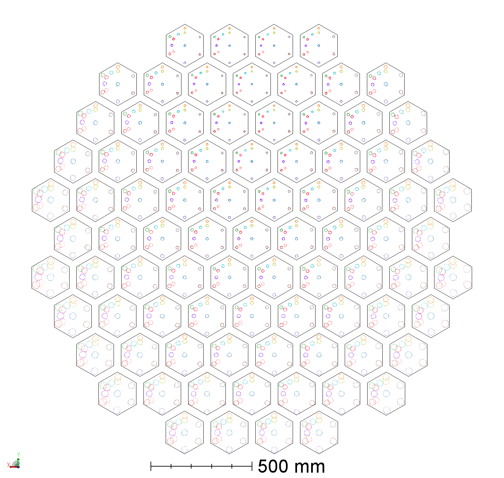
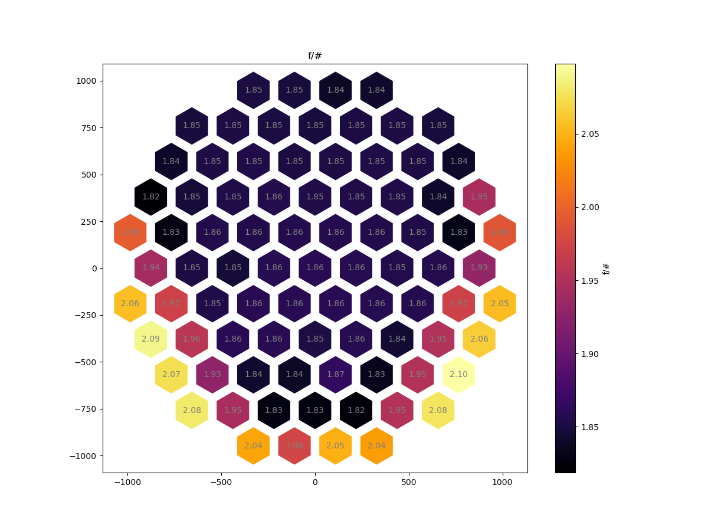

# F/#s in TMP8A (with window offsets)

Allowing for a window offset, to follow the beams, we can
set the semi-fov to avoid vignetting at the camera entrance and
 optimizing for image quality keeping the wafer size to be 62mm in radius (tip of the hexagon).

As in the case without the offsets, this design starts with a semi-fov of
 0.37 deg at the center camera but it is allowed to degrade as one moves to the
side cameras.

Allowing for an offset at the camera window position we get a better behaviour
 than the case without offsets, for example, camera
20 has a semi-fov of 0.37 deg to let the beam pass the
window aperture.

Camera 78 has roughly 0.33 degrees of semi-fov.

All cams look like this:

An f/# map shows the following distribution:

 

Notice that the maximum f/# is **2.12**, lower than the **2.6** we get if we cannot
allow for window displacing.
