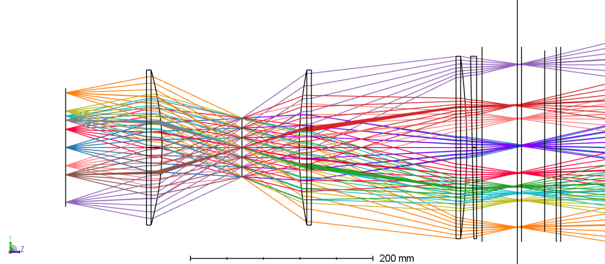
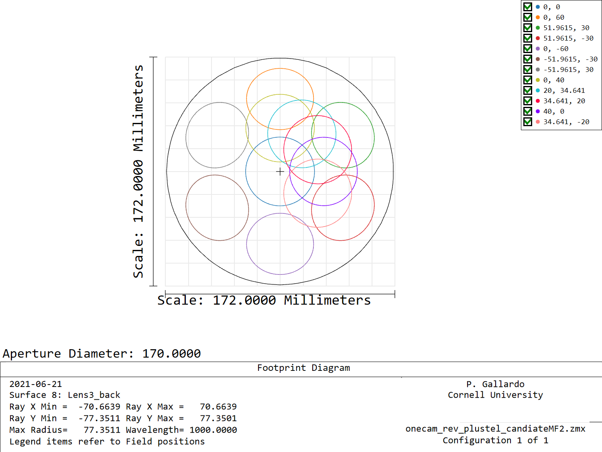
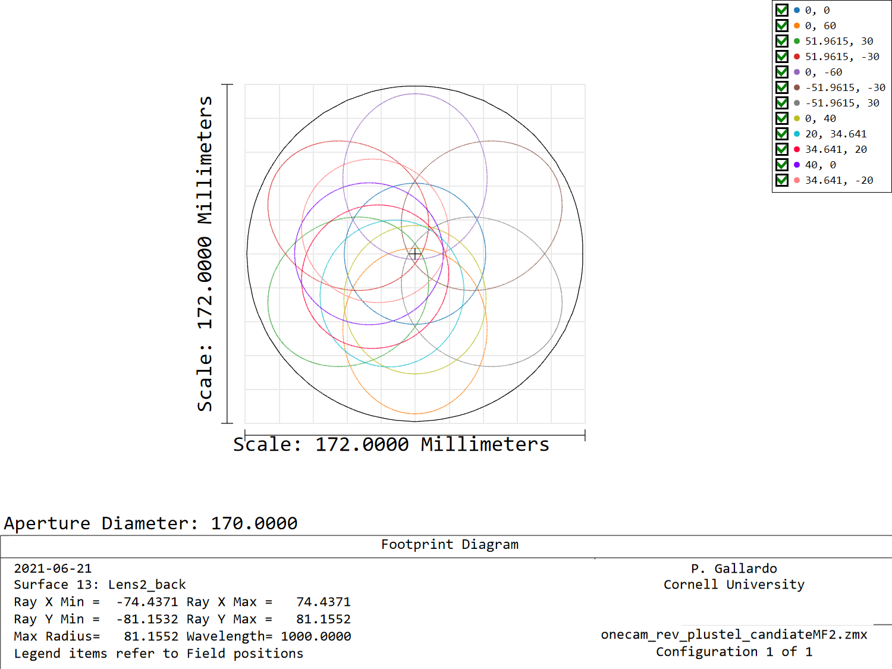
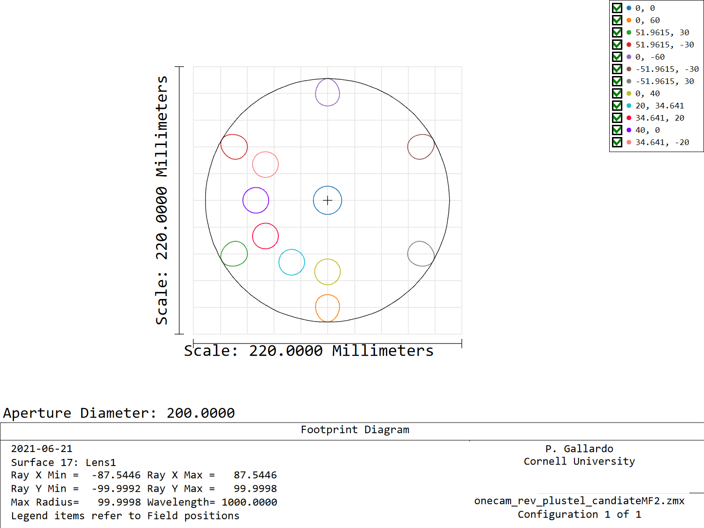
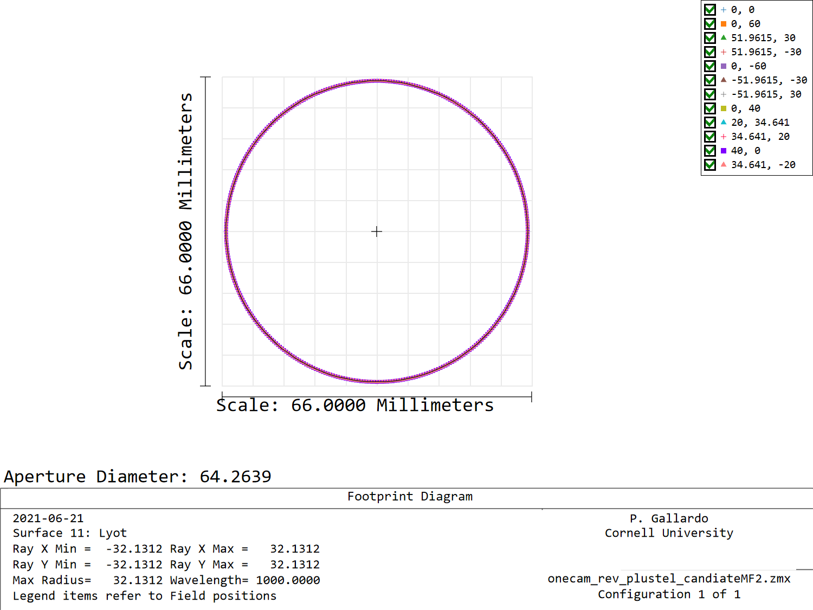
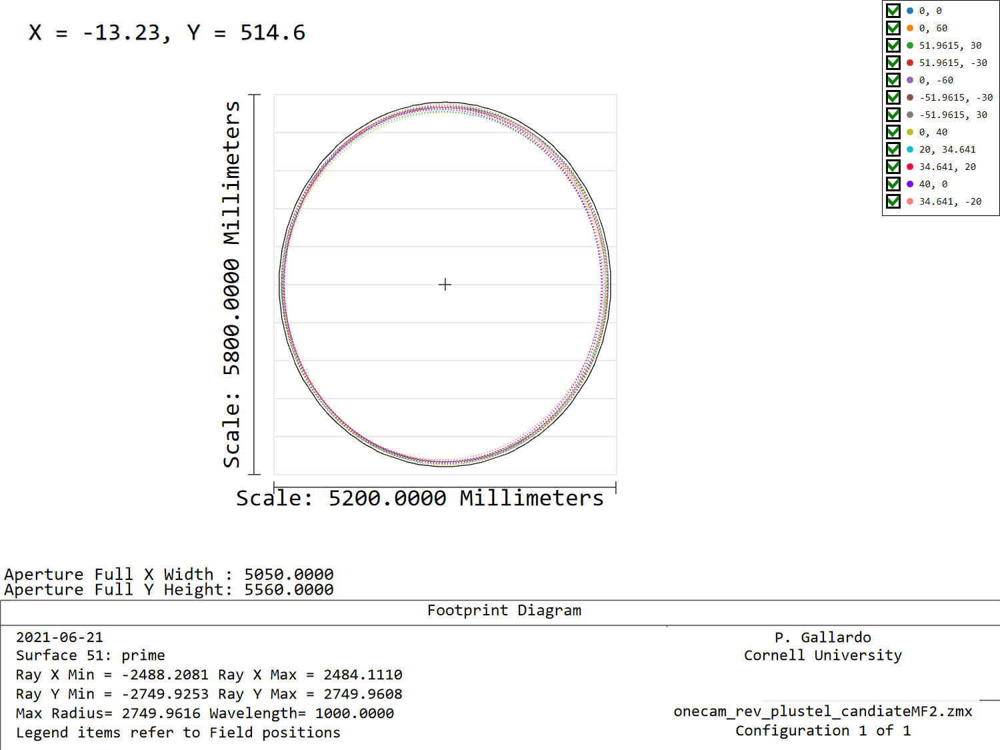
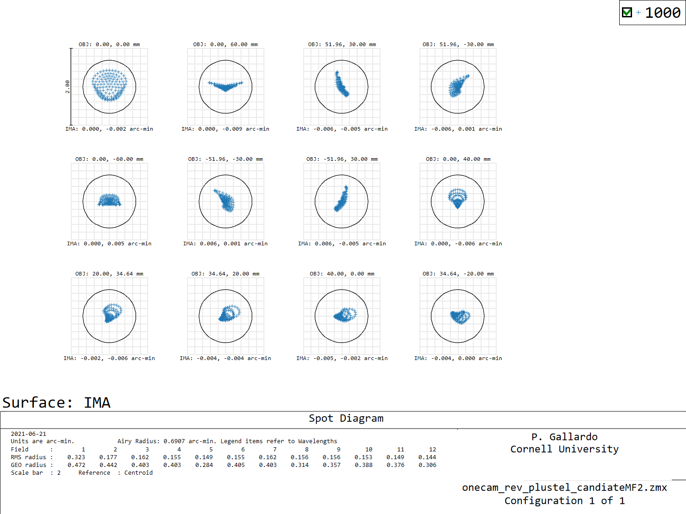
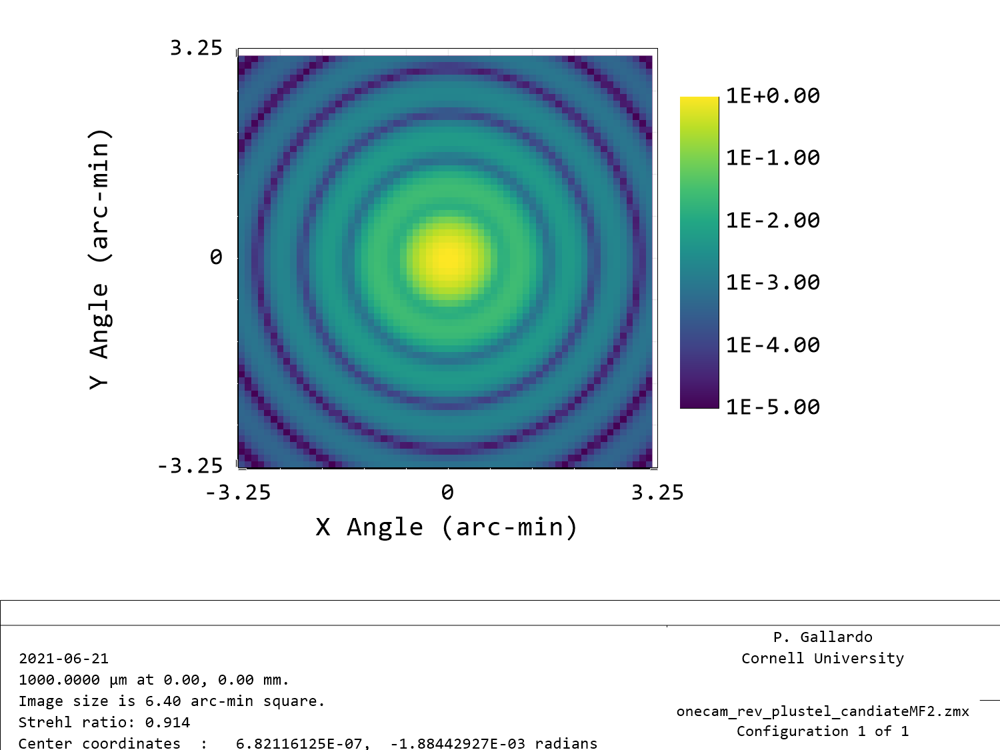
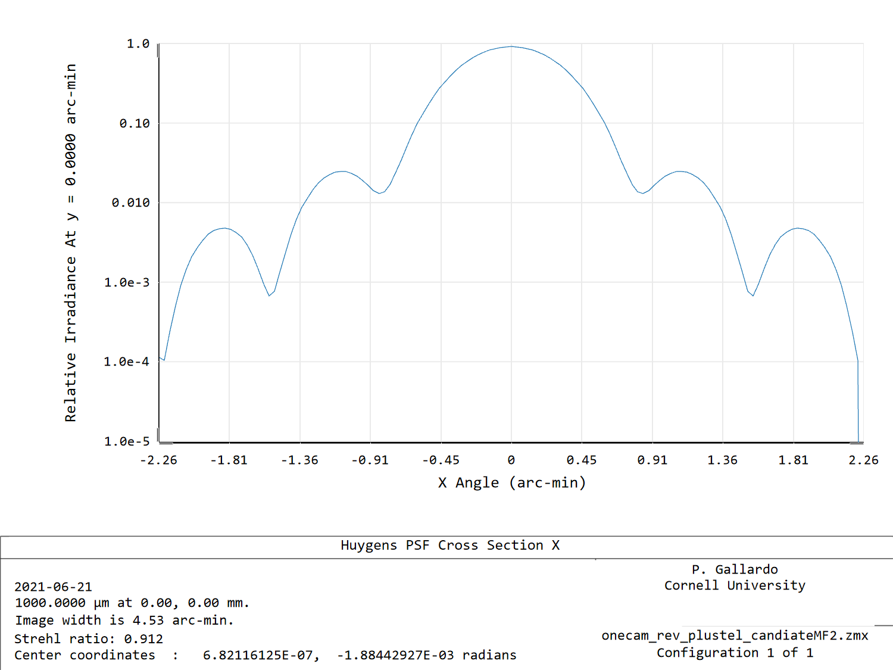
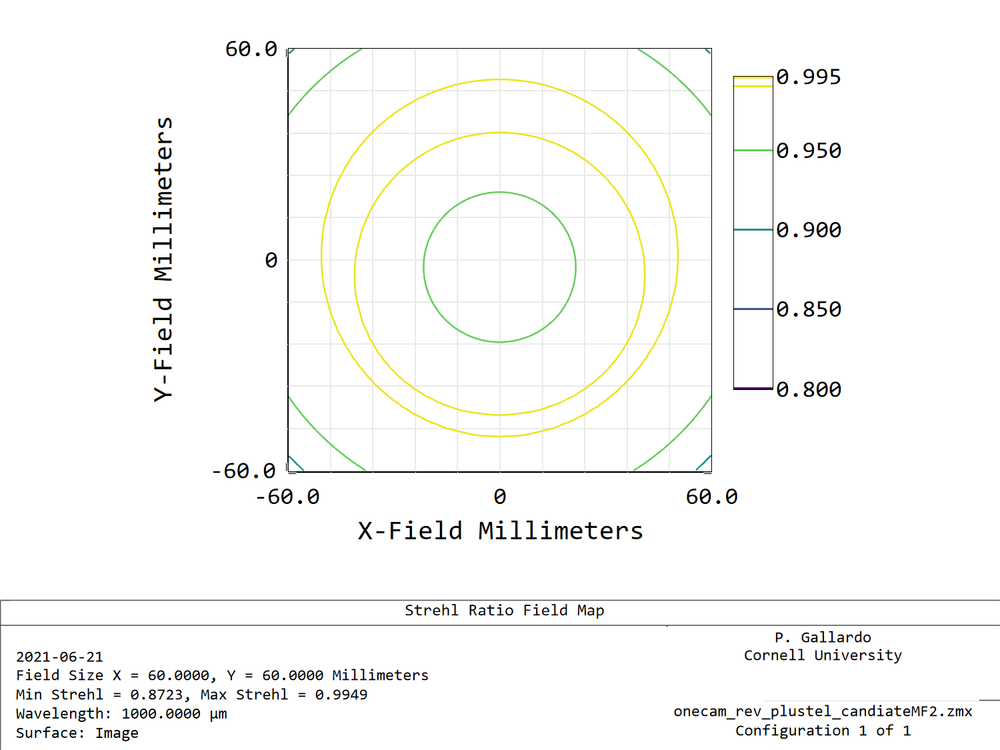

# Time reverse TMA cam

Time reverse system with a candidate merit function, that allows optimization
of the 10 lens parameters, window offsets and prism angles.

Implementend constraints for the f/# and Primary illumination with a defined
stop.

System tends to be a bit shorter than found in the time forward direction,
leaving some clearance at L3.

Preliminary f-number is 1.72 at the center up to 1.93 in the shortest
direction at the edge detector, a 12% variation.

Chief ray angle is bounded by 2.5 deg.

## L3 footprint

## L2 footprint

## L1 footprint

# Stop Footprint

# Primary illumination
This design targetted a 2480mm illumination in x axis , we get actually 2488 mm because some more
 fieldpoints need to be considered, this will  be fixed in the next iteration.

# Spot diagram

The Airy radius zemax computes here is slightly off,
 (0.69 arcmin instead of 0.84), not sure why.

A Huygens psf, however shows the first null where it should be, 0.84 arcmin for
an aperture of 4062 from the center field footprint in the x direction.

# Strehl ratios

