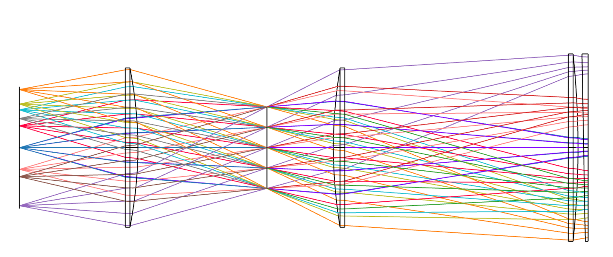
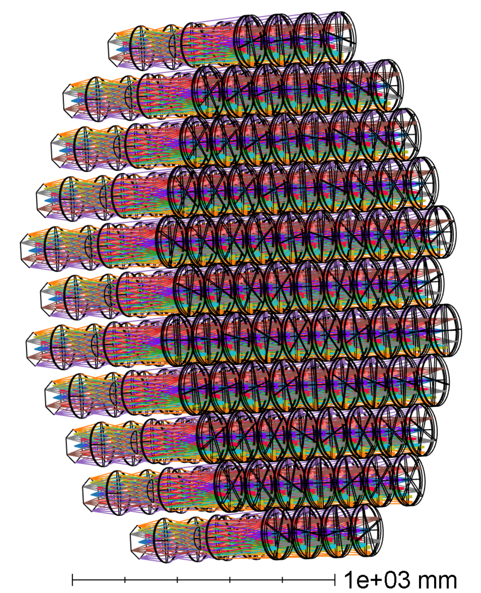
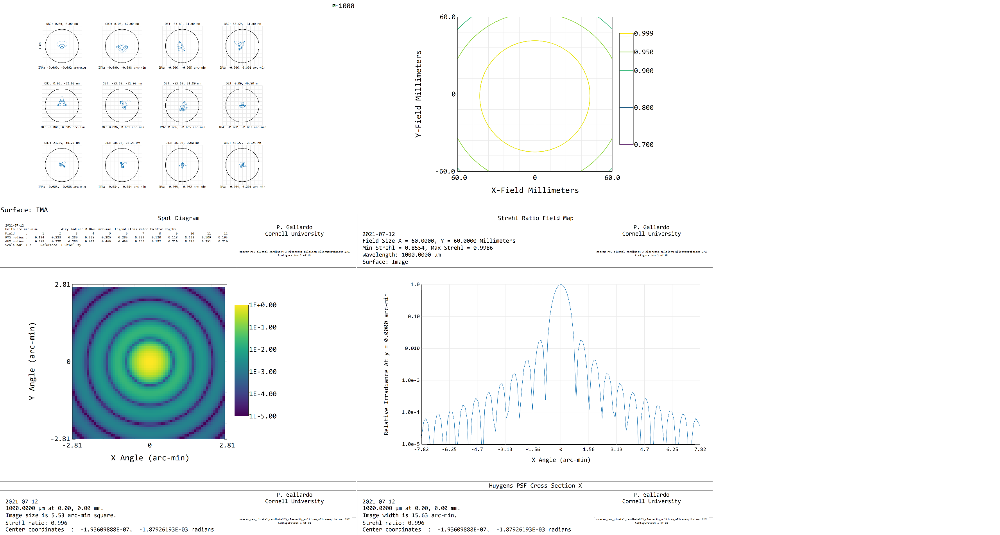
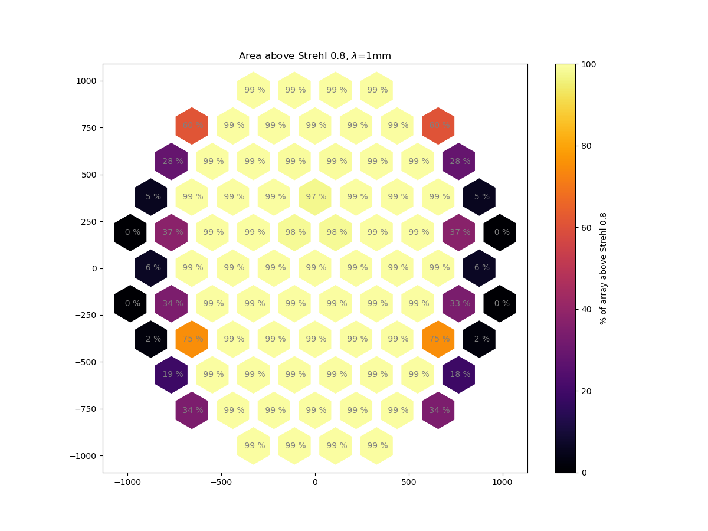
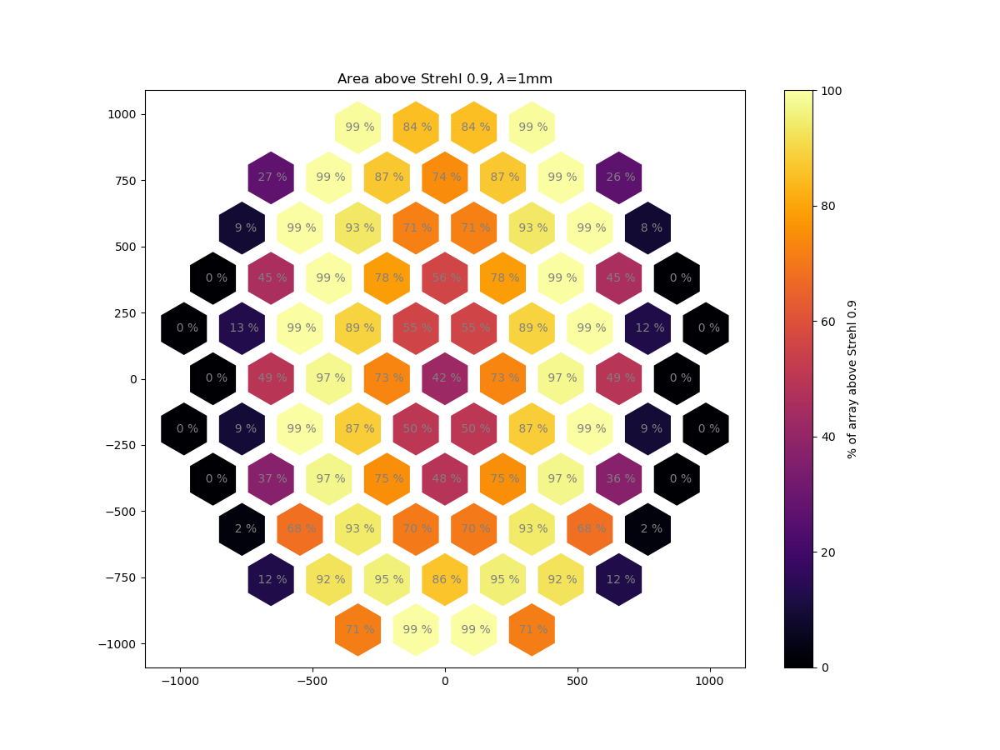
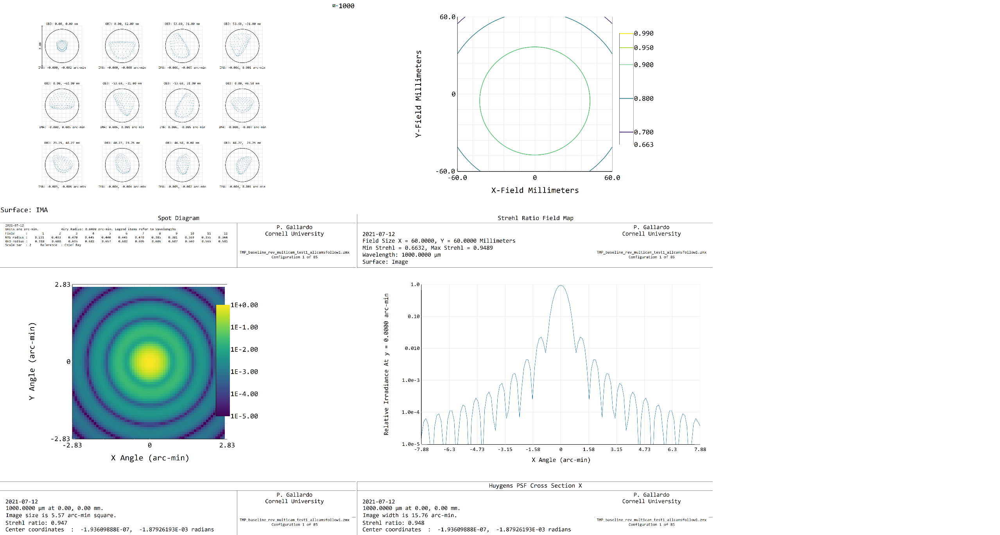
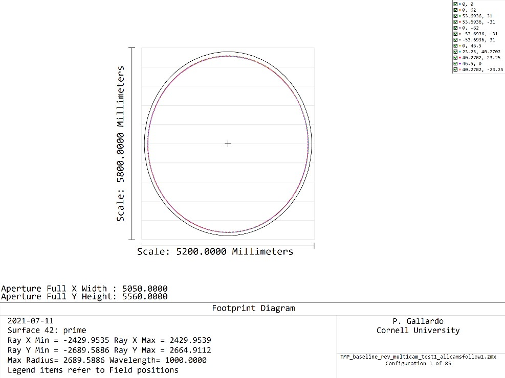
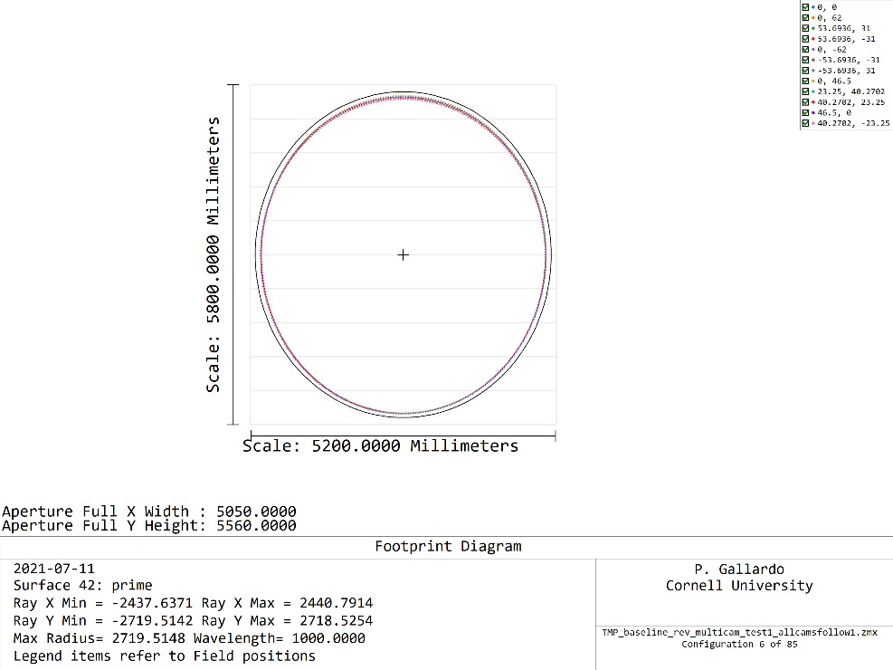
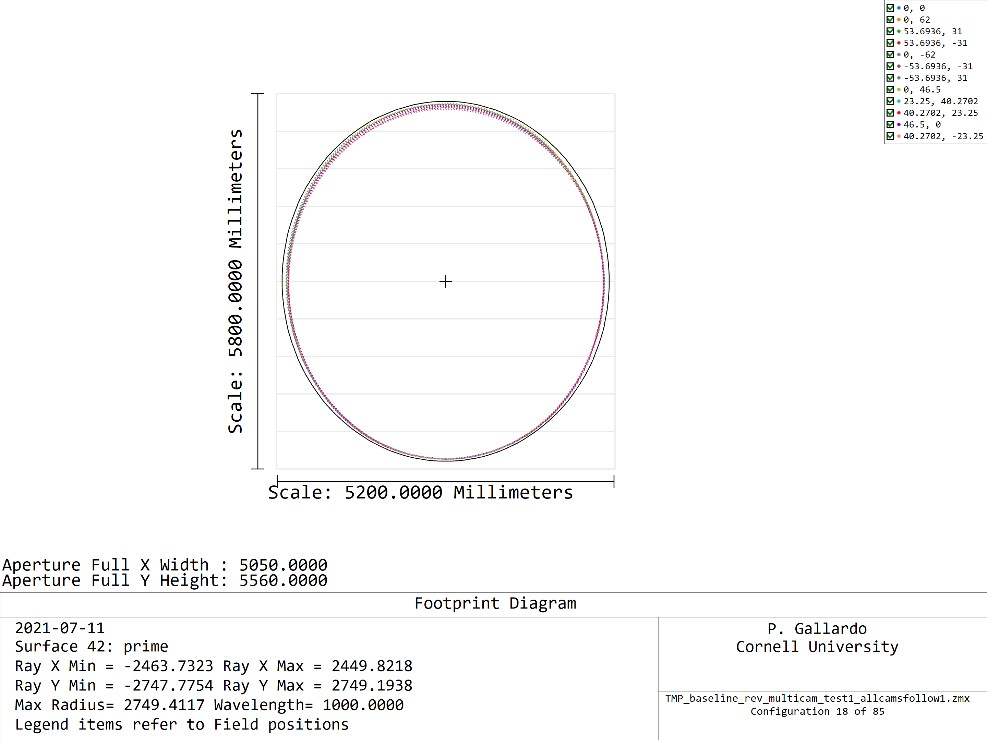

# Time reverse TMA cam

Stop aperture radius: 43.5mm

To check the merit function I ran the optimization for all cams.

This shows pretty good strehl coverage over 0.9.

## Center group

Making all cameras follow the optical prescription of the center camera and optimizing the third camera from the center to the right (cam8) we can get an ok strehl performance and pretty wide coverage. This looks like a good candidate if we only care about strehls >0.8 at 1mm.

If we make a cut at 0.9, of course we would see the degradation at the center cameras, which is a tradeoff of coverage/image quality. You either want to maximize image quality or the number of cameras with identical prescription, but seems like trying to get both is not  easy.

## Footprints

The center camera behaves pretty well with a circular stop. The merit function searched for an illumination of **2450mm** in radius in the x direction at the primary.

As one moves across different cameras, the footprint at the primary changes, becoming more elongated in the y direction.

For instance camera 6 is a bit longer in y

While camera 18 will need to be stopped down some.

# Half angle

For a circular stop of 43.5mm, this design has a half angle at the detector plane of 15.45 deg (1/2tan(h) = 1.81), with a min of (13.57, 1/2tan(h) = 2.07), 14% variation.

# Next steps

Tweak stop size to leave a clearance. Discuss with the group how big the target clearance is.
