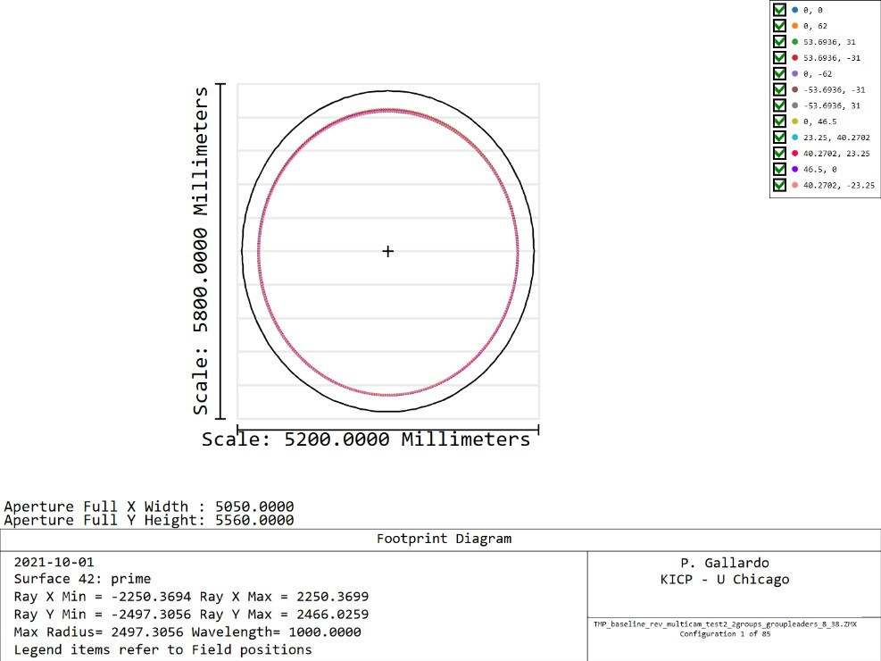
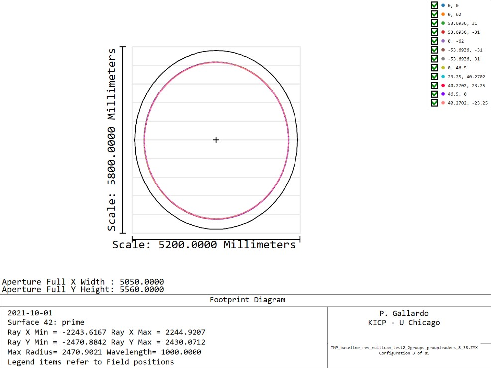
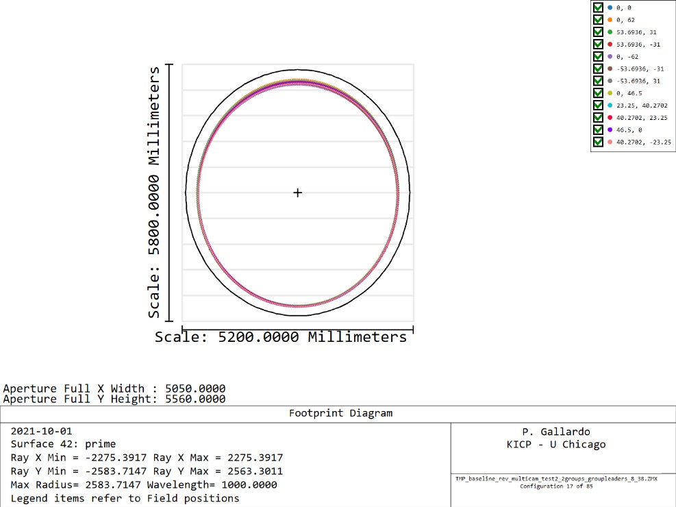
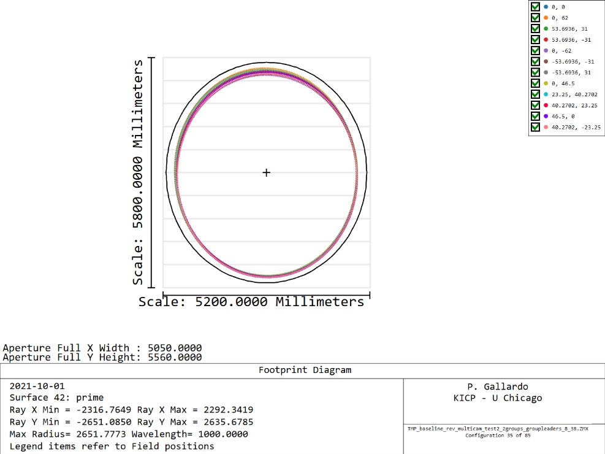
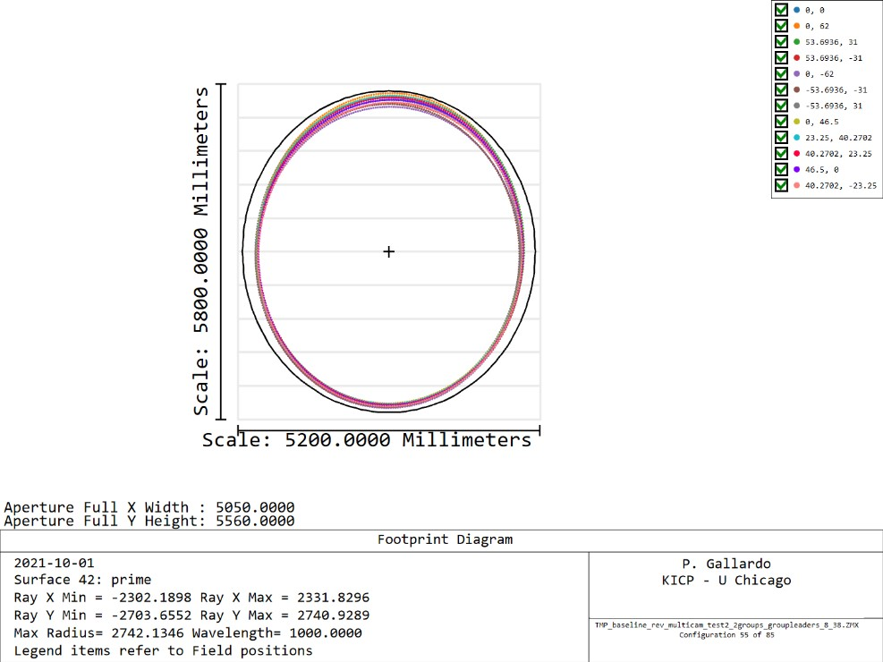
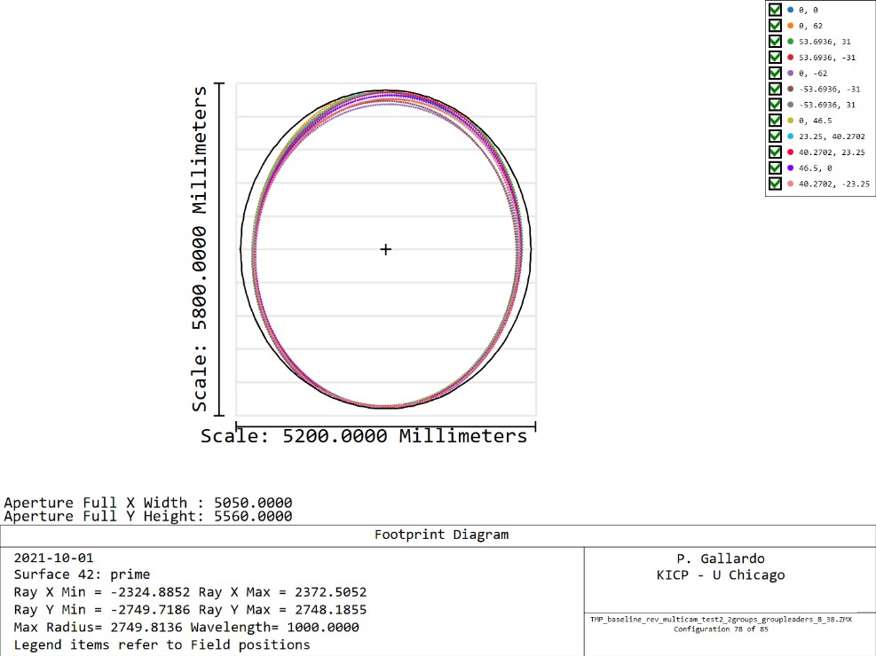

# Lyot stop definitions

In order to evaluate beams in the time reverse sense for thermally
deformed models we need to advance a bit more the camera
design for the TMA.

Currently we have been using a circular stop which dictates
the illumination at the primary.

It turns out that the way cameras illuminate the primary
is a function of exactly what camera we are talking about.

For instance the center camera behaves nicely

And the two inner rings of cameras do so,

## First ring

## Second ring

Here notice that the beam walks up in the primary.

## Third ring

## Fourth ring

## Fifth ring

Note that for a given ring of cameras I am only showing the extreme cases, so not all of them are pathological, however we need to come up with a way of controlling this.
