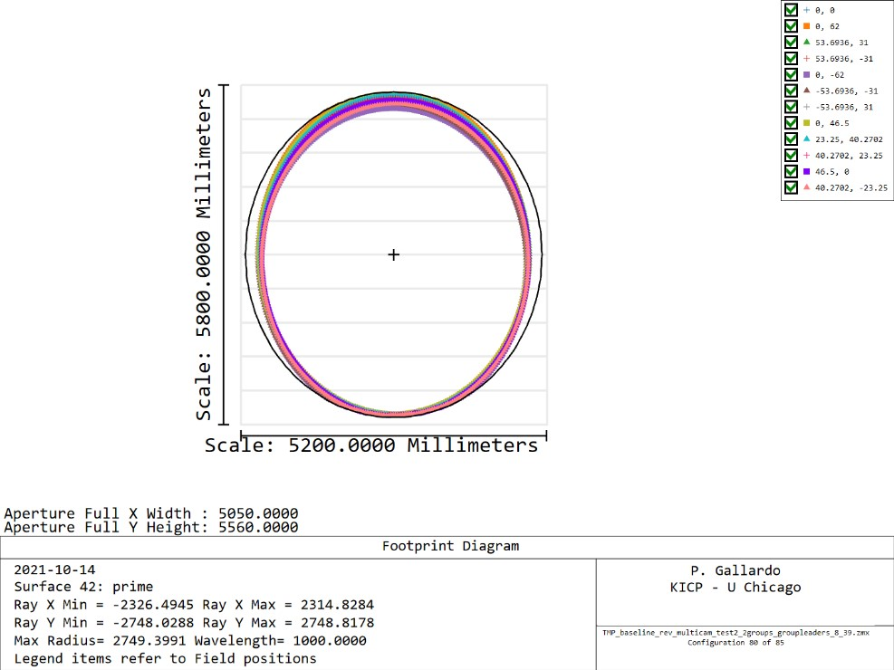
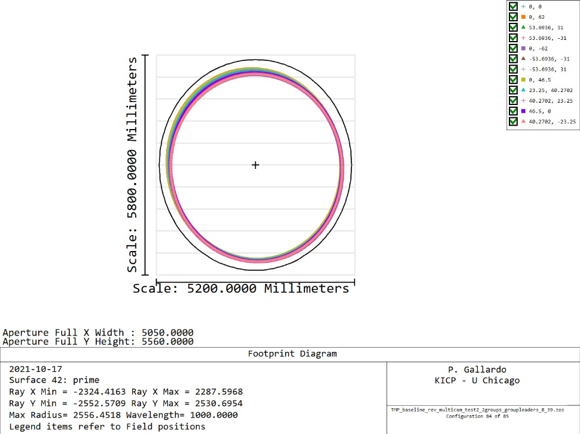
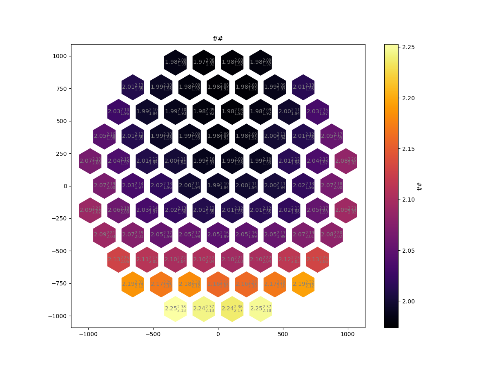
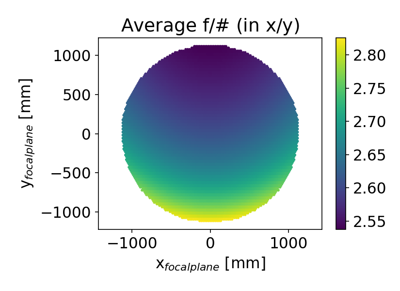

# TMP cam circular Stop

The TMA LAT shows some variation in the beam ellipticity at the tertiary (flashback from TMA design)

This translates to a varying illumination at the primary if we impose a circular stop inside the camera.

If we pick a circular stop the footprints at the primary tend to be more elliptical in the lower cameras as seen below.

I tried adjusting the (circular) stop size to leave a 250mm gap in the x and y direction.

This seems to be working ok in terms of illumination, but still could use some improvement for the cases where the ellipticity is somewhat tilted.

## Camera F-numbers

# TMA f-numbers

During the TMA design we found the same kind of pattern in the f-number variation.

