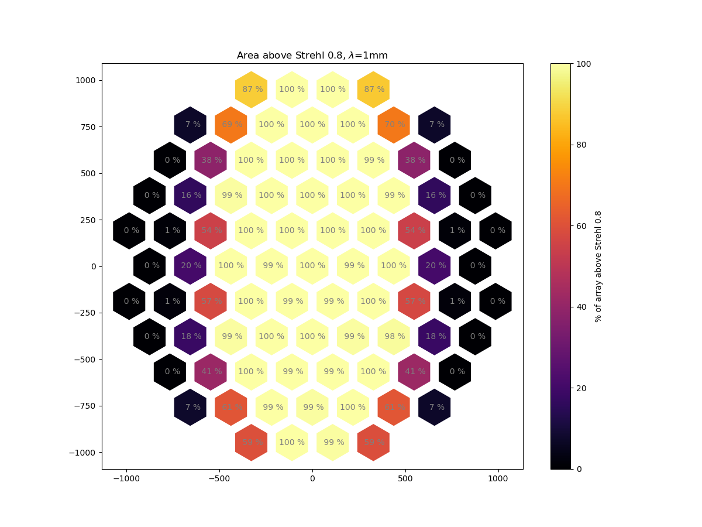
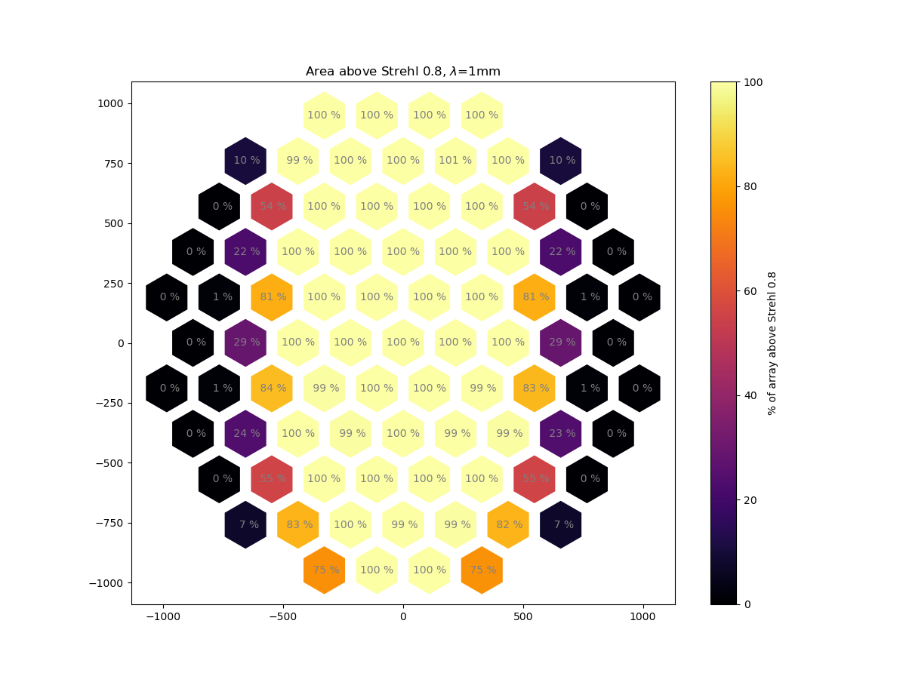
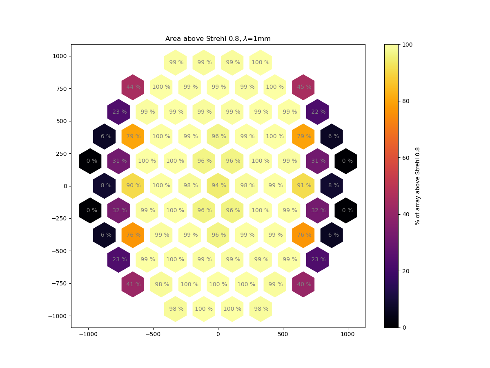
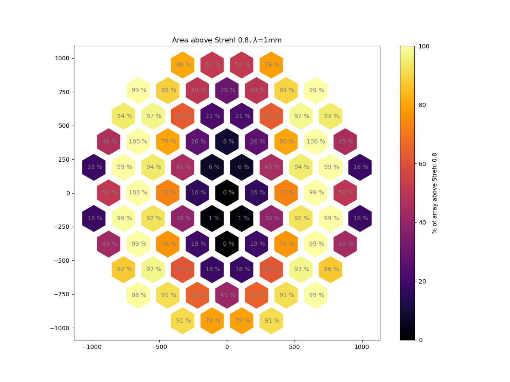
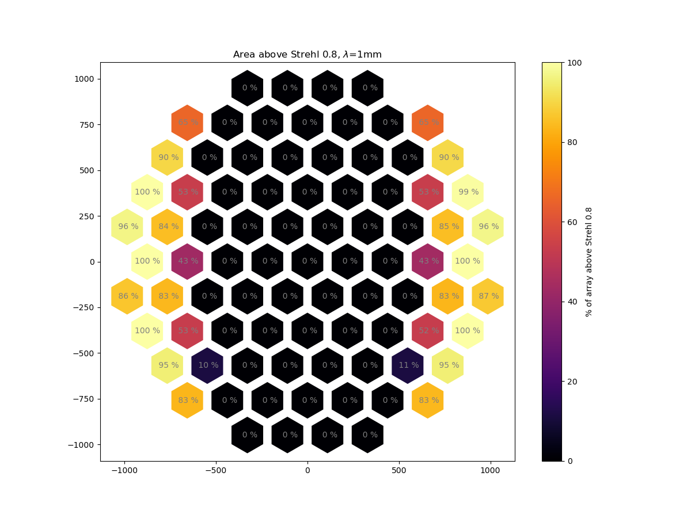

# TMP cam replicated lens prescription

In the past we have asigned groups of cameras rather arbitrarily based on two
desirable propertiees: small number of groups and left/right symmetry.

How far can one go trying to replicate the same prescription as many times as
possible?. Here I try to answer this looking at image quality alone.

## What was tried:

All cameras mirror the center camera, which is optimized evaluating each one
of the cameras in the system. This experiment will yield 85 systems (each one
  optimized looking at one camera alone, but replicated 84 times). This is
  equivalent to using any of the individually optimized cameras in the system
   to make groups.

## Cam 1

## Cam 2 (right of cam1, first ring)

## Cam 8 (right of cam1, second ring)

## Cam 20 (right of cam1, third ring)

## Cam 38 (right of cam1, fourth ring)

## Caveats

Note that here we are looking at strehls alone, vignetting will
produce different fields of view, which will also have a role in the group
selection, however this
