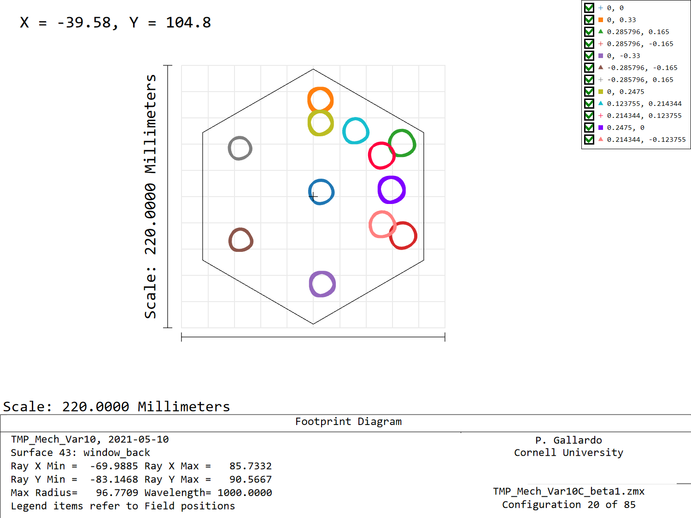
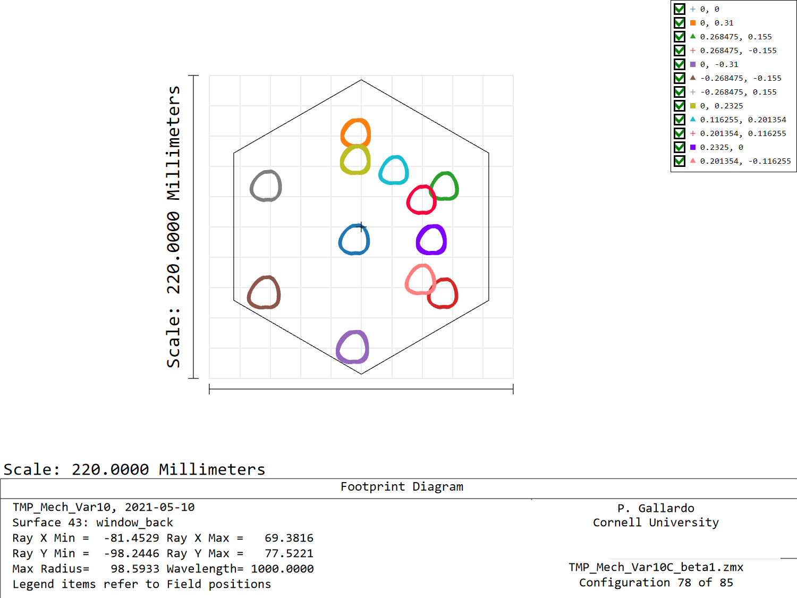
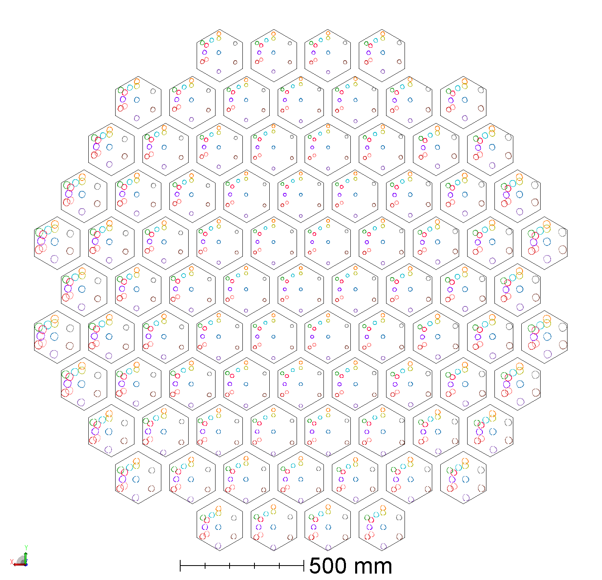
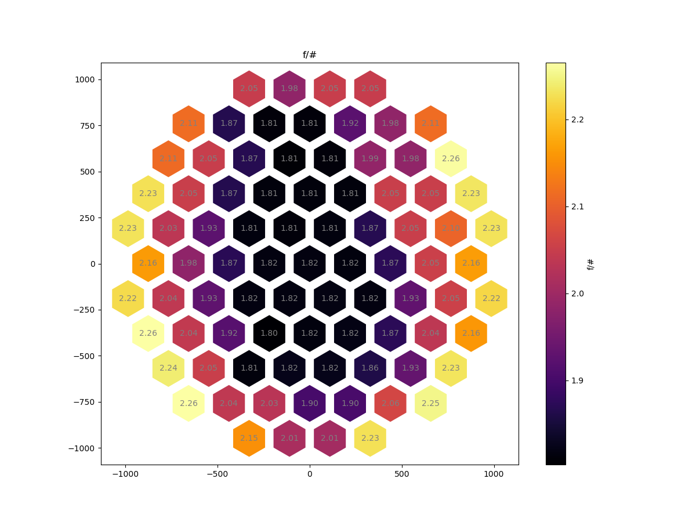

# F/#s in TMP10C (without window offsets)

A first look at TMP10C without window offsets gives 0.37 degrees at the center
camera, camera 20 will give 0.33 degrees of semi-fov

Camera 78 will show 0.31 deg semi-fov.

All cams look like this:

An f/# map shows the following distribution:

 

Notice that the maximum f/# is **2.26**, lower than the **2.6** we get in 8A
without camera window displacement.
