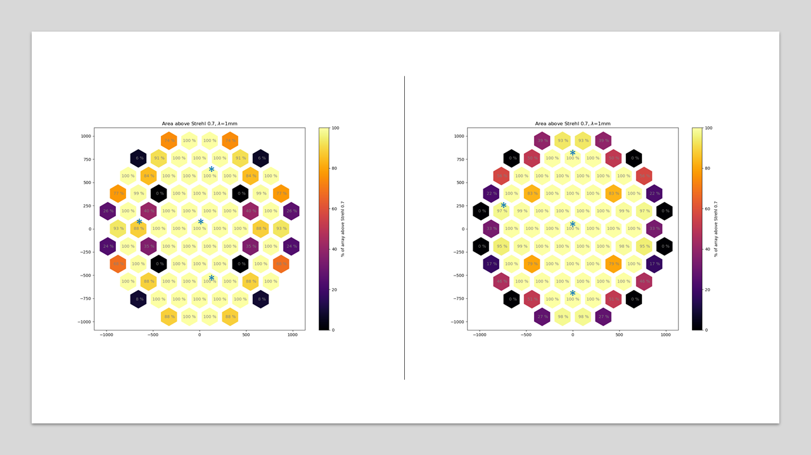

# TMP 85 cam groupings

Enforcing left-right symmetry on the TMP system and allowing for an arbitrary
camera to be the leader motivates the definition of a unique
camera numbering system. In the past I was trying to do this, but the camera
grouping was interfering with the naming convention giving a camera numbering
that depended of the grouping, which is not very useful for the general case.
To address this issue, the following camera numbering is used (which I hope
  to keep in the future).

  

  This numbering scheme has the following properties:
  * Starts with camera 1 at the Center
  * Increases anti-clockwise
  * Jumps from one concentric ring to the next after a complete turn

With this numbering in place, I built the pipeline to generate a design that
1. Is able to handle an arbitrary number of groups
2. From within a group, it replicates an arbitrary camera
3. Sets an arbitrary number of variables for the optimizer
4. Optimizes that camera propagating all parameters within the same group

Combining these scripts with the tools we wrote a few weeks ago  to evaluate
Strehls we can get a higher level of the performance. Here note that
the asterisk marks the group leader with the numbering shown above.

## Next steps

1. Adapt these scripts to work on the CD design (which is somewhat incompatible
   with the TMA, so some work will have to be redone)
2. Evaluate the design with more detail (f/#, clearences, field of view, etc)
3. Implement the filtering in the optical design

## Technical note:
The design on the right can be accessed under:
    zemax_tools\S4cam\groupedCameras\TMP_mech_Var4\xy_symmetric_alternative

Work shown here was implemented in scripts:

    zemax_tools\ZOS_API_scripts\S4camScripts\S4cam_TMP__set_camera_groups.py
    zemax_tools\ZOS_API_scripts\S4camScripts\S4cam_TMP_optimize_groups.py

Hexagonal strehl plots are implemented in scripts:

    S4cam_extract_image_quality.py
    S4cam_extract_image_quality_postproc.py
    S4cam_extract_image_quality_postproc_mk_cams_hexagon_plot.py

Placement of these files will probably vary in the future, but I will try
to keep filenames the same within reasonable limits.
