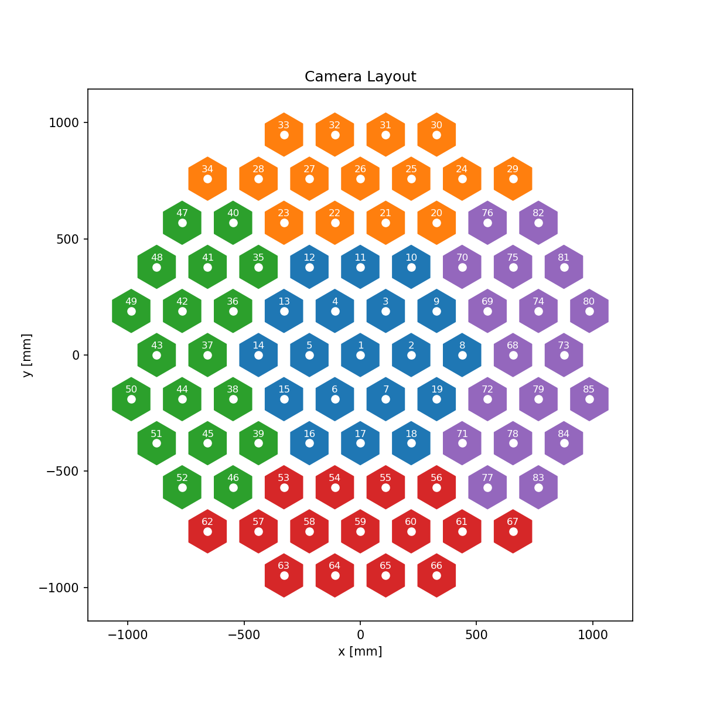
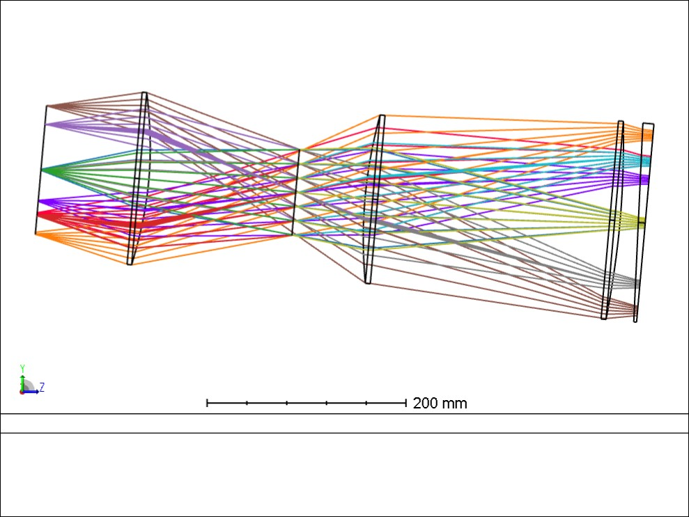
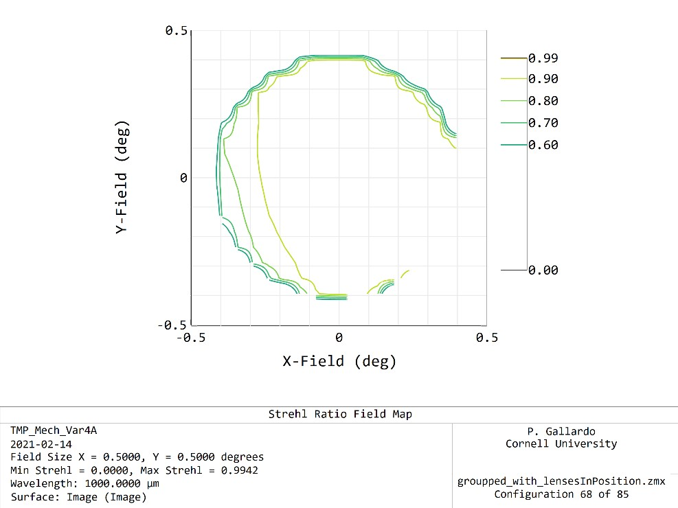
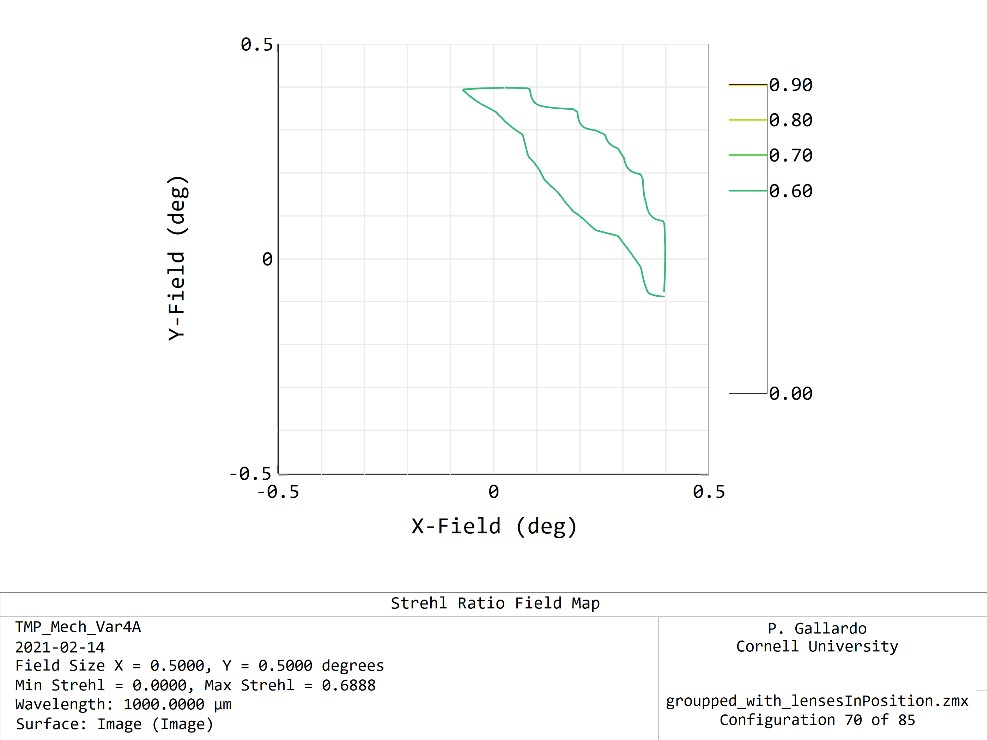

# TMP 85 camera groupings

A 3 lens camera with 8 polynomial term lenses is defined by: 4 thicknesses,
3 radii of curvature 3 conic constants and 3x8 aspheric terms totaling 34
numbers per camera, for 85 cameras, the degrees of freedom extend to 2890.

One can optimize all these parameters by considering each camera individually.
To group these cameras, as a first approximation I have defined all cameras
in the group sharing one camera prescription. The camera that contains the
parameters that the rest of the cameras in the group follow is called the
"group leader". At this point I have coded the group leader to be the smallest
camera number in the following diagram.

For example, the camera leader for the blue group is camera 1 and the camera
group for the purple group is camera 68.

# Center camera

This seems to work reasonably well for many of these cameras, however as
as expected, the image quality is degraded some. I need to further explore
the impact of this simplification in the design (strehls, footprints).

A first look at the performance shows that the primary image is degraded in
~10 cameras, these will need more work.

For the center group image quality is degraded in camera 8, the rest seems to
be performing ok.

# Purple group
Group leader is camera 68 with the following image quality
.

Many cameras of this group show a fraction
of the focal plane better than 0.7 at 1mm. However some cameras show degradation, for
example camera 70 at 1mm looks like this: 

I need to further explore the details of these effects a bit more deeply.
