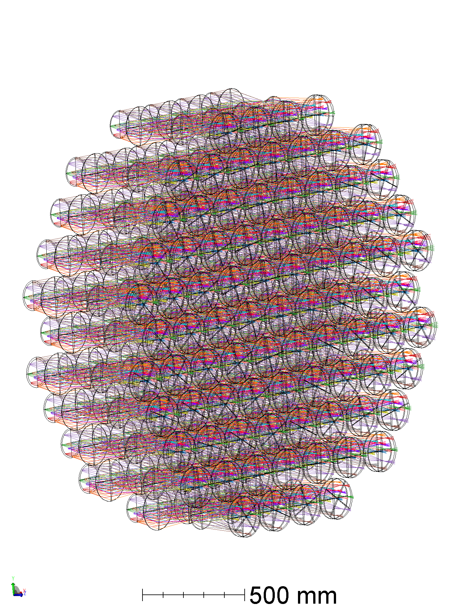
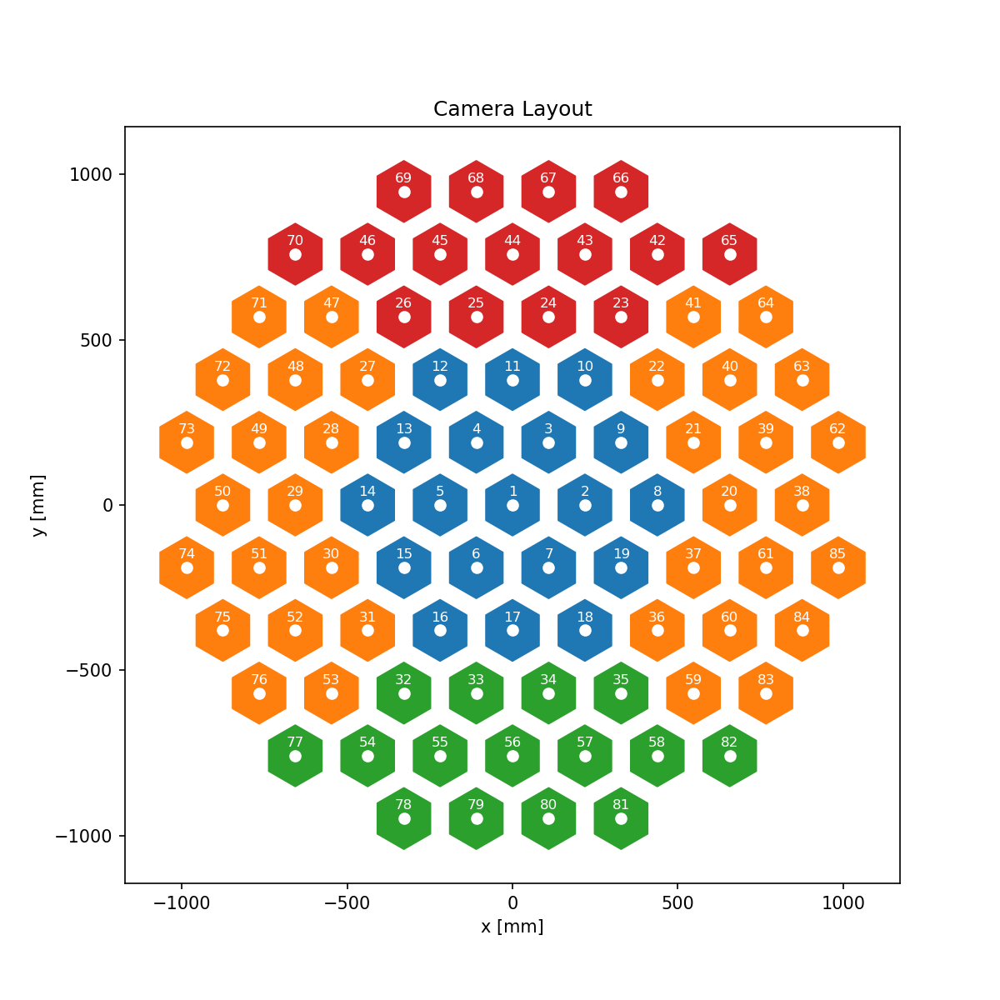
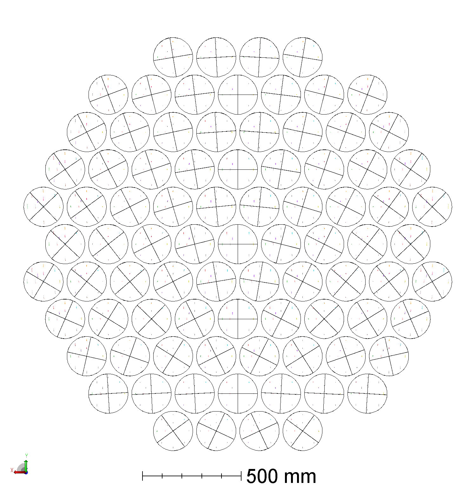
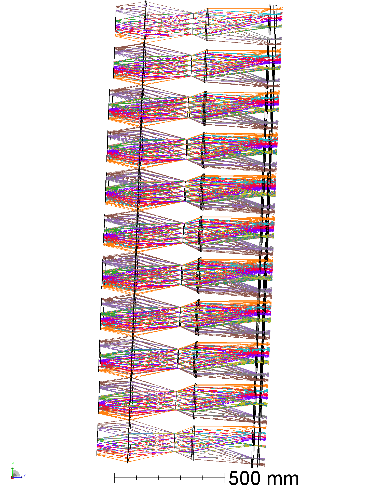
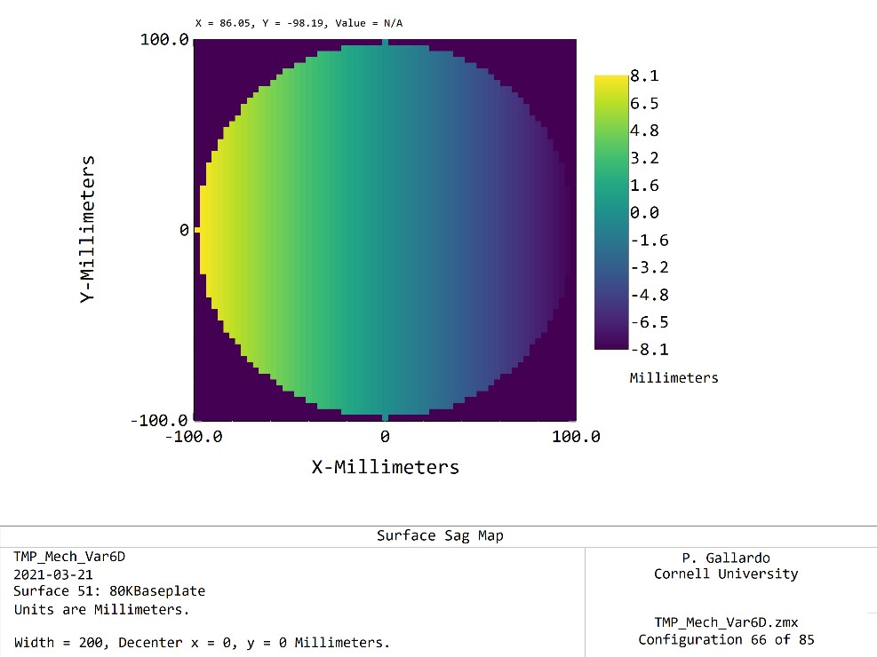
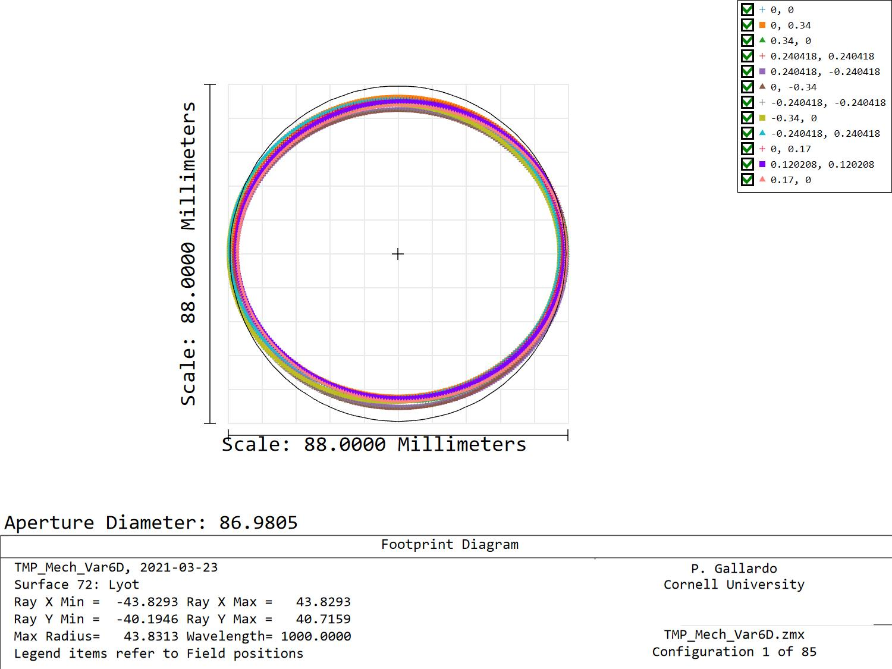

# TMP mech var6D 85 cameras beta 1

Preliminary prototype of 85 cameras for the TMP var6D.

## Tilt determination:

As previously, a tilt was added at the TMP focal plane surface and optimized for spot size, yielding an angle of 3.7 degrees (see surface 40 in zmx file).

## Camera groups:

## Wedges

Silica wedges have the following geometry

With a sag that goes from gentle at the bottom to aggressive at the prototype

For instance, camera 66 shows a peak to peak value of 16.2 mm.

## Lyot image

Lyot image turns out to be elliptical, which seems to indicate the tilt chosen was not optimum for this configuration. We will need to iterate on this further.

## To Do:

* Pick a better tilt angle
* Redo
* Generate Step files
