# TMPcam beta ver 9

## Changes:

1. Moved camera entrance in ~30mm
2. Imposed limit on telecentric angle at detector plane and f/# variation
3. Optimized cameras in 4 groups.

## Camera placement

The camera from last week allowed 0.38 degrees through the center camera,
however vignetting creeps in not far from the center. For example camera 23
in the third ring "up left" showed the following footprint (version beta 6).

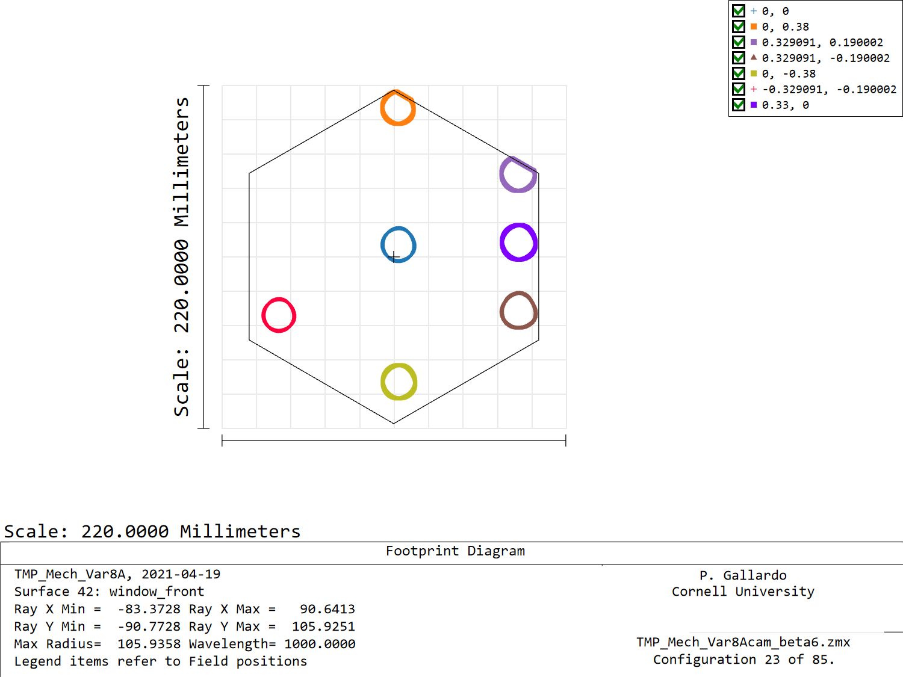

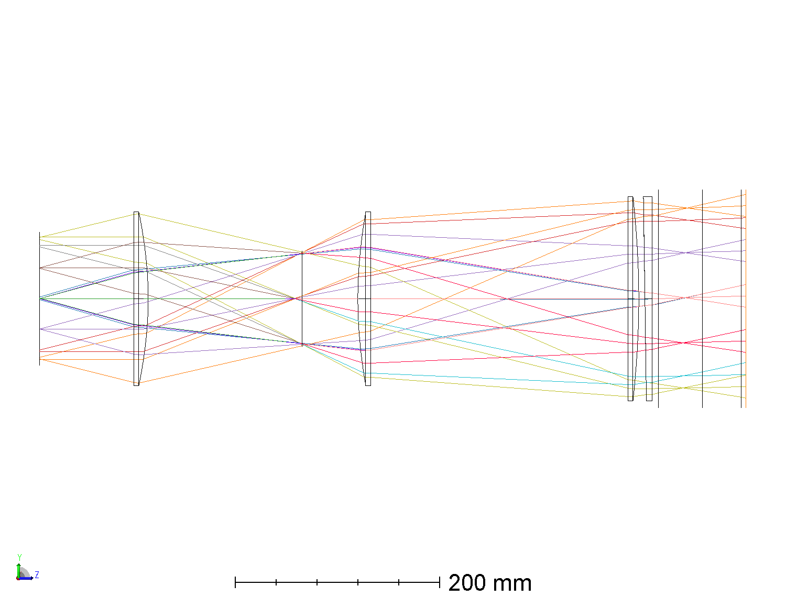

Moving the camera "in" will alleviate this to some extent as the window moves
into the cone, the problem with doing this is that at some point rays will clip
on L1.

Moving the camera in will clip rays in L1, originally I tried moving it in
50 mm, however cliping in L1 was too severe. I ended up moving it 30mm and
reducing the fov by 0.01degrees in radius, so the fov is now 0.37 at the center
camera.

Model looks like this now:
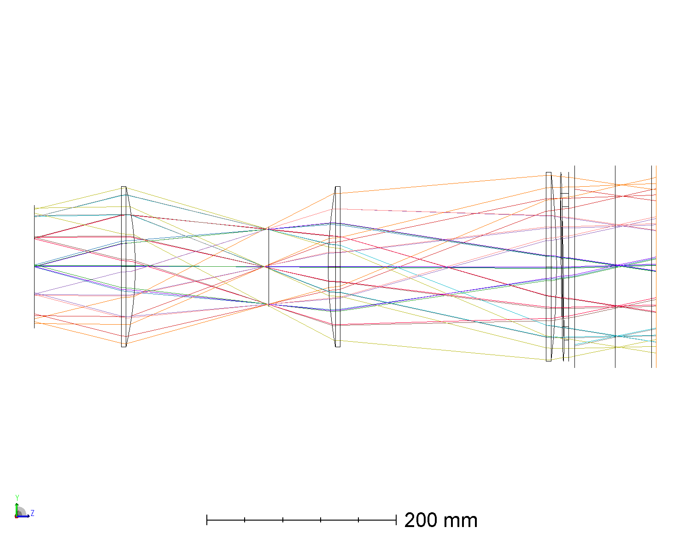

Where footprints for cam1 are:

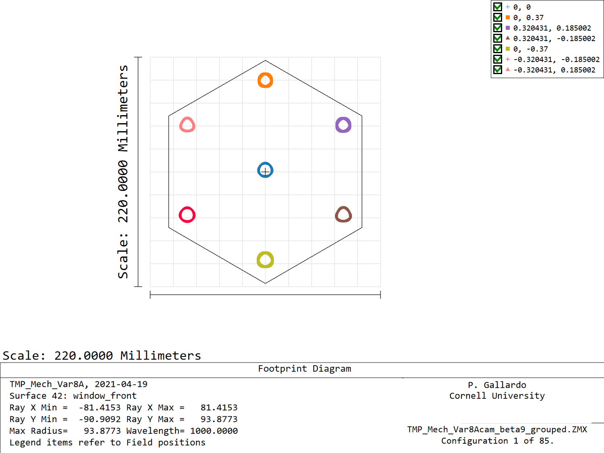

And footprints for cam 23 are:

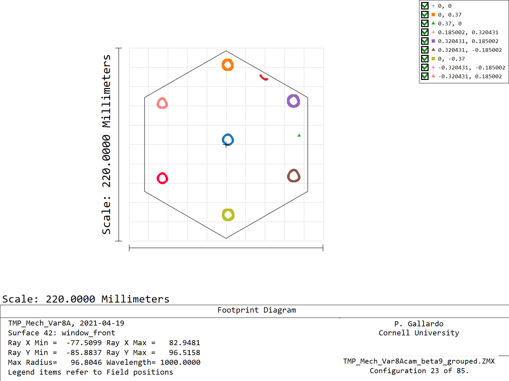

## Limits on telecentricity and f/# variation

As shown last week, a limit on f/# ellipticity was introduced. For this I
impose that the ratio of the max f/# over min f/# in the tangential and sagittal
directions **must be = 1.12**

On top of this constraint I also impose that the telecentric angle at the focal
plane **must be lower than 2.5 degrees**.

For the center camera at 1mm this seems to be working ok in terms of img quality.

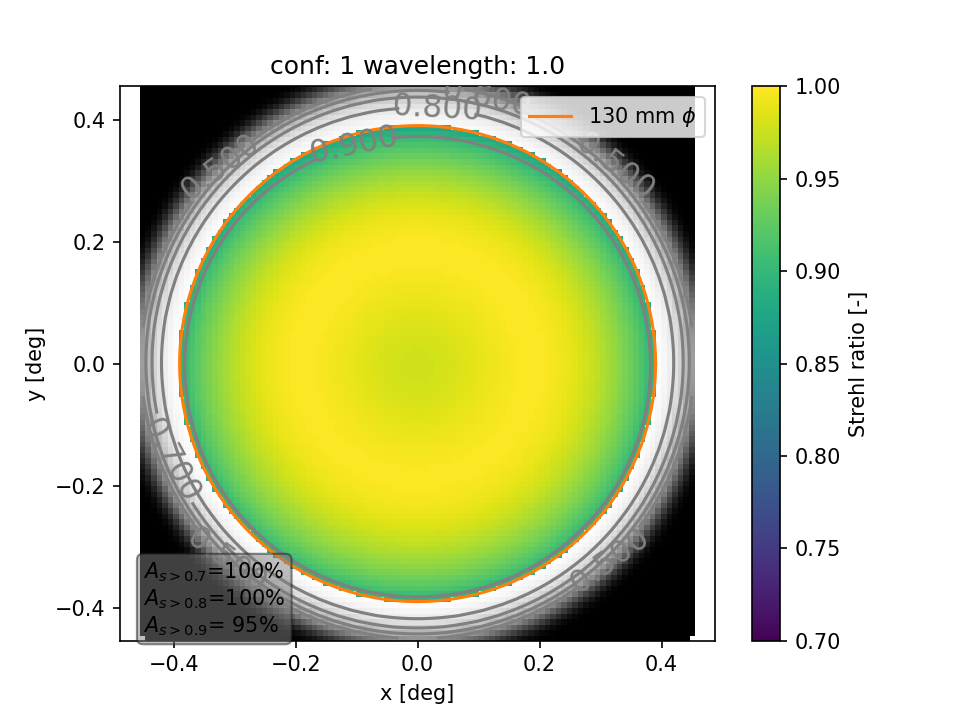

### Telecentric angle
A plot of chief rays looks like this (max angle of 2.5 degrees was met exactly):

### f/# variation

f/# variation can be quantified with an auxiliary screen very far from the
detectors past the third lens. I do this and extract the coordinates of the
rays that draw a ring for a few field points.

Doing this will give the shape of the cone, which I can then use to fit ellipses,
the major and minor semi axes will give the f/# in the sagital and tangential
directions. This method is better than using only the plus/minus marginal rays
because it accounts for rotations.

Both semi major and minor axes are around 15 degrees

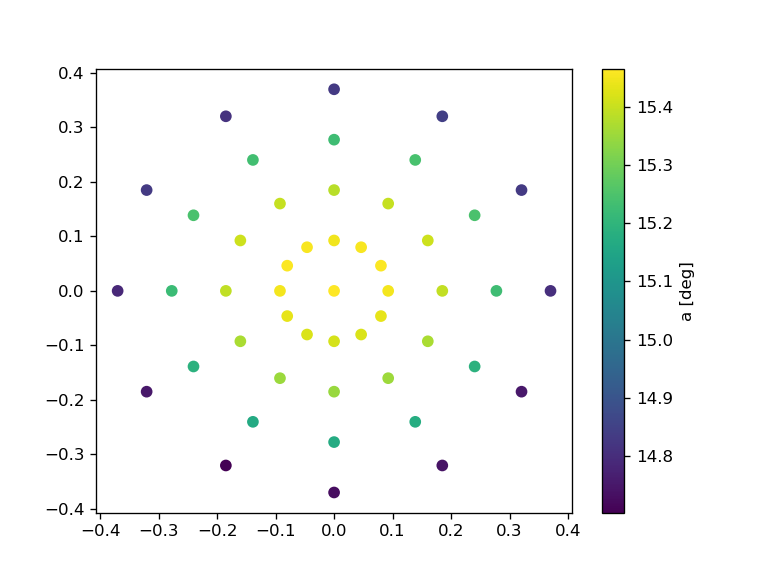

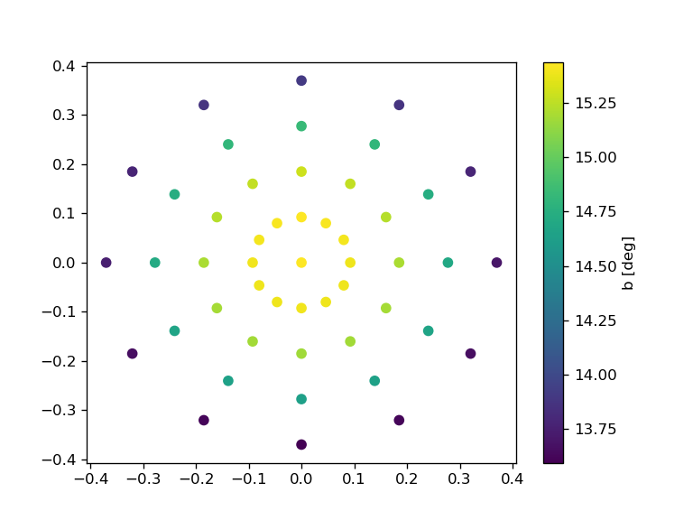

Dividing the semi-major axis over the semi-minor axis gives

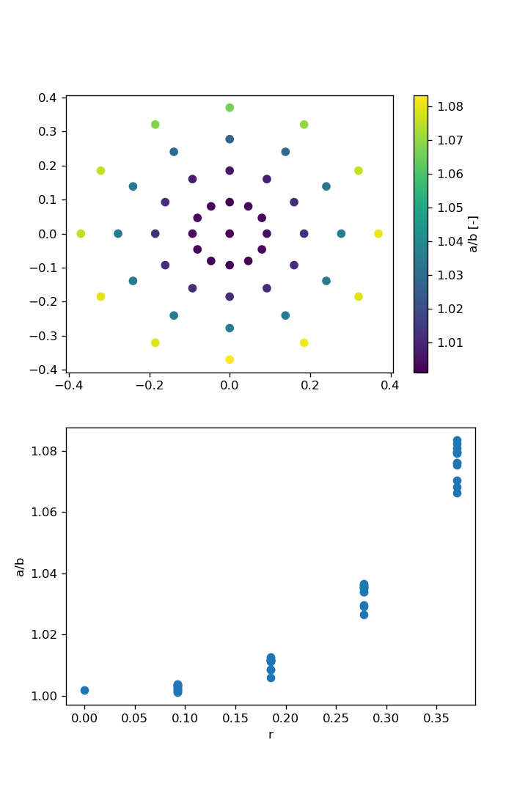

And the solid angle can be computed as pi a b

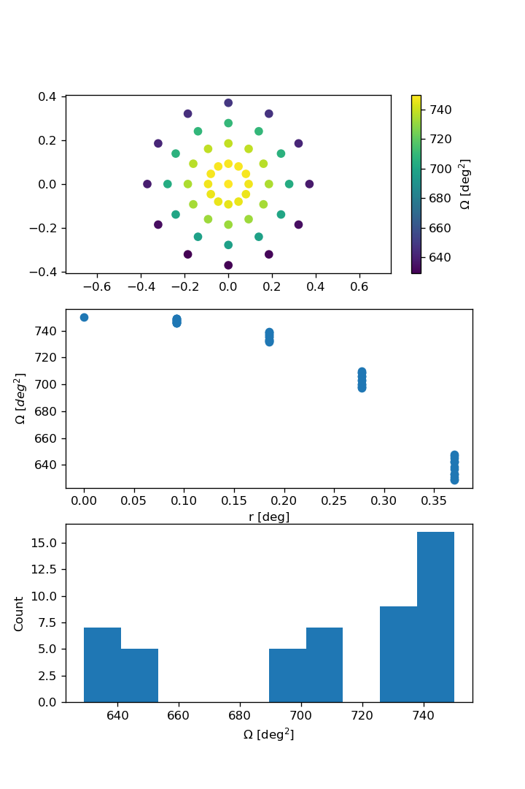

## Groupings

I attempted to implement camera groupings for this merit function and camera
placement. In the following plot each color is one group of cameras. I used
cameras **1**, **20**, **56**, **44** as group leaders.

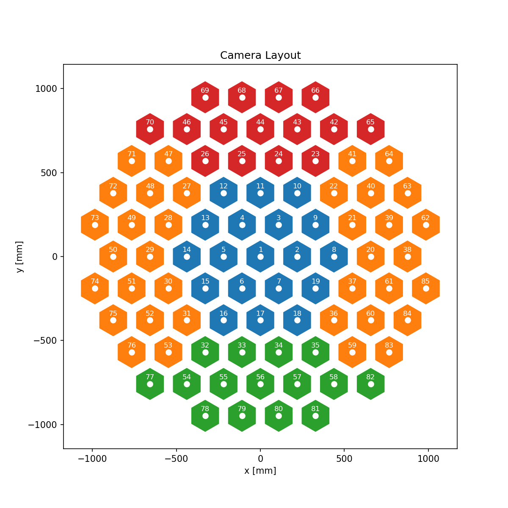

This yields the following Strehls at 1mm and above 0.8:

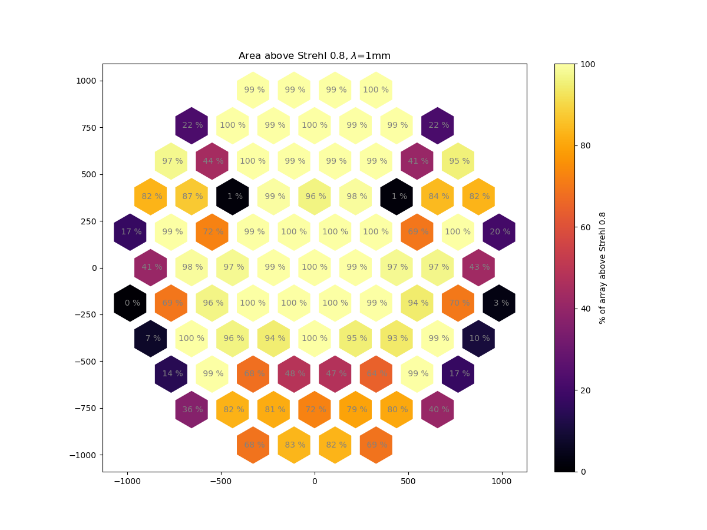

And at 2mm Strehls look like this:
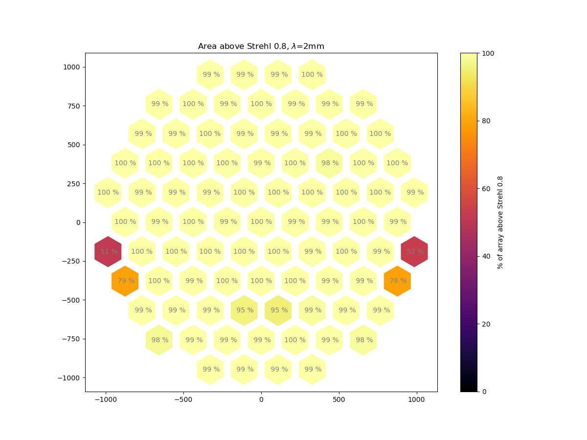

# Next steps

* Quantify vignetting in extreme cameras, look for an optimum for the camera position and decide if defining individual fov
for each group would make sense.
