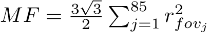
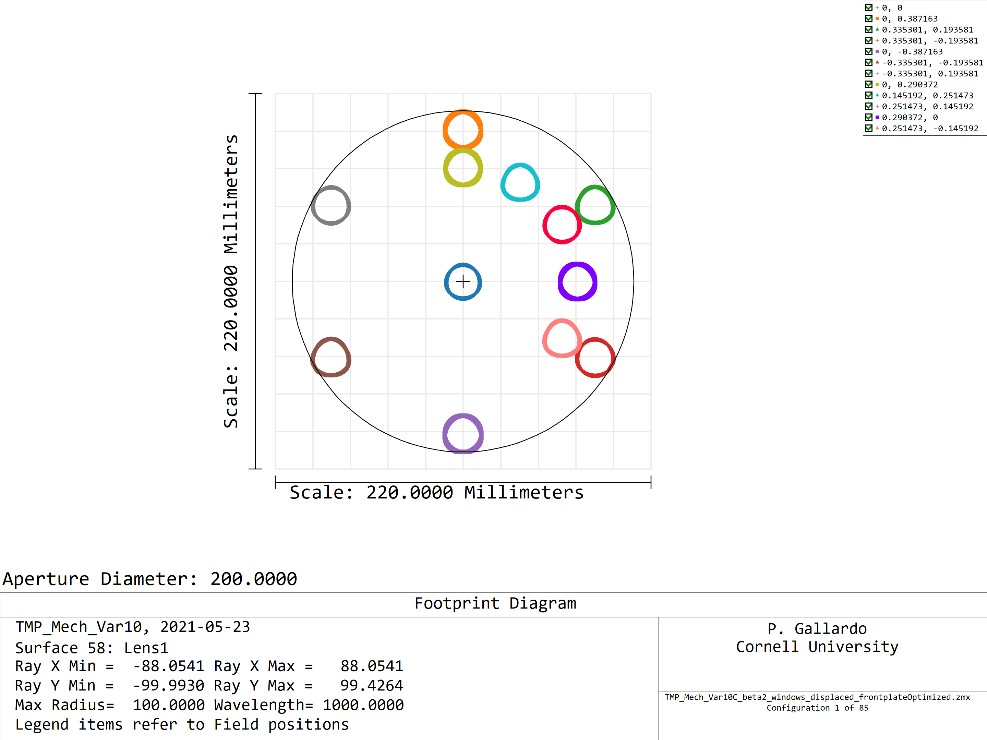
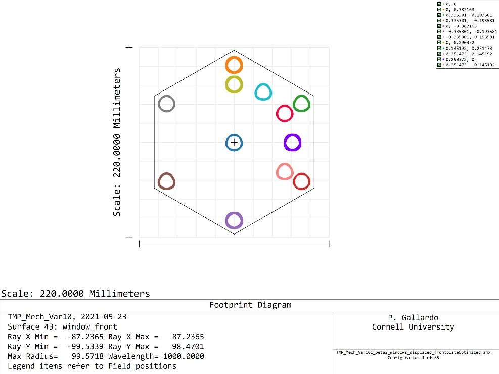
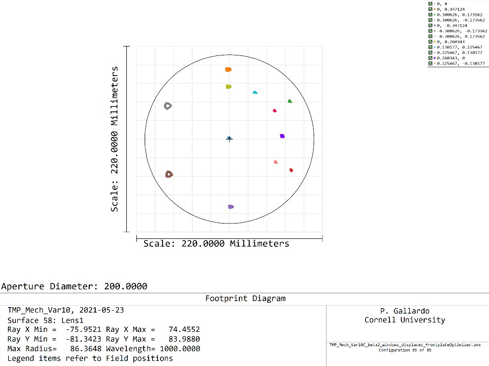
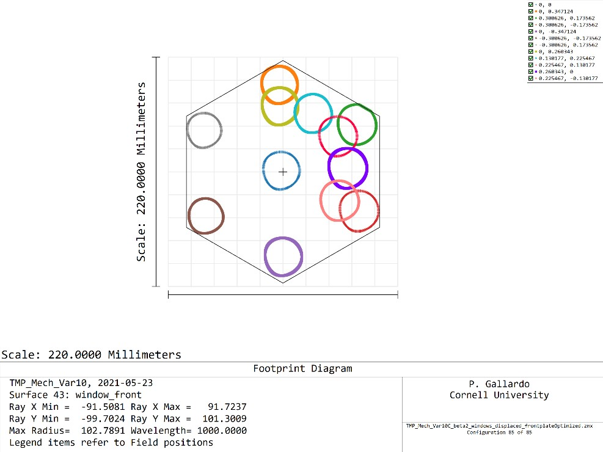
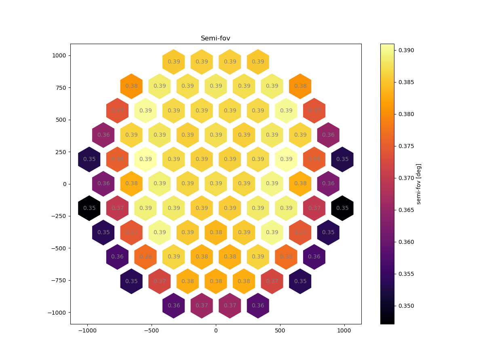
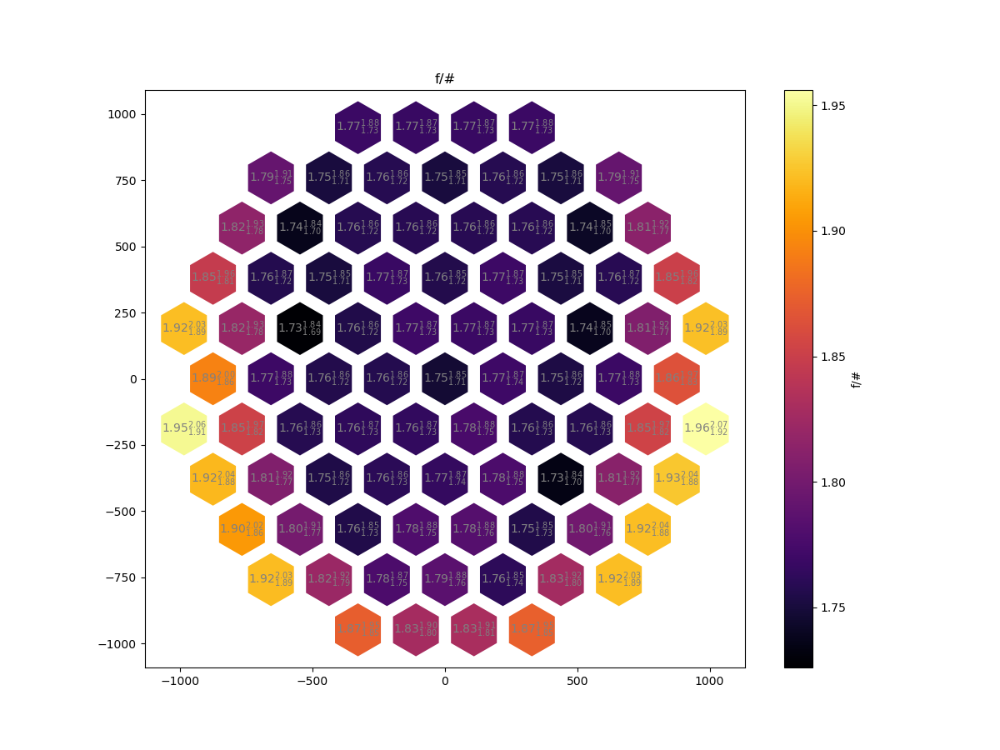
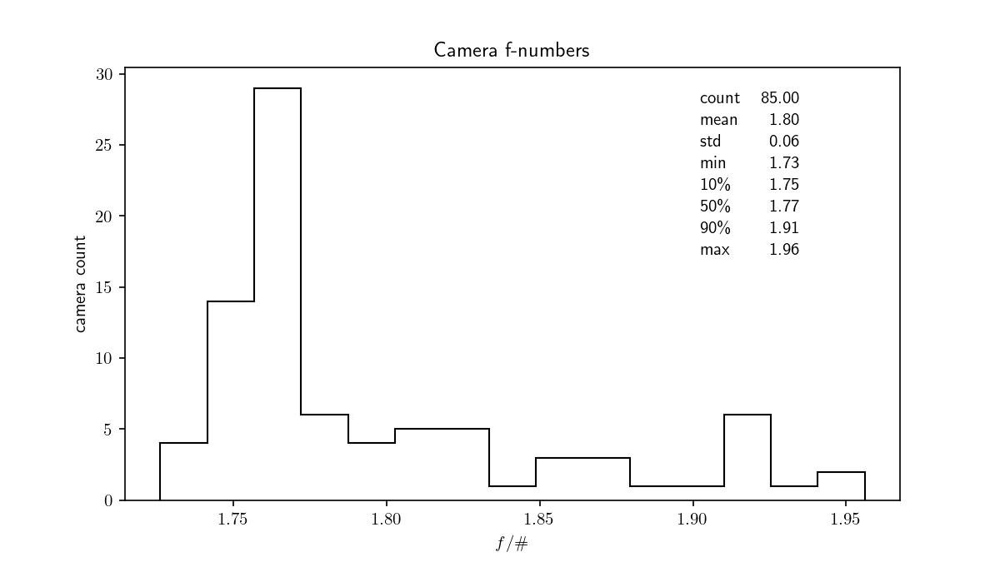
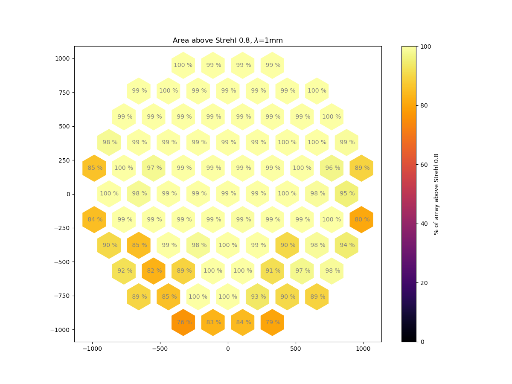

# Front plate position optimization for the TMP

It is of interest to optimize the position of the front plate to maximize the total field of view solid angle. This can be formalized with the following merit function

This corresponds to the total solid angle seen by the combination of 85 cameras, Which must be maximized.

This is achieved by selecting the maximum unvignetted field of view per camera,
ie we need the field of view to be unobstructed by the **window** entrance and
the **first lens** surface.

One must notice that changing the front plate position will then change the
entrance window x-y offset, which needs to be optimized simultaneously.

This can be implemented in Zemax leaving as a free variable the front plate
position, the camera field of view and the x/y offset for each camera.
Which yields a rather big optimization problem (see file fov_window_displacement_frontplateposition.MF) with 256 variables (1+85x2 + 85).
After a few hours running, Zemax seems to find a solution that is better than the starting point (which was 30mm) at
 z=42.76 mm from the focal point.

 This front plate placement gives a total field of view of 31.58 deg^2, better
 than the total field of view from last week's model, which had 28.87deg^2,
 a 9% gain.

 For instance, at the center camera, we are limited by L1, while using a good
 fraction of the hex window.

 
 

 As one moves to the sides, the beam starts growing and the hexagonal window is
 the limiting element.

## Semi-Field of view

## f/#

## Strehls
Optimizing all cameras individually, a best case scenario we get:

