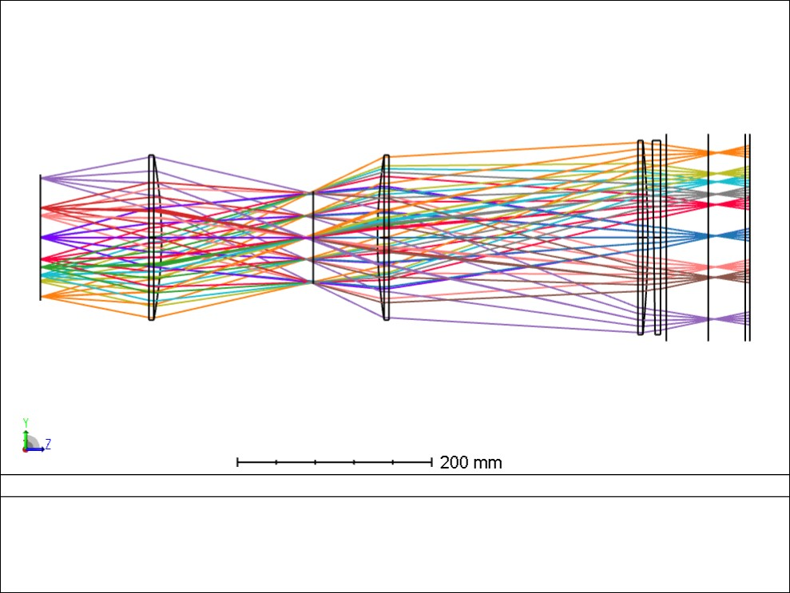
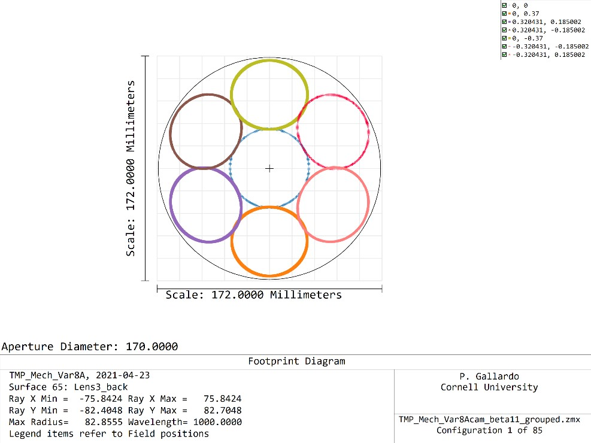
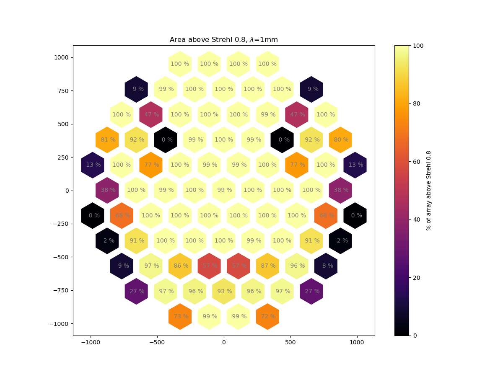
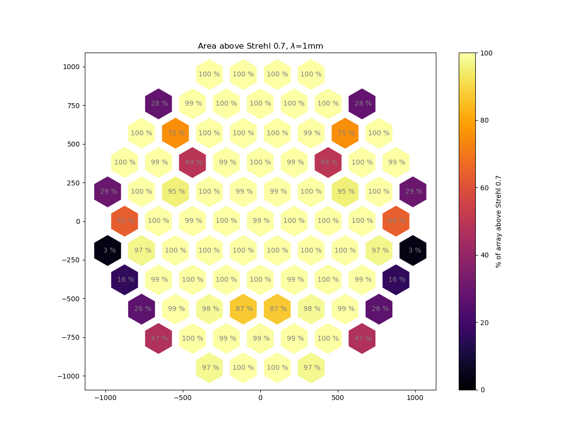

# TMP cam with biconic lenses

Some of the restrictions implemented to constrain the chief ray angle were not
active for the system shown last week. I made a few changes to better search
for a solution.

## Changes:
1. Start search with a suitable starting point, then do a Hammer search to
look for a better solution
2. Run the local optimizer with automatic convergence a few times to let it
slide into the solution.
3. Added a restriction to better handle vignetting condition on lenses
4. Added a restriction to better handle plate scale assymetry at the detector
wafer plane.

# Layout

## Camera groups

## Strehl Coverage

### Better than Strehls = 0.8 at 1mm

### Better than Strehls = 0.7 at 1mm

## To do:

1. Modify the grouping to improve cameras 33, 34 (bottom center), 21, 22 (upper right) and 27, 28 (upper left). Test if making a small change in the grouping (for example adding it a neighbour group) can improve Strehls.

2. Work on vignetting (see next post)

## Caveats

I am letting the total length of the camera float, need to look into setting it constant and see if this degrades performance.
