# TMP Var8A cam beta 11 F/#

This design was optimized to allow a maximum f/# variation of 12% and a maximum telecentric angle at the focal plane of 2.5 degrees.

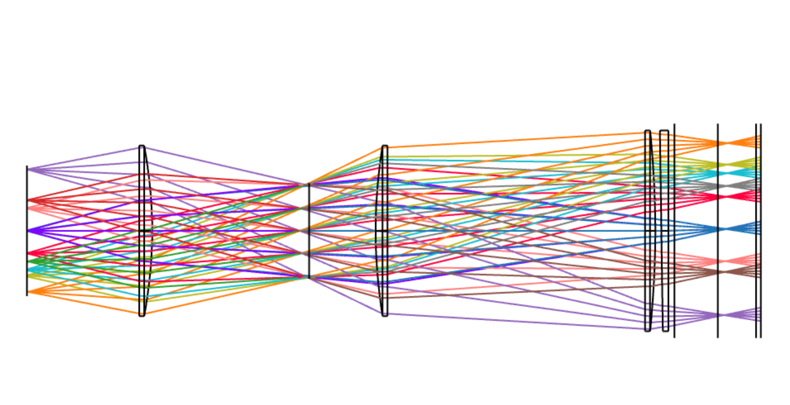
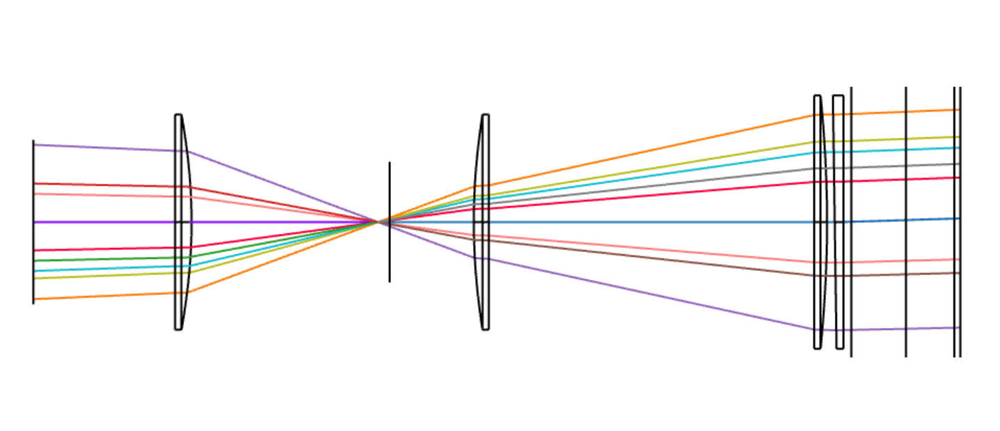

This can be checked by looking at the footprints at L3
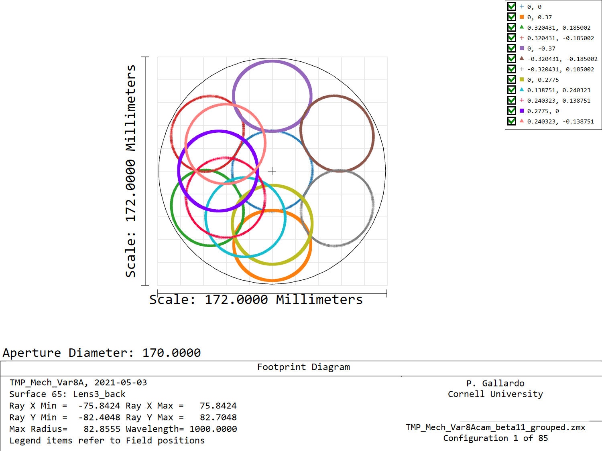
Or by looking at a screen at 100 meters from the focal plane in the direction of L3.
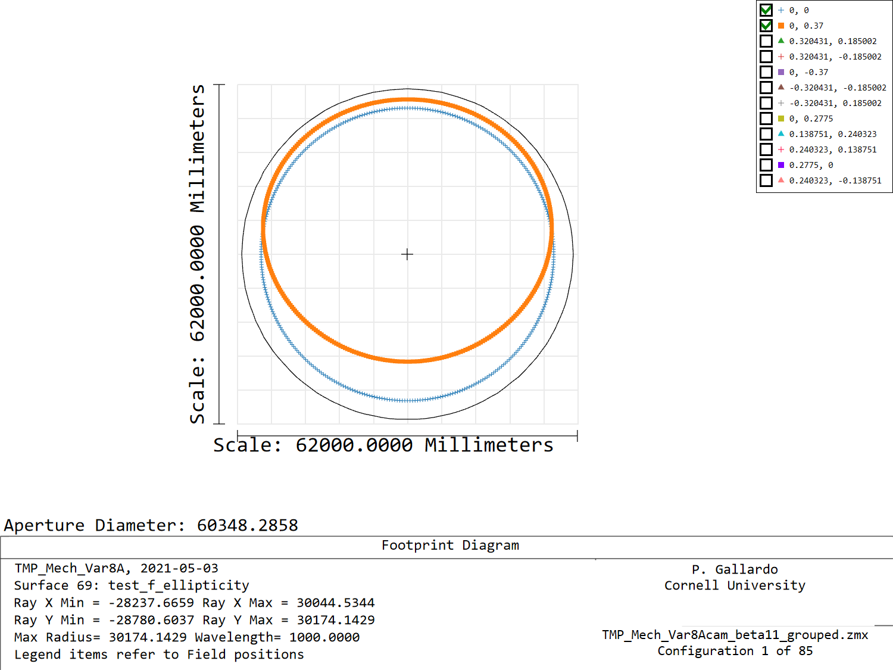

On this surface we can then fit ellipses to each field position and evaluate the semi-axes (a, b) for these. This fitting is better than we have done in the past as it allows the ellipse to be rotated in an arbitrary angle.

The solid angle for this ellipse is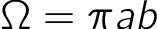 while for a rotationally symmetric cone we get  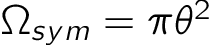. If we want to convert the elliptical solid angle into a single angle cone with the same solid angle then 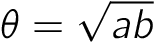 and the equivalent f/# is

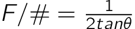.

With this in mind we can visualize the following:

## Semi axis angles
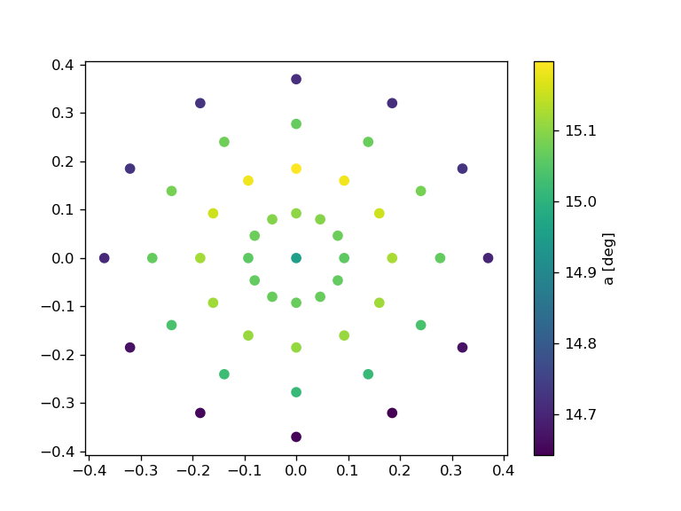
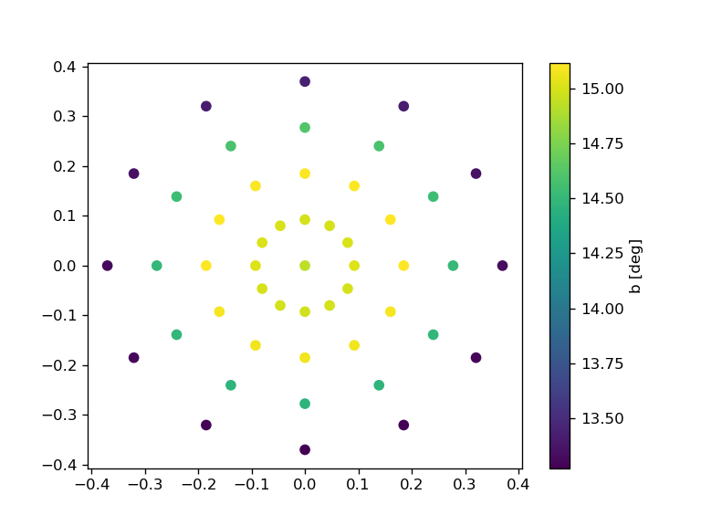
## Solid angle
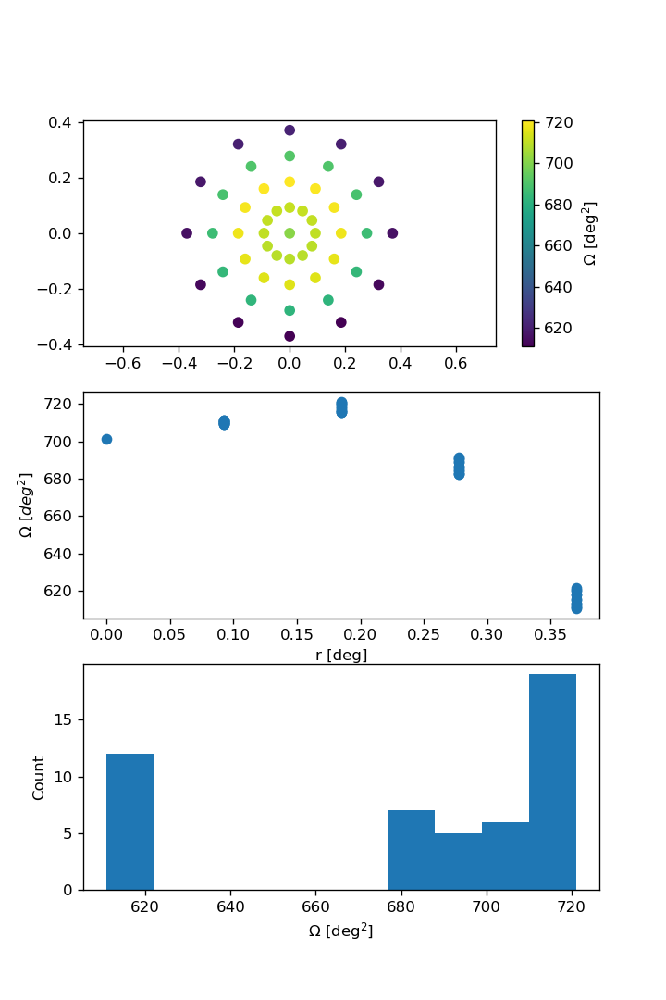
## Ellipticity (a/b)
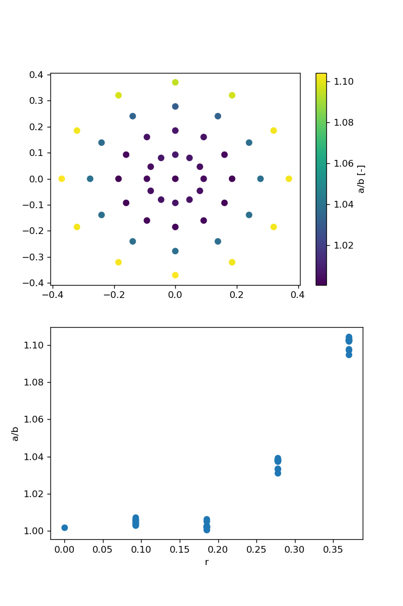
## Equivalent f/#
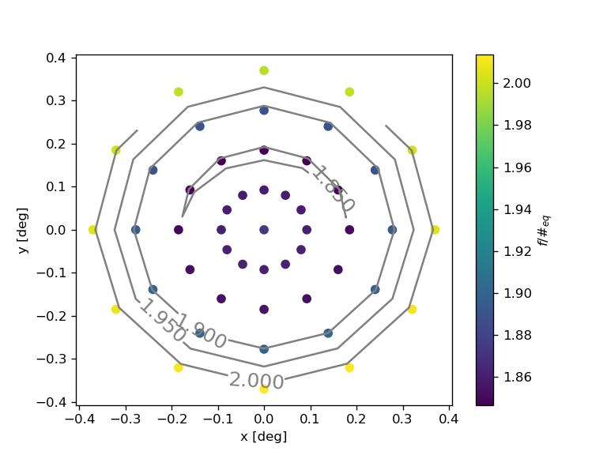
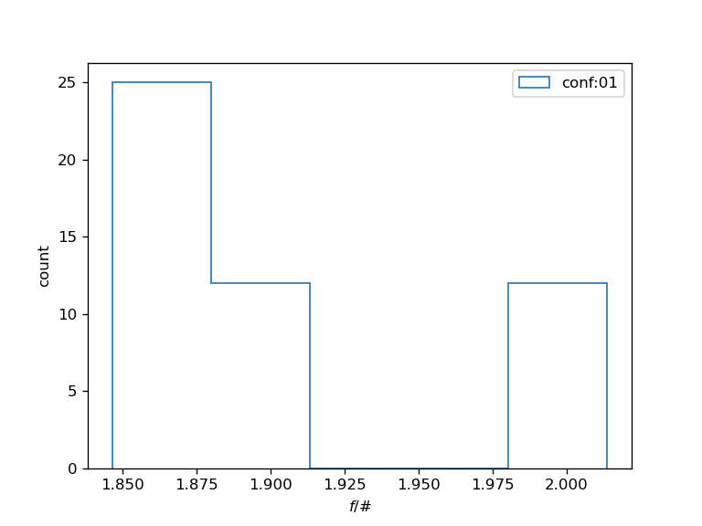
For the center camera we will have an average f/#=1.9 with a minimum of 1.84 and a max of 2.01.
## All camera f/# metrics
Are in file f_numbers.csv

# Caveats

**Vignetting** is the biggest effect, in the last meeting we showed that if we are able to displace the window positions, we can have the three inner rings unobstructed (0.37 deg semi fov), for these cameras the calculation here will hold.

For the outer two rings, vignetting will reduce the fov, for which the f/# will have to increase.
