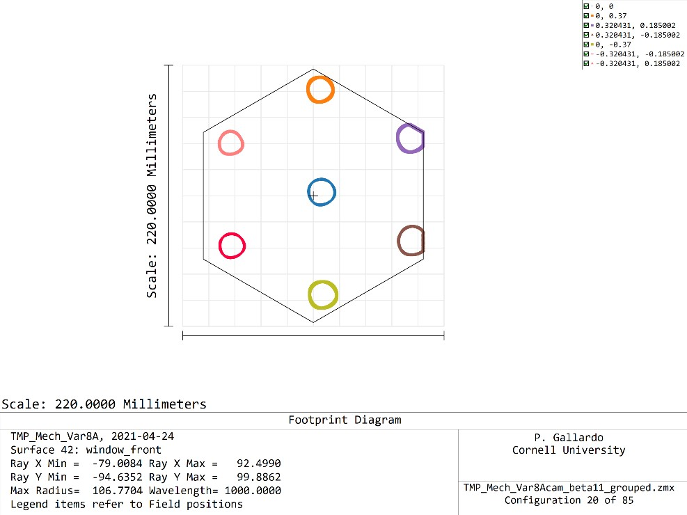
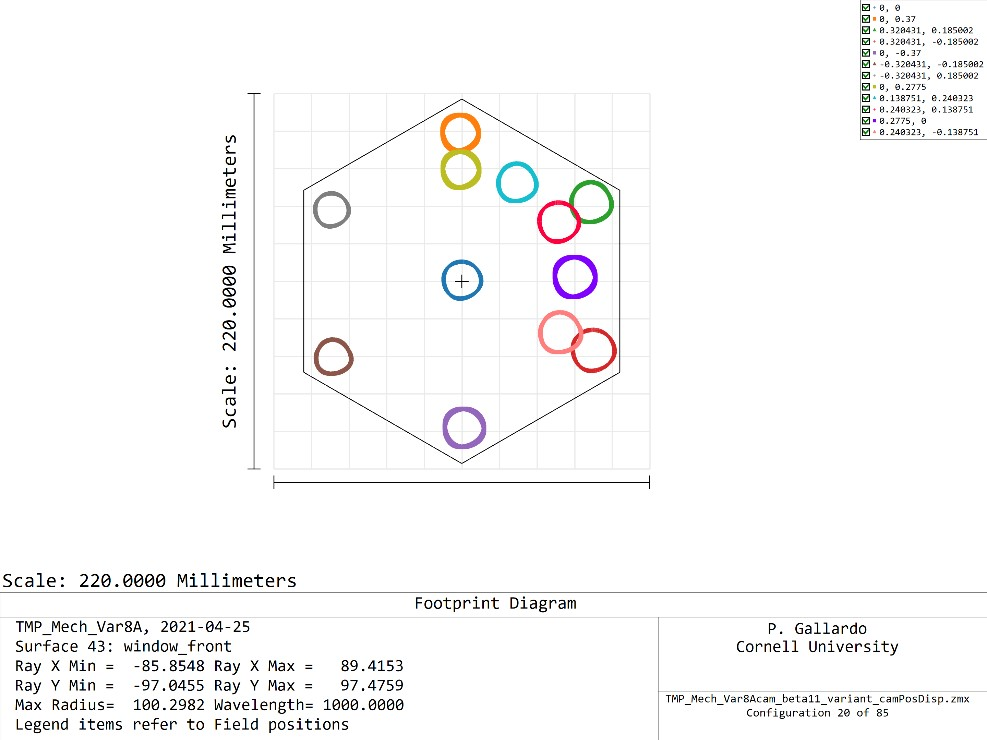
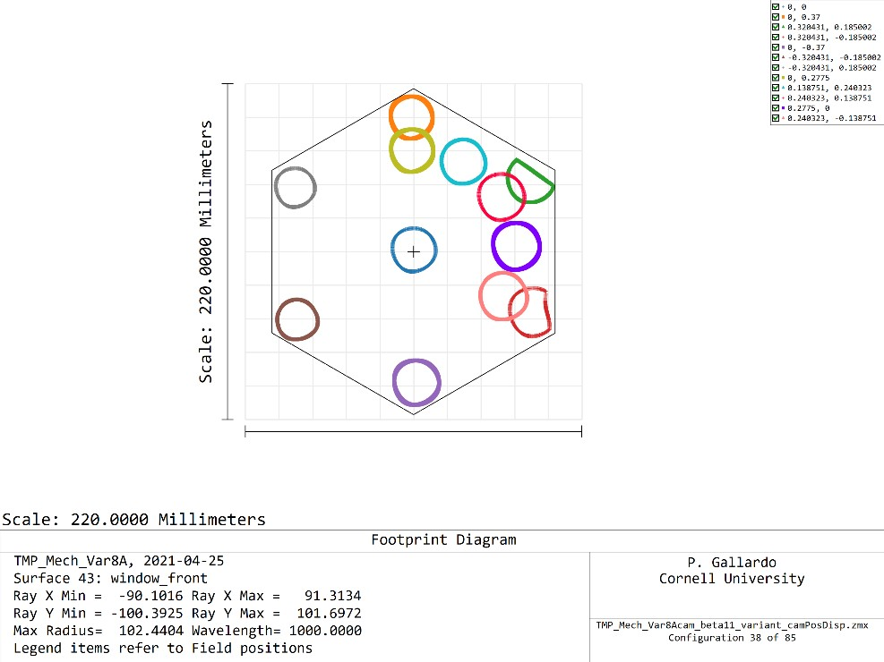
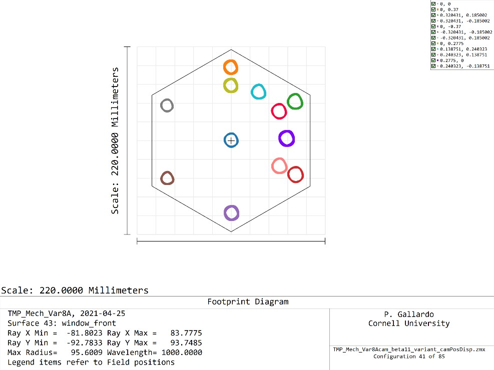
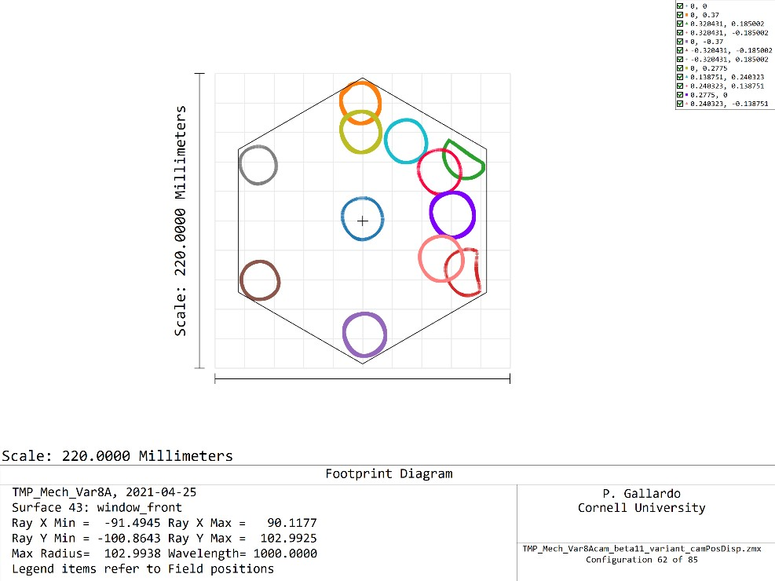
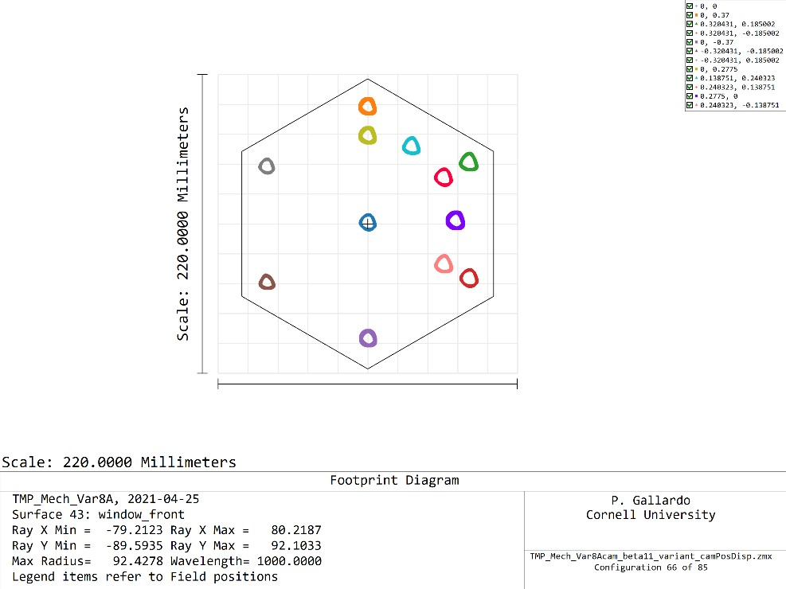
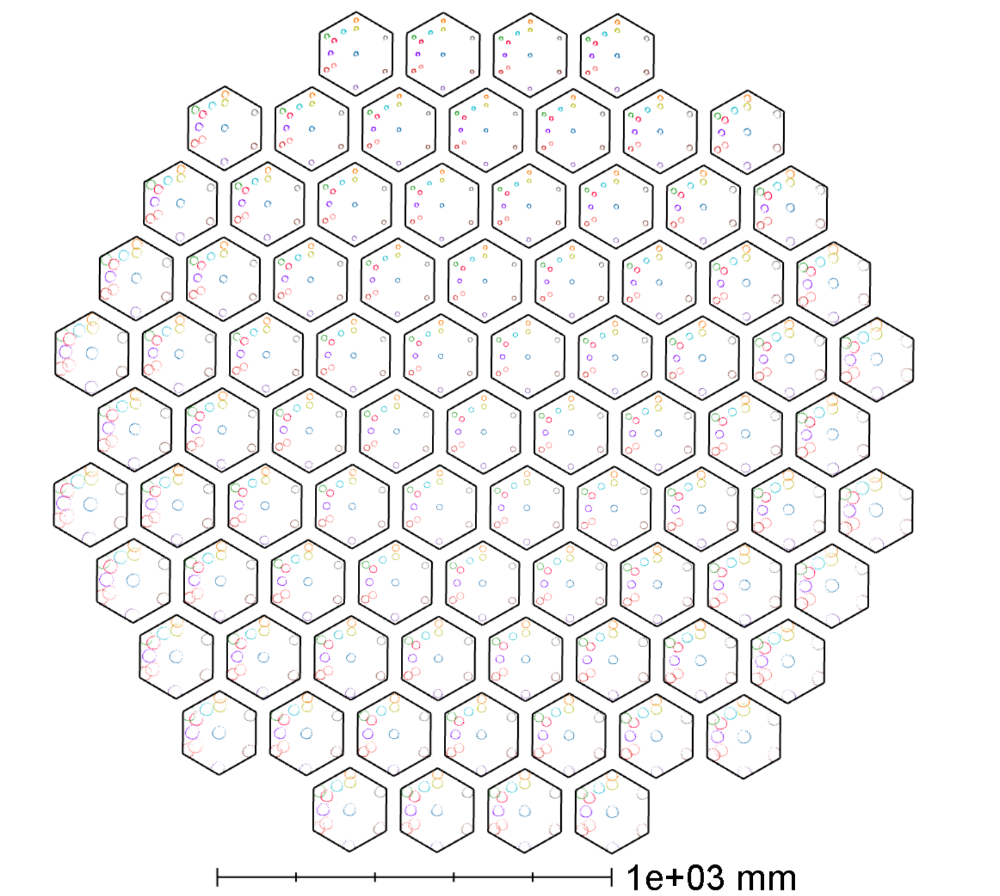

# Camera entrance vignetting

Currently the camera is built following the foolowing recipe:

1. Start at the focus at the center field of the TMP
2. Go back 30mm and place the filter stack and front plate surfaces
3. Use a center to center distance of 219mm and place cameras parallel and coplanar in a hexagonal lattice structure.
4. Find the field angles on the sky that hit the wedge on the center and then find the angle that makes this ray stay on the camera axis (for all cameras).

This scheme, of course is the simplest one can come up with, but it **does not consider the effect of the angle of incidence** of the TMA.

For instance, camera 20 (on the third ring of cameras) will start seeing vignetting due to this effect at the camera entrance.

To try to fix this, I tried allowing for a small displacement at the window entrance for each camera and optimized this offset such that the chief ray for the center field will pass through the center of the window entrance. Cameras continue to have a center-center distance of 219mm, but now the camera entrance deviates slightly from this depending on the camera.

This requires a displacement < 10 mm for each camera, that is small at the center and larger to the edges.

This makes camera 20 work like this:

The third ring now works with the edge field very tightly next to the edge. The fourth and fifth rings still need work, but not in all cameras:

For example camera 38, to the right and center clips rays

While camera 41 looks better:

Something similar happens in the last ring, the rightmost camera clips at the edge

While the top right camera does not because field curvature helps here.

## All camera footprint

