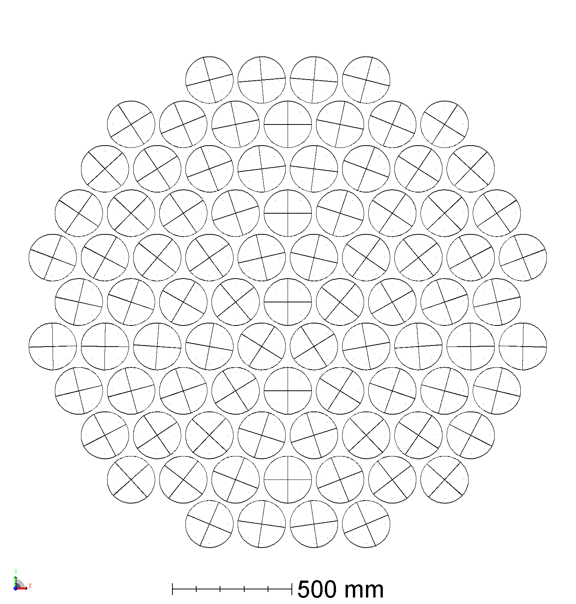
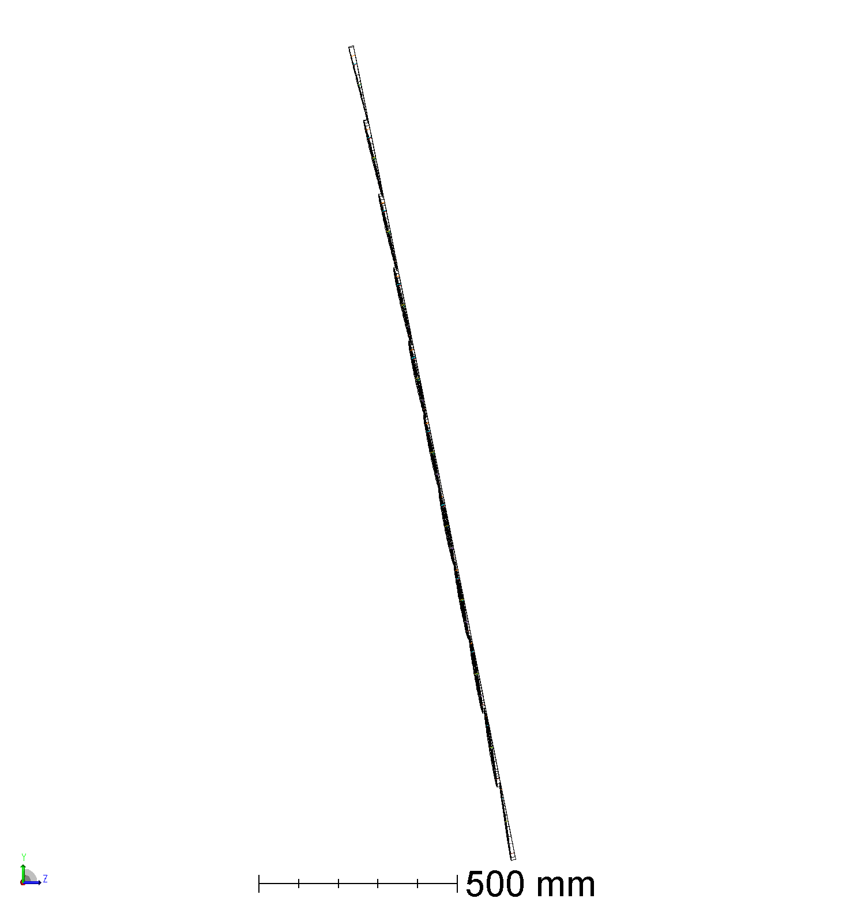
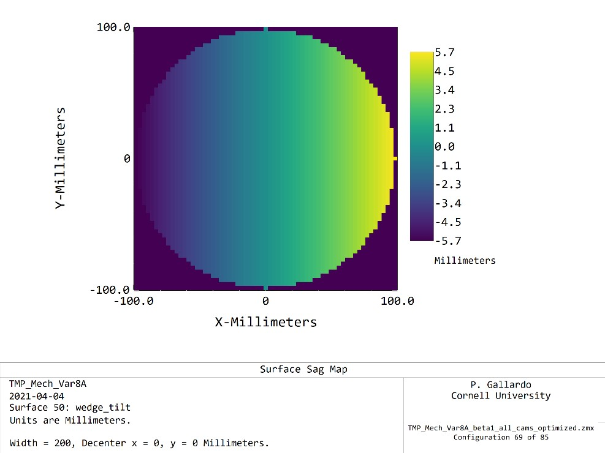
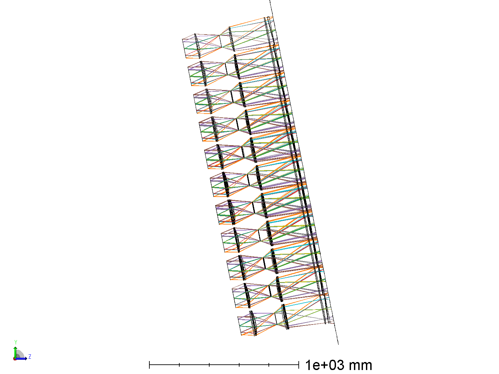
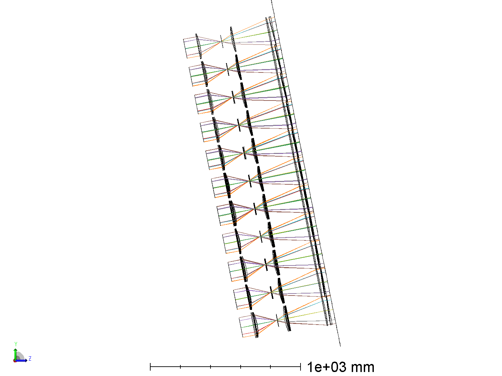
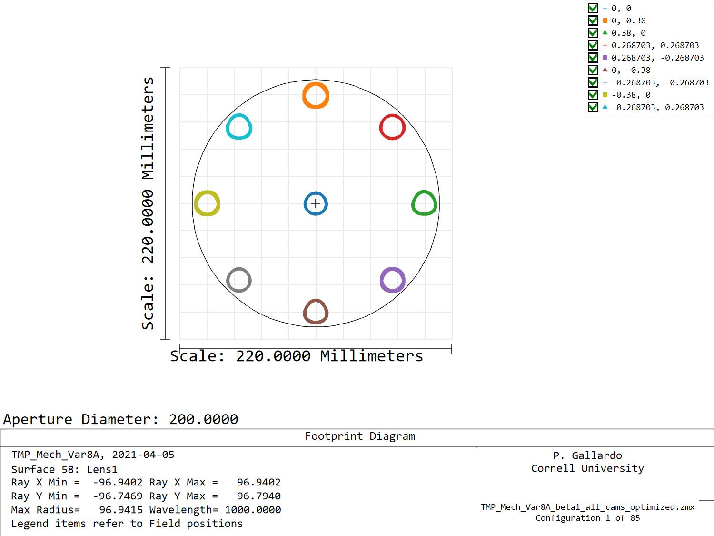

# TMP Var 8 cam beta 1

The TMPVar8 LAT was optimized to eliminate the tilt at the cryostat entrance
and to minimize the wedge tilt angle needed to keep all cameras parallel.

As it can be seen in the following figure, the minimum wedge tilt is located
higher than in previous iterations of the TMP telescope, this helps distributing
the wedge tilts more evenly between the top and bottom part of the focal plane.

This gives a maximum sag of ~11.4mm peak to peak in the alumina wedge.

The design shown was produced optimizing all cameras one by one.

This design was made placing the first lens 2 inches from the focal point at the center field, the wedge is placed 1 inch from the focus. This yields a L1 semi-fov of ~0.38 deg, which gives 38.5 sq deg solid angle, ~55% of the total TMP solid angle.

## Next steps:

* Incorporate changes to the merit function proposed by RH.
* Iterate on lens 1 placement to improve camera fov
* Produce a grouped design
* Evaluate camera Strehls in the grouped configuration.
