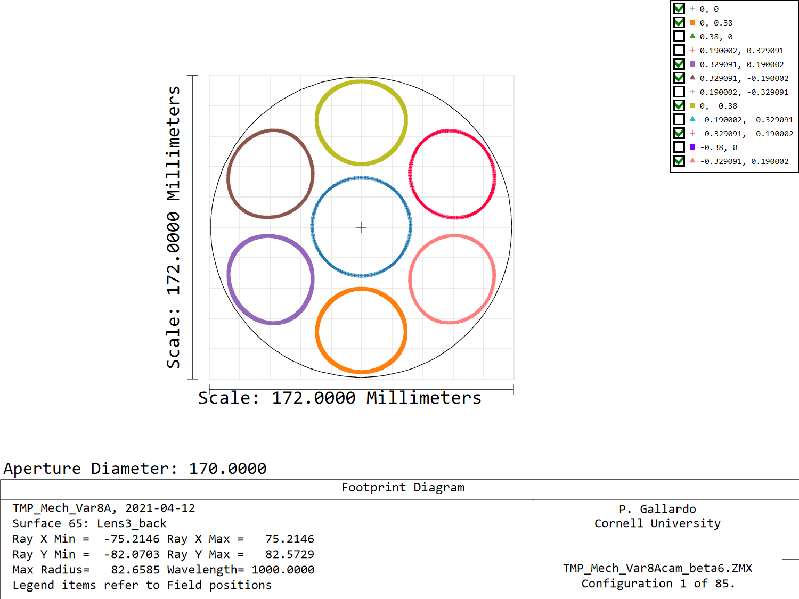
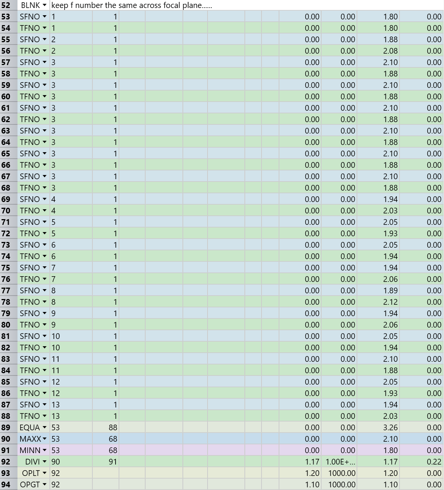
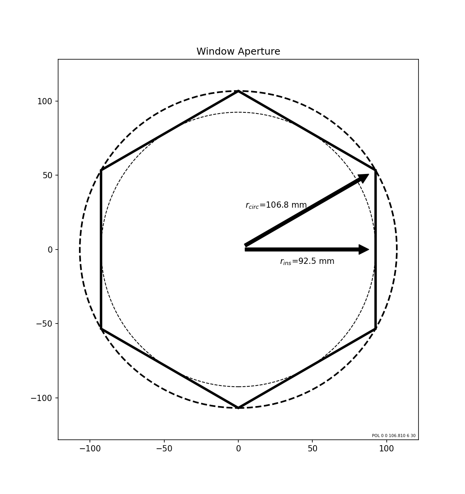
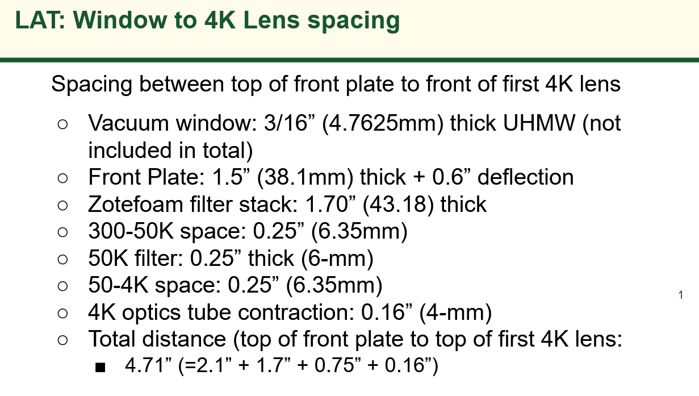
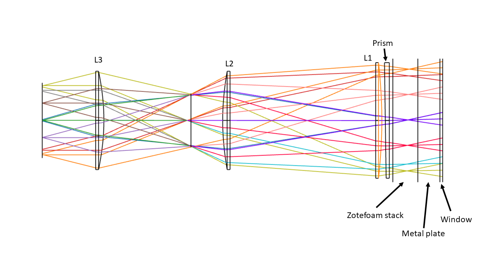
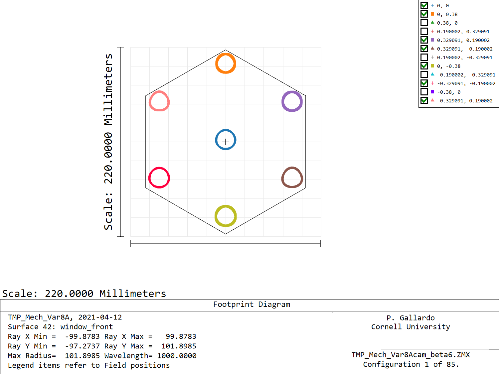

# TMPcam beta ver 6

 Changes:
1. Added pressure in the merit function to *try* to circularize f/#
2. Added surfaces at the camera entrance according to last meeting's document.

## f/#

We evaluate the f/# in the tangential and sagittal direction for all
edge fields. Then we evaluate the max and min, divide both to get an ellipticity.
Optimize to target an arbitrary number. For this the total length of the
camera needs to be able to float.

This tends to put the stop closer to L2, which makes sense from a projection
perspective.

In this case a target of max/min=1.17, which gives this shape for the extreme
rays:

Conclusion: In this configuration Strehls start degrading not far from ratio 1.2.
The general trend is that the high strehl area shrinks quickly, in fact, if one
tries to set this ellipticity to 1.1 even for the center camera we get a fov
lower than the window fov 0.38 deg.

Seems we are over constraining the system if we want to be too stringent.

What is our requirement in f/# ellipticity? Is this rms? max to min?,
it is important to get this metric right.

## Apertures and filter stack

### Focal plane size
From SS's file, the outermost pixel is located at 61 mm from the center. In
this design I have used this number to map the outermost field in the focal plane
 following a hexagonal geometry.

### Window aperture

As described in the meeting notes from last week,  an entrance window of
 185.0 mm from parallel side to parallel side is used:

As a placeholder I used this as an aperture for the subsequent filters, which
will need to be updated.

### Filter distances

I used a sketch from this slide to enter filter distances:

