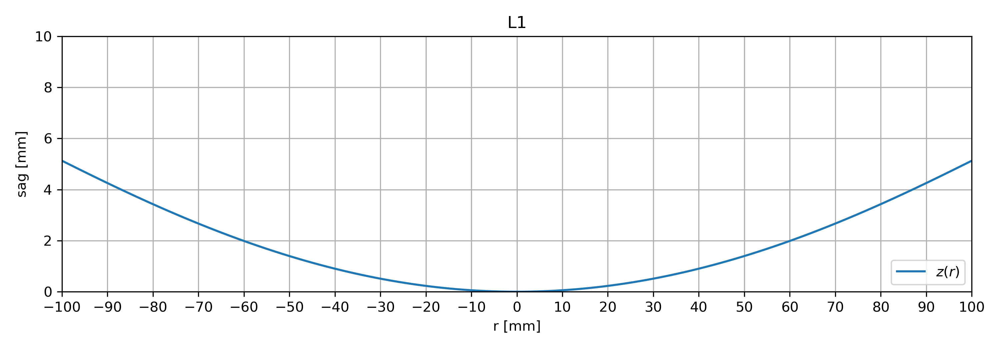
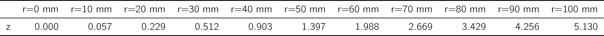
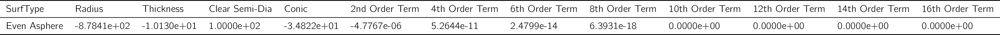
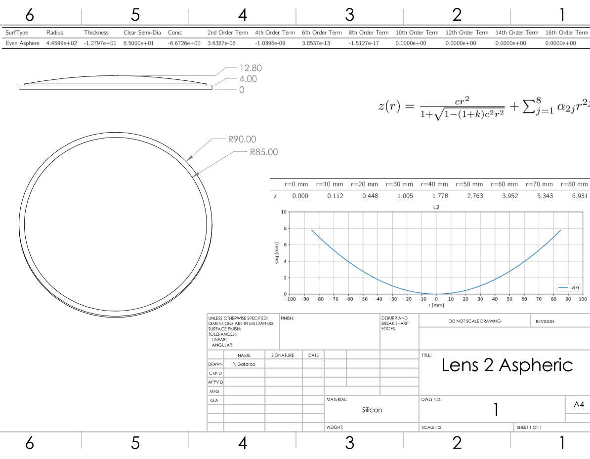

# Export Lens Definitions from Zemax

This set of scripts facilitates the task of producing documents for
lens manufacture. We use the Zemax ZOS API, python and latex to render tables of parameters.

Surfaces supported are: Biconic Zernike and Aspheric.

Use the following scripts to:

1. Generate CAD 3D model: S4cam_export_lens_cads.py
2. Make plots across x/y axes and produce a tex table with explicit numbers: S4cam_plot_lens_shape_and_mk_table.py
3. Export all the numbers defining a zemax lens surface into a csv file: S4cams_export_lens_surfaces.py
4. Make a table with the biconic zernike terms exported in step 3: S4cams_export_lens_surfaces2.py

To run everything at once just run mk_lens_data.bat and you will have tables that look like this:

This set of tables can be used to make a drawing for manufacture like the following:

