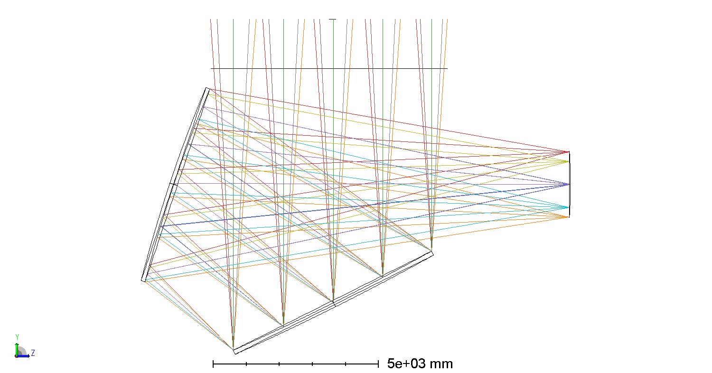
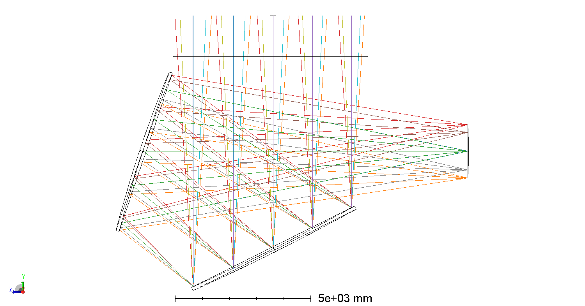
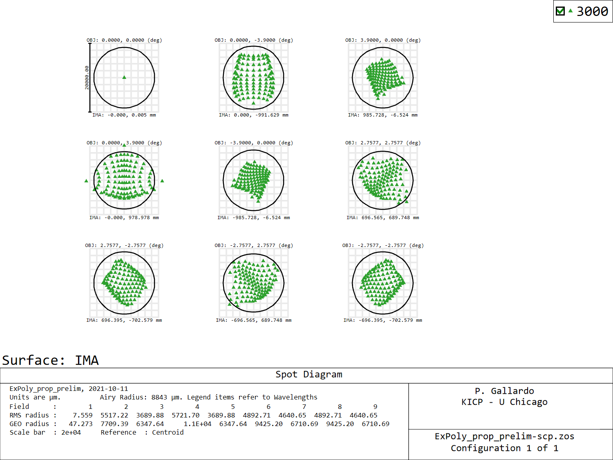
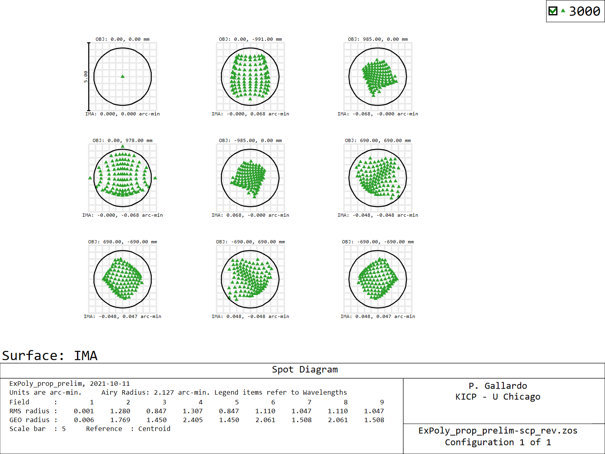
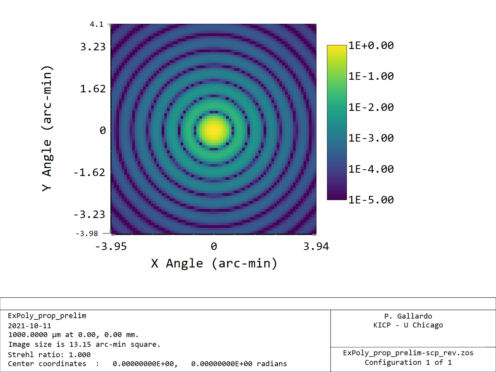
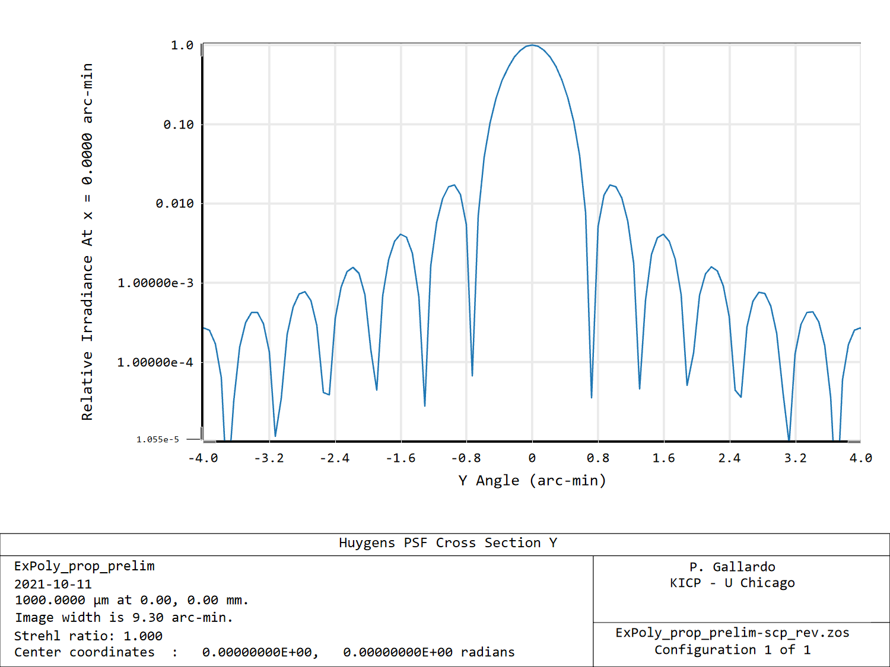

# Time reversed CD

In order to optimize the CD cameras in the time reverse sense we need a time
reversed CD model. Time reversing the CD doesn't work right away
as Zemax struggles with off-axis systems, for which some manual investigation
was needed.

I manipulated a bit the CD design to leave only a minimal set of surfaces
to investigate what the issue was.

Here is a list of items that need to be kept in mind to reverse the system
 (these are mostly technical notes for myself):
1. The time reversed system flips the z-axis (light coming out of the FP)
2. The time reversed system does not flip the y-axis, so "top" is still "top"
in time reverse.
3. The time-reversed system flips the x-axis.
4. To flip the z-axis the polynomial terms in the polynomial definitions need to flip sign.
5. There are a few sign flips in the polynomial terms that can be ignored in this case due to left/right symmetry. But in general the odd terms need to flip sign, while the even terms are kept the same. Because the symmetry of this system this effect does not change any signs.
6. The tilts need to be defined according to these coordinate definitions
7. To check all these it is useful to set the origin in the focal plane surface
 and to check the tilts to the centers of all surfaces are located where they should be.

In practice what needs to be done is to:
1. Time reverse with the time-reversing tool in Zemax.
2. Flip signs in the tilts.

Sanity checks:

## Layout
Here the top model is time forward and the bottom is time reversed. Note that the axis triad has the z-axis reversed.

## Spot diagram

Note here that the units in the spot diagram are now arcmin.

## Beam

