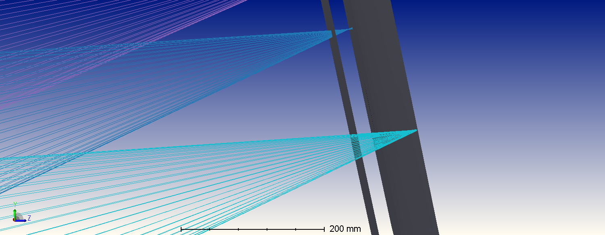
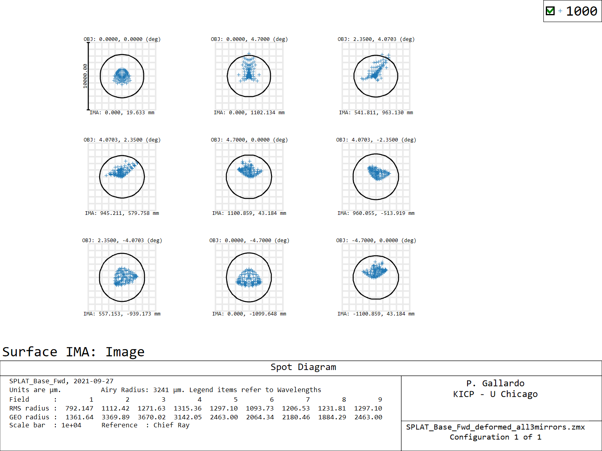
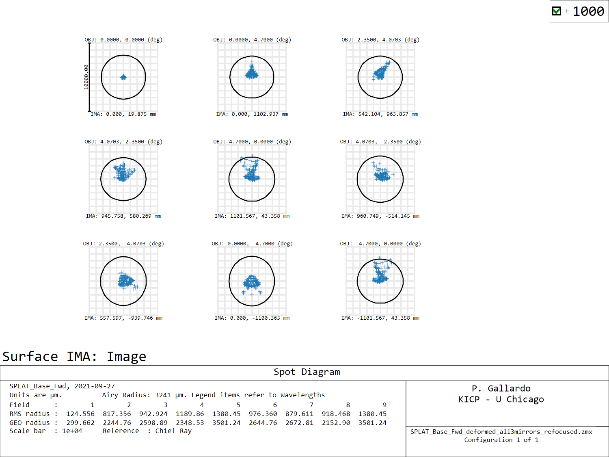
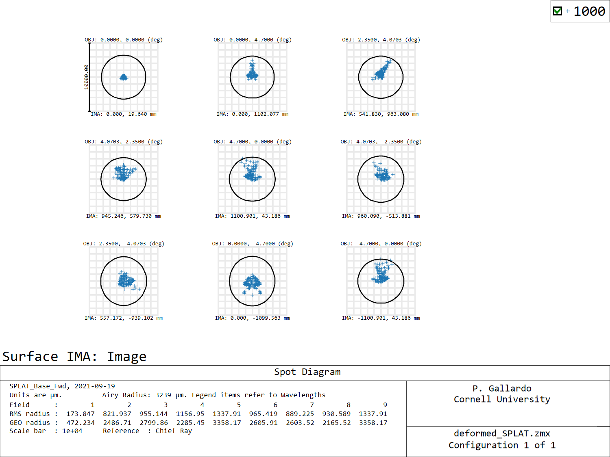
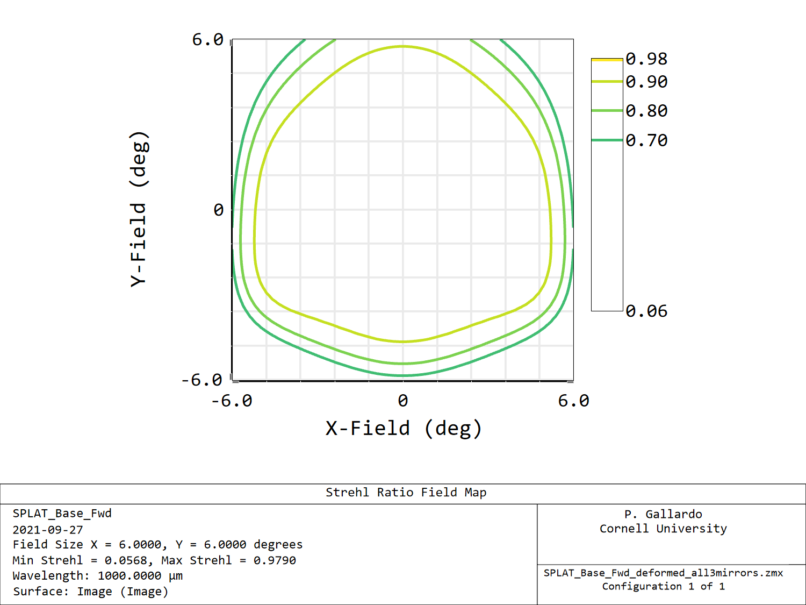
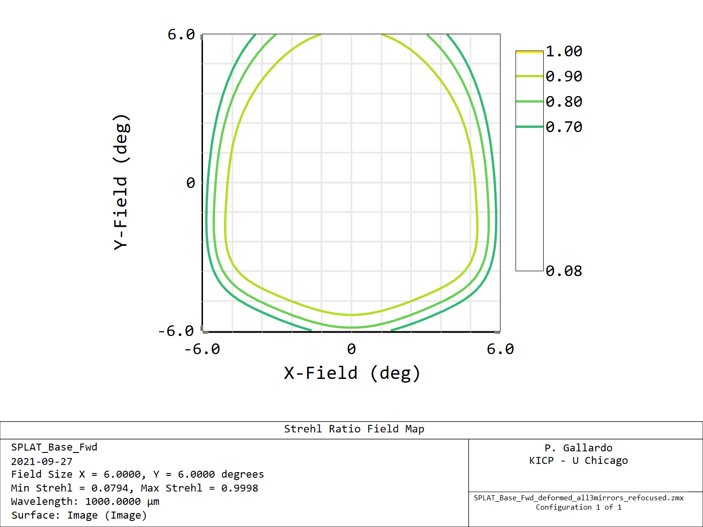
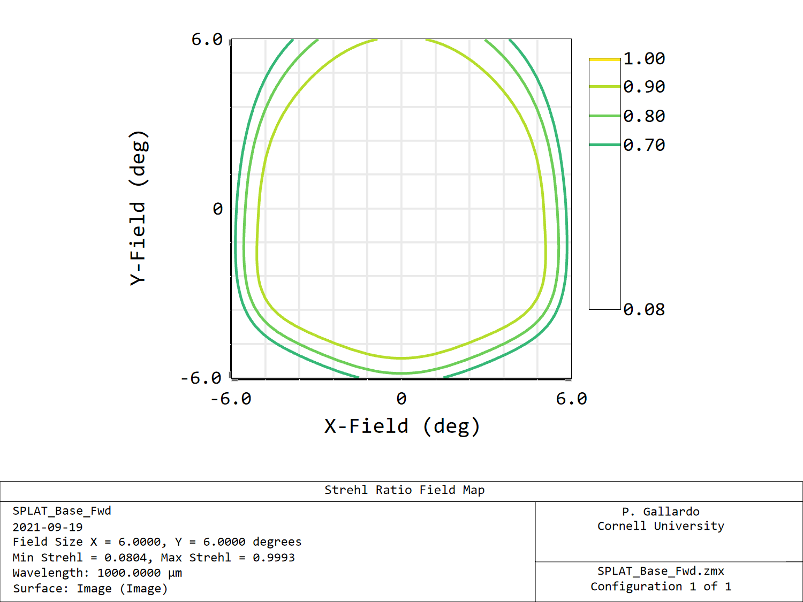

# Deformed TMA

I add a 60 micron deformation as a second order polynomial to the sag of all three mirrors in the TMA.

The second order polynomial follows the equation

z = a(x/R)^2 + b(y/R)^2

Where R is the normalization radius.

If we want a sag of z0 in the x direction we need to find

a = z0/(Rx/R)^2

Where Rx is the radius in the x direction.

For the three mirrors these numbers are

| mirror      | a[mm] |
| ----------- | ----------- |
| Primary     |-0.059       |
| Secondary   | -0.143       |
| Tertiary    | -0.059      |

These numbers displace the focus slightly away from the camera.

Notice that the shape of M2 works somewhat compensating the deformation of M1 and M3.

# Spot diagrams

## Deformed mirrors no refocusing

## Deformed mirrors with refocusing

## Unperturbed system

# Strehls

## Deformed system

## Deformed system with refocusing

## Without deformations

