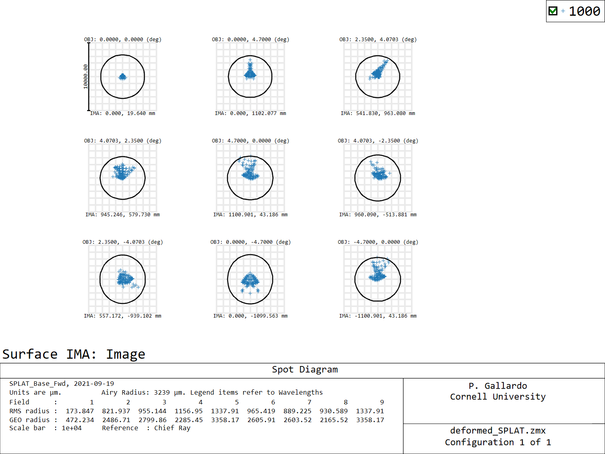
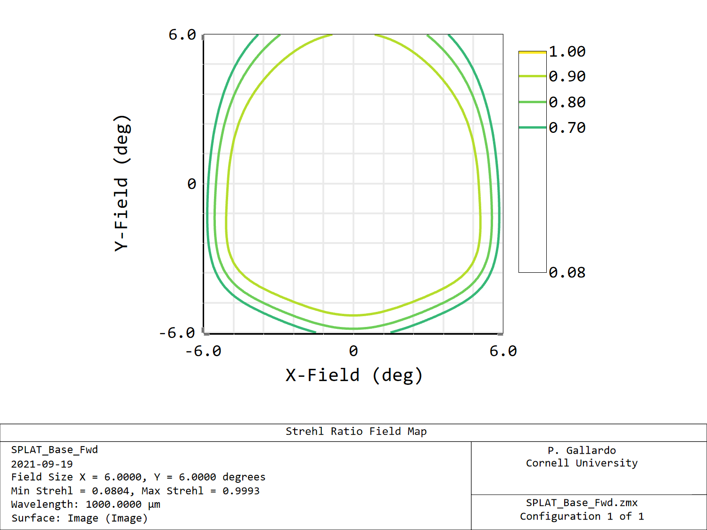

# 60 um leading order deformation

A good starting point to model the mirror deformations
can be built with a one parameter model. Such a model
can be built by using the quadratic polynomial term
and adjusting the amplitude to give a given depth.

Such model consists in finding the coefficients (a, b) in

a (x/R)^2 + b (y/R)^2

Here the x,y coordinates are in the mirror local "lens coordinates" (Zemax terminology here) and the R parameter is the normalization radius for the polynomial surface of the TMA, which in this case is 2500 for all three mirrors.

If we want to deform the mirror in x,y with a circularly
symmetric polynomial, then a = b.

Evaluating the polynomial in the edge of the primary and imposing a 60um sag (6e-2mm) gives a=5.86e-2 mm

This polynomial looks like this:

We can take these two polynomial terms and add them to the polynomial terms in the TMA.

In the following figure I show the deformed SPLAT spot diagram for the unperturbed and deformed SPLAT.

 

And we can evaluate Strhels for the unperturbed and deformed splat.

.
