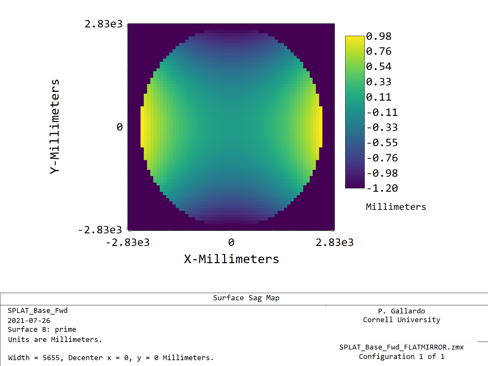
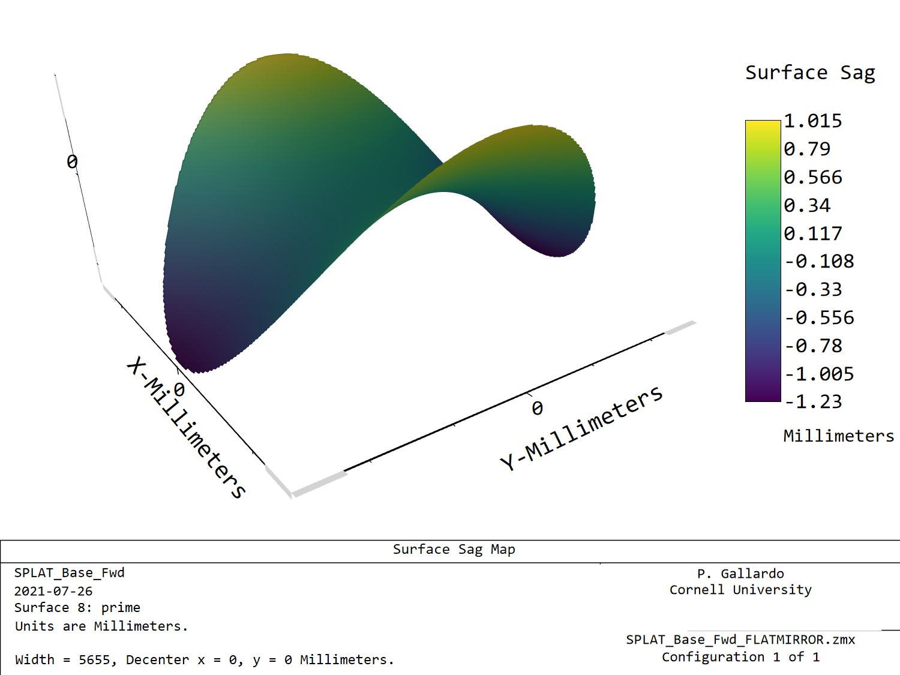
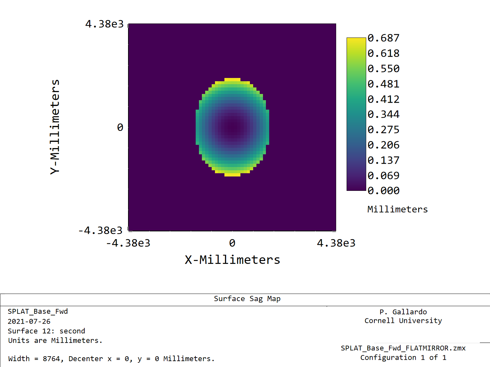

# Mirror deformations

Large scale mirror deformations can be described by low order
Zernike polynomials. For a list of zernikes in this base see
https://spie.org/etop/1997/382_1.pdf

The TMA is defined according to x/y polynomials, which give a nice basis
to add zernike deformations.

For instance, if we flatten out all the polynomnial terms in the TMA, we can
create a potato chip mode by just setting to not-zero the term x^2-y^2. This
will make a mode that grows quadratically in the x direction and decreases
quadratically in the y direction.

In this example I show a potato chip mode and a cup mode. Note that because
the apertures are not circular there is some asymetric that can be dealt with
some fitting.

In order to push this calculation al the way through Strehls we will need:

1. A list of deformations in the coordinate system of each Mirror
2. A fit of these deformations in x/y polynomials
3. A Strehl calculation of combinations of these.

If we want to evaluate for instance two extreme cases per mirror there are 8
 combinations of cases to evaluate.
