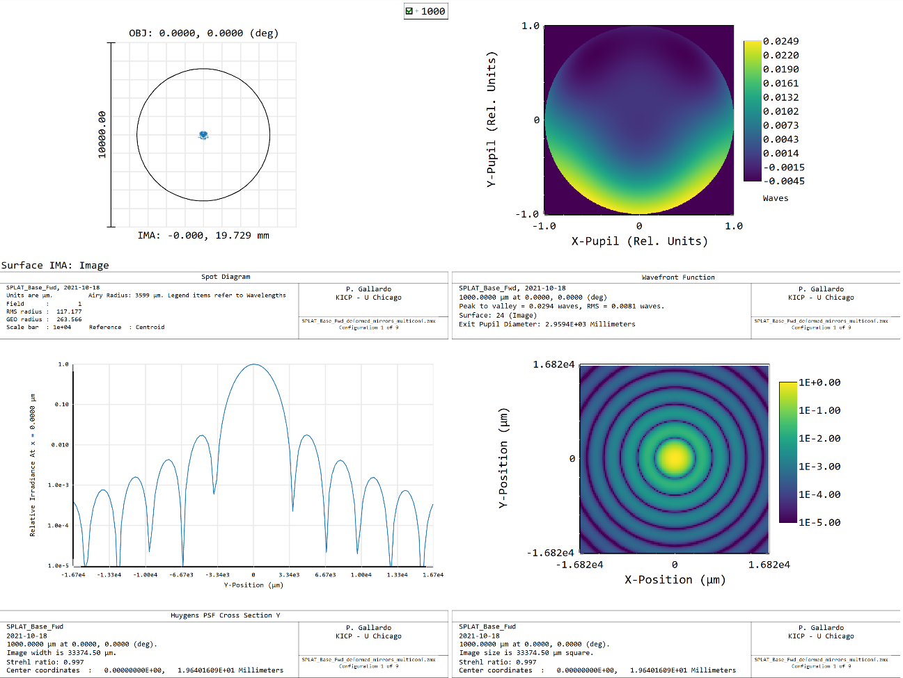
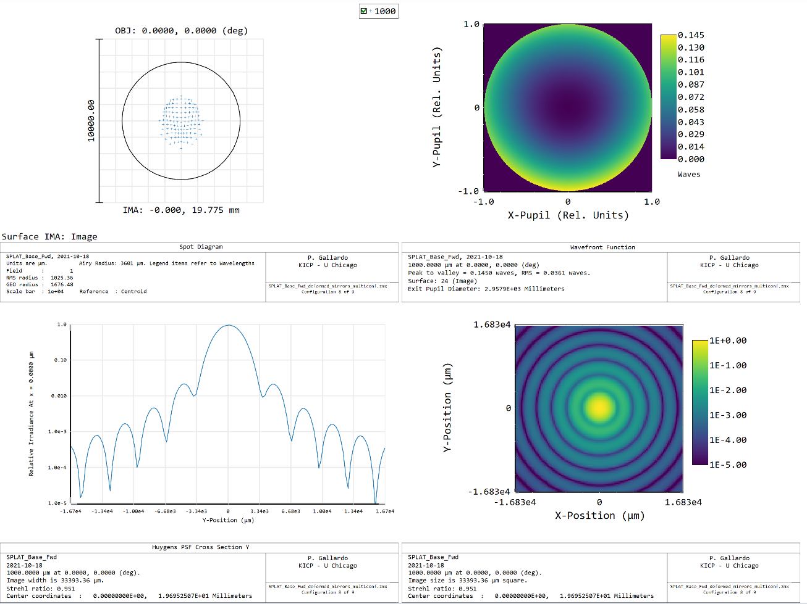
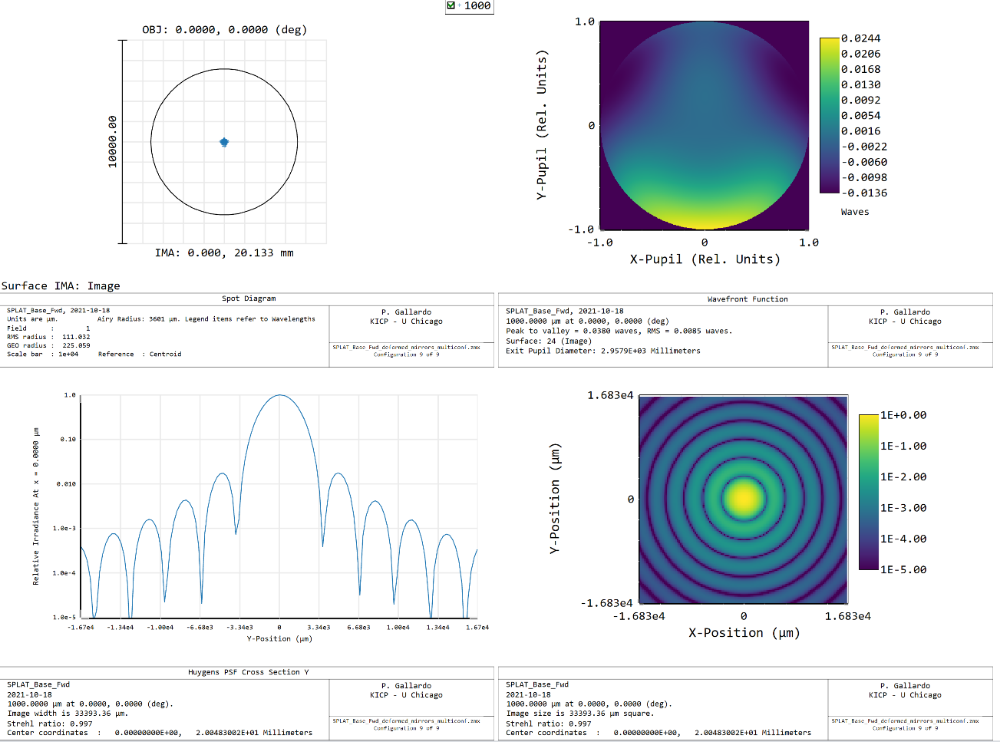
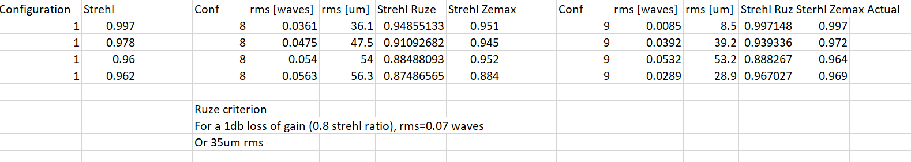

# Phase errors and Strehls

The Ruze formula gives G/G0 = 1 - sigma^2

Where sigma is the rms phase error and G0 the Gain for a perfect system.

This means that for a Strehl ratio of 0.8 a phase error of 1/14 lambda is needed or 1/28 lambda (35 microns) in surface deformation.

Here, note that if we allow for a 60 micron sag for the mirror deformation this will be a peak-to-peak value, not a rms value.

In Zemax we can evaluate the wavefront error, I tried applying the Ruze formula, which gives sensical values for the center fields and works ok for the extreme fields.

For the unperturbed system:

For the perturbed system

For the perturbed system refocused

The Ruze calculation is as follows:

Configuration 1: unperturbed system
Configuration 8: All mirrors deformed
Configuration 9: All mirrors perturbed with (~8mm) refocus

Is there a higher order term? Yes. G/G0 = 1 - sigma^2 + mean_phase^2.
This means that as long as you add a constant phase the Strehl won't be hit as bad as the rms indicates.
