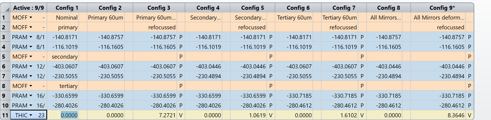
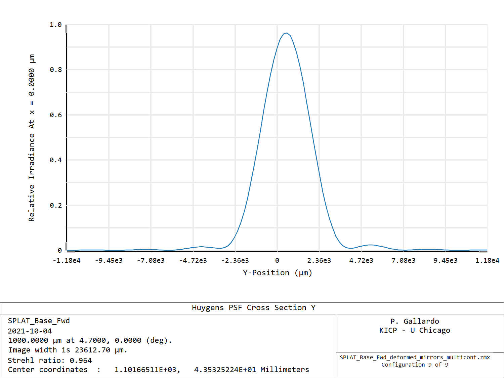

# 60 um deformations

In the TMA the secondary is smaller than the primary. To account for this in the perturbed model we linearly scale down the 60um deformation from the primary. This yields a 38 micron deformation for the secondary.

We do this for all mirrors, which gives the following coefficients in the second order term.

| mirror      | sag         | second order coeff [mm] |
| ----------- | ----------- | ------------------      |
| primary     | 60          | 0.059   |
| secondary   | 38          | 0.016   |
| tertiary    | 60          | 0.059   |

In this zmx file we have 9 configurations,1 for the nominal case, 3 for the individual mirror deformations without refocusing and one for the all mirror case (with its refocused form).

Here, note that the perturbations happen in the second decimal place for the coefficients and the refocus is of order 8mm for the "all mirror" case.

The perturbations for individual mirrors give small changes in the spot diagrams, which can be corrected almost entirely by refocusing. For instance,

The nominal case has these spot diagrams

While the biggest deviation occurs when all mirror deformations are active

If we refocus 8mm we get

Which is in the same level as the original spot diagram.

# Beams

This is a time forward simulation without a camera, but we can simulate a beam by setting the entrance aperture to 4500mm and getting a Huygens diffraction PSF.

There are several combinations of focal plane position and deformation but lets look at the worst focal plane position at (4.7, 0) degrees from the center in the worst case (all mirrors deformed). Here we have this beam in the deformed case:

Note that the height in this normalization is the Strehl ratio.

And if we refocus we get the Strehl from 0.95 to 0.96

These beams have a FWHM of 3360 microns which combined with the plate scale gives 0.86 arcmin at 1mm. As a comparison, remember that the first null of an Airy function for a 4500mm diameter aperture is at 0.93 arcmin.

TO DO: combine this with a TMA camera model, which will broaden the beam. A few decisions on stop size selection have to be made.
