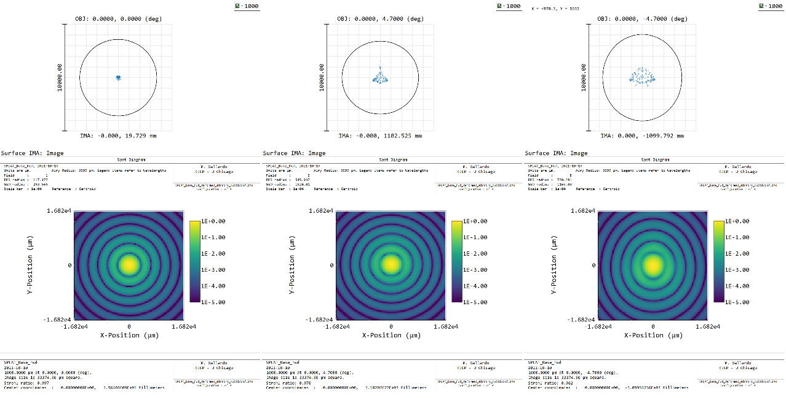
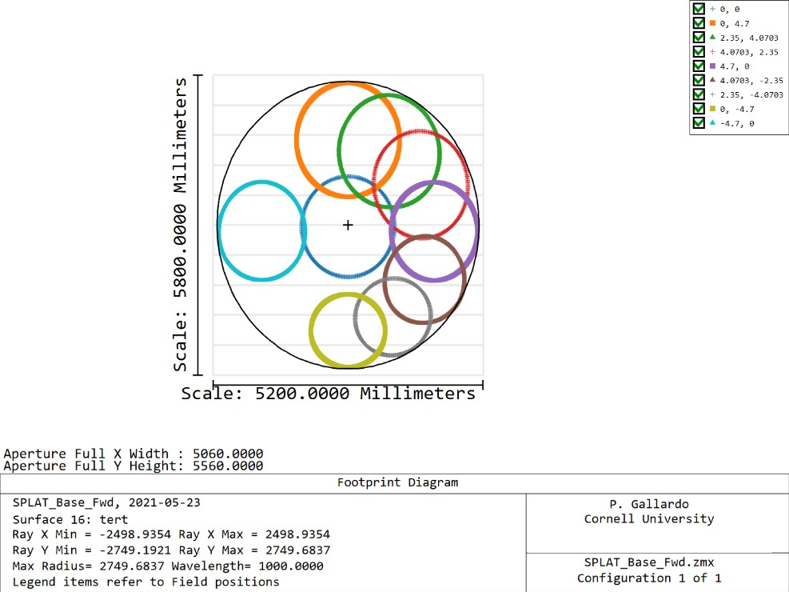

# Beam ellipticity in the TMA nominal configuration

Motivated by the primary footprint ellipticity from the camera design I
investigate what are the beams on the sky for the TMA alone in the time
forward sense, which allows to clean up the narrative.

In the time forward sense the beams in the sky seem circular at the center
and sides of the focal plane. The beams at the top of the focal plane also
seem circular but the beams at the bottom of the focal plane are somewhat
elongated. Note that this ellipticity is also captured in
the shape of the airy disk circle in the spot diagram.

The footprints at the tertiary also reveal the difference in ellipticity.

Here note that the elliptical on sky-beams show up in the bottom part of the footprints (where the footprint looks circular). While the upper half is better behaved.

This probably means that the lower cameras will need to be treated independently by either creating a separate group to allow good illumination at the primary or by creating a custom stop.
