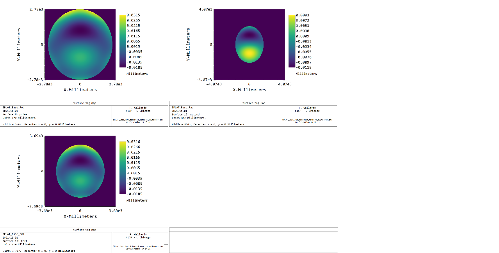

# TMA gravitational deformation fits

Fitting the gravitational deformations to a 5th order polynomial results in a good agreement between the fitted surface and the FEA.

Here notice that the deformation has an rms of 10 microns. This gives an upper bound for the wavefront rms of 34um (sqrt(3 * 20**2)) or 3.5% of a wave.

Inputting this to the shape of the mirrors  (while scaling the secondary sag to 0.64) gives

Here, there might be a minus sing somewhere we need to check. Action item: follow up with Nick on the signs.

## Beams and wavefront gravity_def_mirrors

Which gives a minimum Strehl of 0.95 with a very modest degradation from the undeformed case (1%).

# Ruze formula estimate
With a 10 micron rms per mirror there is a 20 micron rms in wavefront error. For three mirrors this gives a 34 micron rms in wavefront error.

The Ruze formula for Strehl degradation gives 1 - rms^2 = 5% strehl degradataion as an upper bound.
