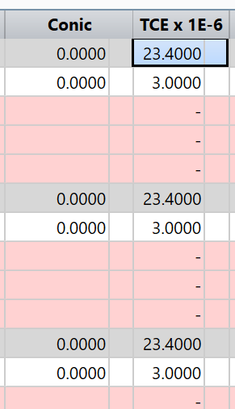
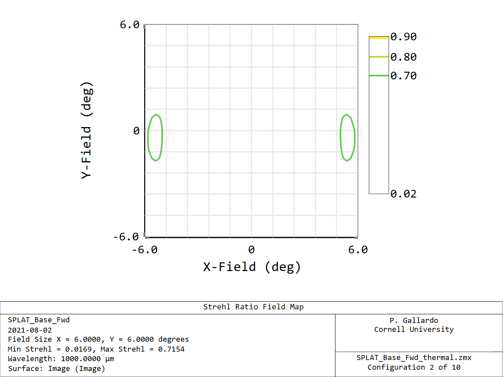
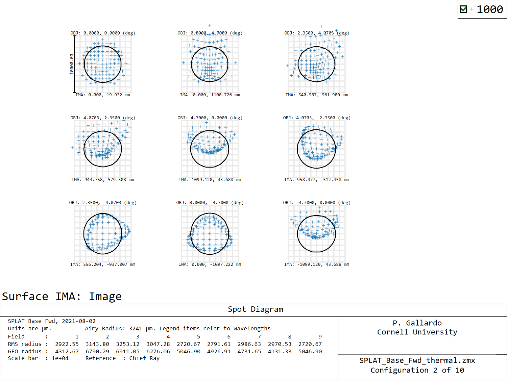
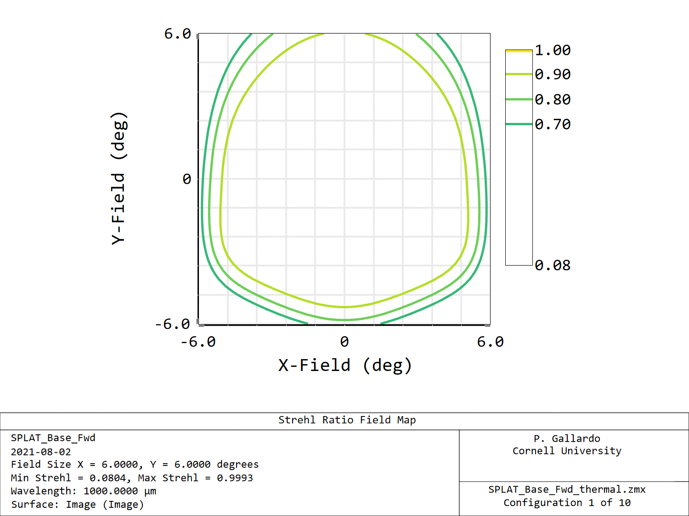
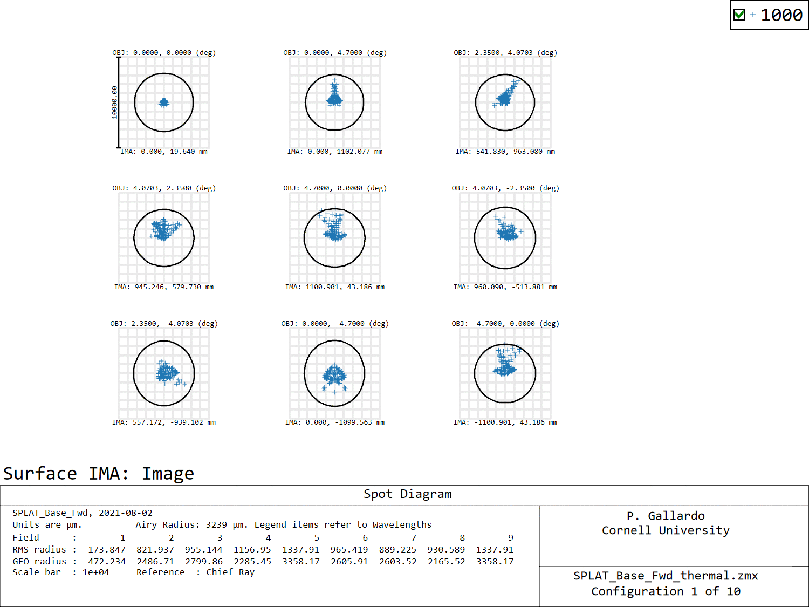

# TMA thermal contraction

Aplying a coefficient of thermal contraction of 23.4 e-6 for the mirrors and adding a dummy surface with a coefficient of 3ppm, we can generate a thermal model for the range of temperatures from 20C down to -60C.

Applying this thermal deformation results in the following strehls and spot diagrams at -60C at 1mm.

Next step: Implement refocusing.
