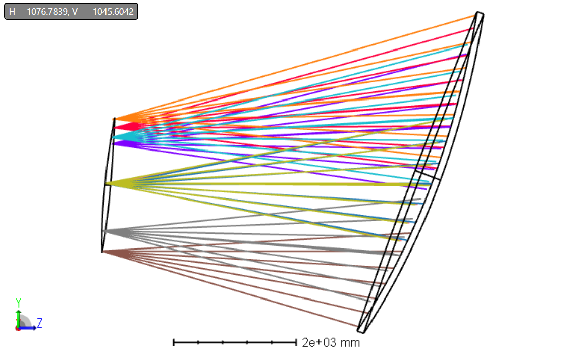

# Polarization

To evaluate polarization, I coated the mirrors with I.0 to represent a lossless mirror in Zemax.

Then a polarizer (Jones matrix) was added right at the focal plane. The idea here is to excite the system in one polarization and place a polarizer in that direction, then we evaluate the perpendicular polarization to have a quantification of crosspol due to the geometry.

Finally, we use the tool "Polarization Transmission" in the graphical interface, which gives a transmission for each field in the system.

Evaluating the system in 32 radial fields, I get an average cross pol transmisison of order -32dB (-32.7 vs -32.1 dB). Numbers are in pol_transmission.xlsx.

# Validation against SP design

I did the same for the TMA original design, getting -41.8 dB.
