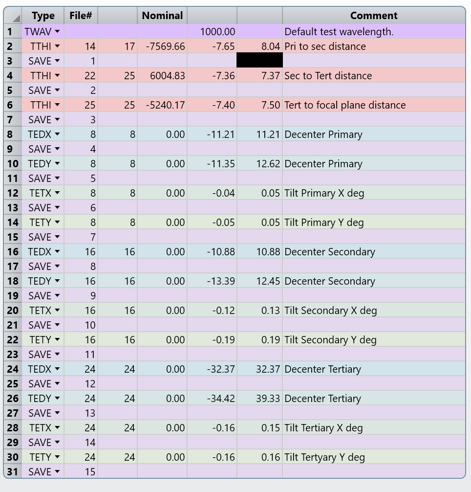
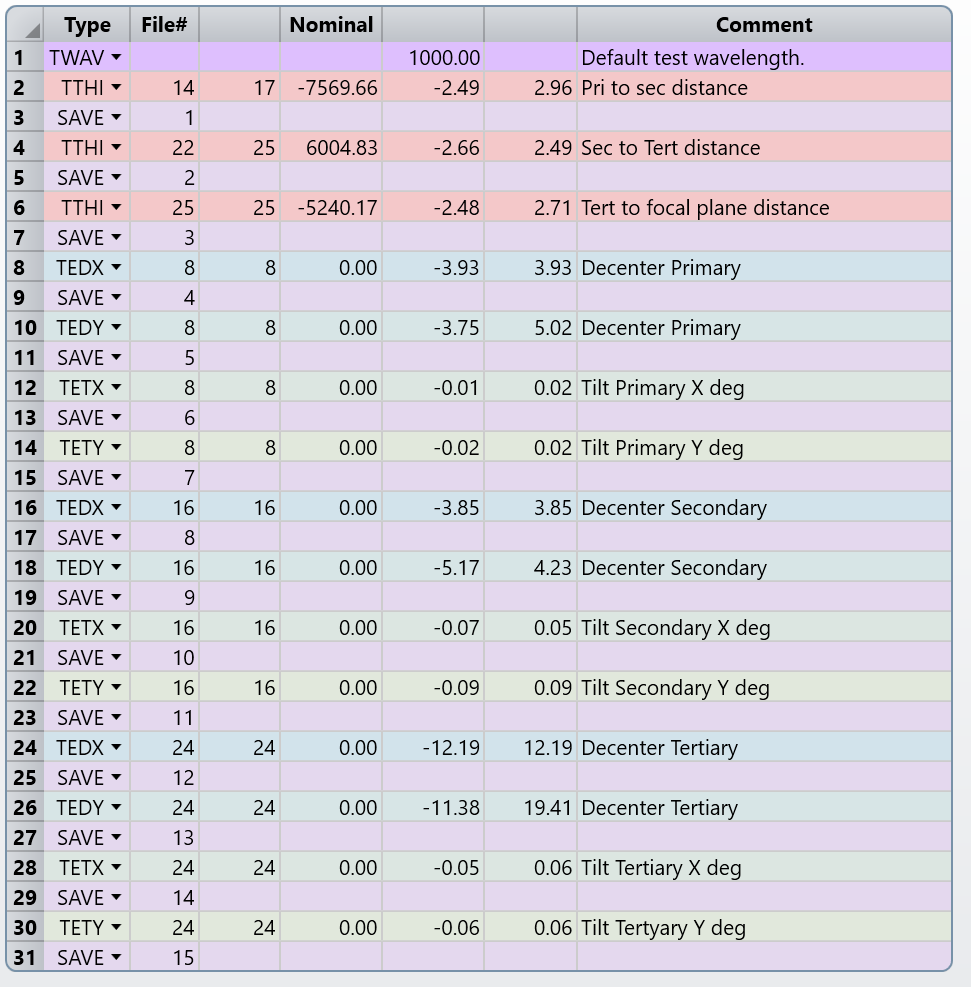
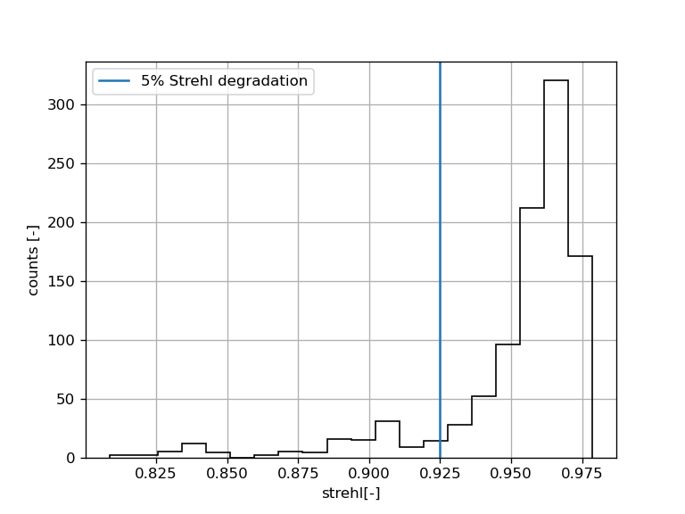

# Tolerancing

All inter-thickness distances are varied, plus x/y decenters, plus x/y tilts totaling 15 variables, see zmx file tolerance data editor for detail on what each variable is doing.

I ran first a reverse sensitivity analysis, the merit function is such that for the edge fields (evaluated in a circle of radius 4.6 deg in 8 points). The reverse sensitivity yields:
* Mirror ditances better than 7mm
* Decenters better than 10mm
* Tilts better than 0.1 deg

Using this values, one can explore what values give a reasonable degradation if one varies all variables at once randomly (following a gaussian distribution). Here note that the tolerances are tighter than the sensitivity values, this is expected because if each variable gives a fixed deviation, the total deviation will grow by a factor of sqrt(15)=3.9, so we need at least a factor of 4 better tolerances than the computed in the sensitivity analysis.

The criterion I used is Strehl degradation with 90% confidence interval. Tighter tolerances can be allowed by the use of a safety factor from here on.

This criterion gives the following table:

And the histogram looks like:

