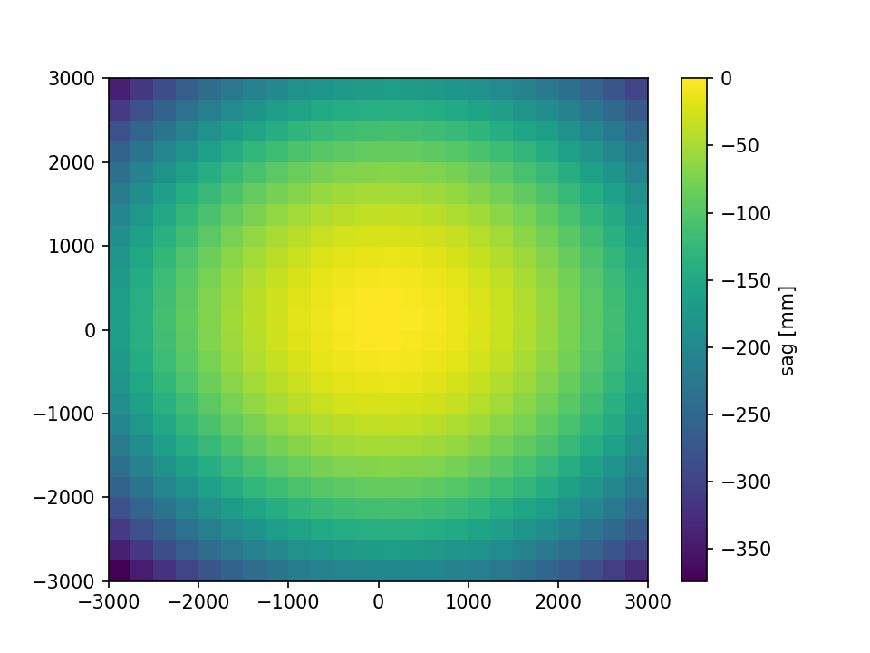

# TMP Grasp Model

Grasp conversion from a Zemax model requires us to be able to convert:

1. Mirror shapes
2. Mirror positions
3. Mirror rotation matrices

Mirror shapes defined as polynomially defined surfaces require
sampling the mirror surface in its local coordinate system
and storing in a text file. Grasp then can import this
file and interpolate it with a third order spline. This can
be done with some coding with the Zemax API.

Mirror positions, the position of the mirrors can be extracted
by querying the local coordinate system displacement in the API.

A full coordinate rotation for Grasp requires two orthonormal
vectors. The coordinates definitions are such that in Zemax we
can query the coordinates of the axes in the local coordinate
system and then use them to populate the rotation matrix for Grasp.

Code that makes this translation possible is in
``export_mirror_surfaces_grasp.py``

## Sampled mirror sag

One example of the sampled M1 sag is given below:

Note that because Grasp uses a third order spline interpolation
we do not need a very fine grid to get good accuracy. This is important to save memory to be able to push the calculation to high frequency.

## Grasp model

## Beam @ 90GHz, center point

## Notes

150 GHz calculation fails, probably due to lack of memory. I actually had to reduce convergence in order to make the 90GHz calculation work with our 64GB memory system, usage peaks at ~45 Gigs.

To do: add more pixels to this calculation, this will take a bit more effort as the feeds need their own coordinate system.
