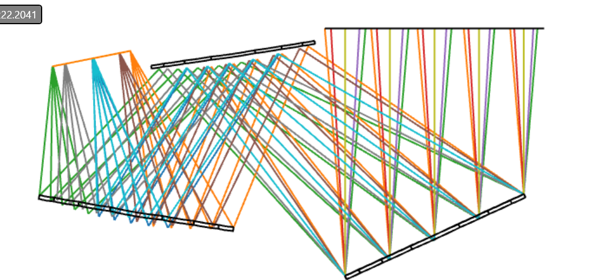
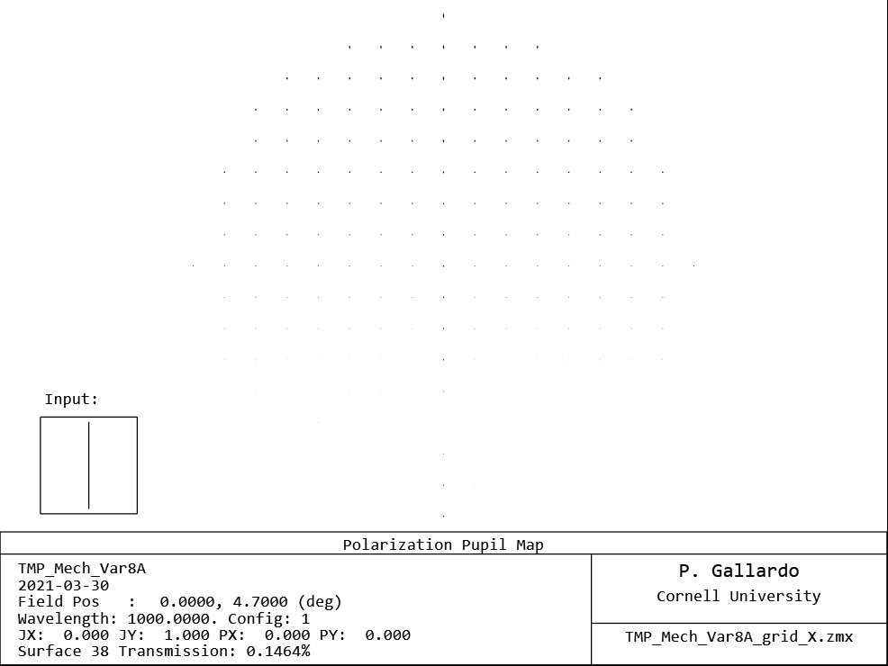

# Polarization

## Setup

Coat all mirrors with perfect reflectors: I.0

Place a Jones matrix grid in front of the focal plane (orange surface, see below)

Evaluate the total transmission while injecting a perpendicular polarization to the jones matrix.

1. Sky polarized in Y, grid in X: Max transmission = 0.15%
2. Sky polarized in X, grid in Y: Max transmission = 0.21%

### Input in X

### Input in Y

Cross pol is estimated to be ~ -26dB
