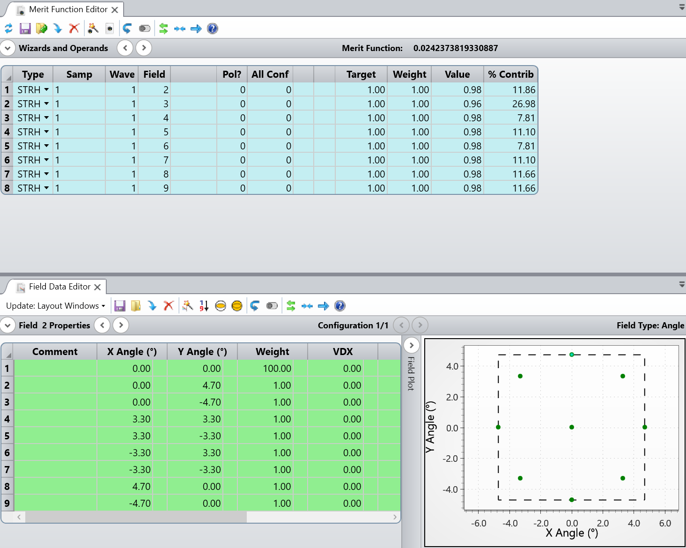
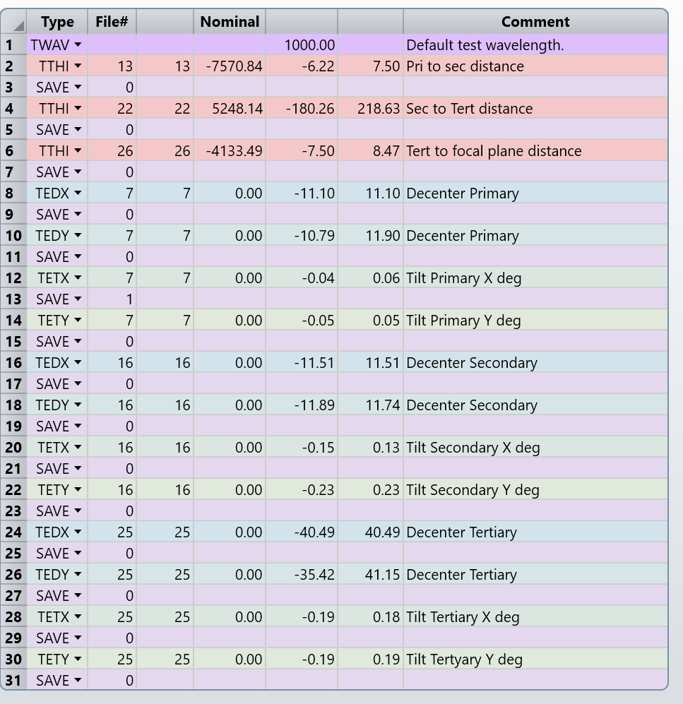
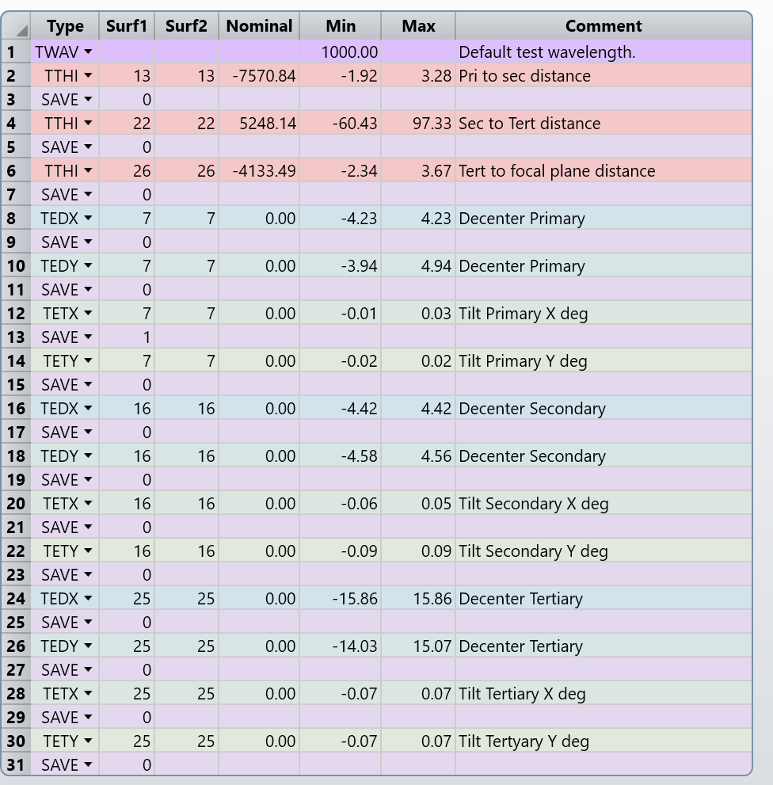
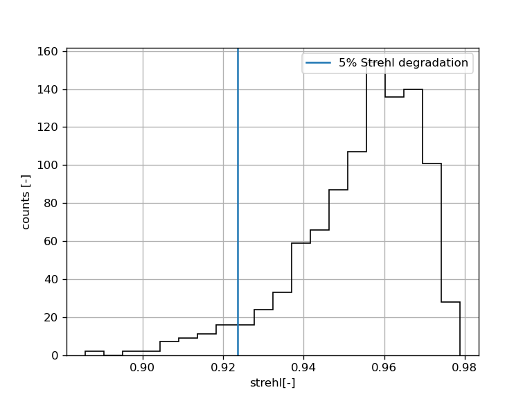

# Tolerancing

## Method:
All inter-mirror distances are varied, plus x/y decenters, plus x/y tilts totaling 15 variables, see zmx file tolerance data editor for more detail. Focal plane diameter was increased and the aperture
was decreased to 4800mm to avoid edge effects.

The merit function is such that for the edge fields, evaluated in a circle of radius 4.7 deg in 8 points we compute the average Stehl. Fields used are the outermost points in the following figure:




## Sensitivity analysis
Requirement for sensitivity analysis:
1. Average Strehl change = 0.05
2. Evaluated in 8 points at the edge of the field of view 4.7 deg

### Result:

* Mirror distances better than: 7.5mm
* Decenters better than: 11.1 mm
* Tilts better than: 0.05



```
Sensitivity Analysis:

            			   |-----------	---- Minimum ----	----------|	  |------------	---- Maximum ----	----------|
Type           			      Value   	    Criterion      	 Change       	  Value   	    Criterion    	  Change
TTHI 	 13 	 13 	   -6.21631020 	    0.07423737 	    0.04999999 	    7.50183444 	    0.07423737 	    0.04999999
TTHI 	 22 	 22 	 -180.26388777 	    0.07423736 	    0.04999998 	  218.62999606 	    0.07423736 	    0.04999997
TTHI 	 26 	 26 	   -7.49545244 	    0.07423736 	    0.04999998 	    8.47464919 	    0.07423736 	    0.04999998
TEDX 	  7 	  7 	  -11.09943288 	    0.07423736 	    0.04999998 	   11.09943288 	    0.07423736 	    0.04999998
TEDY 	  7 	  7 	  -10.78894073 	    0.07423736 	    0.04999998 	   11.90378619 	    0.07423735 	    0.04999997
TETX 	  7 	  7 	   -0.04094185 	    0.07423737 	    0.04999999 	    0.05671510 	    0.07423737 	    0.04999999
TETY 	  7 	  7 	   -0.05306902 	    0.07423736 	    0.04999998 	    0.05306902 	    0.07423736 	    0.04999998
TEDX 	 16 	 16 	  -11.50868745 	    0.07423735 	    0.04999997 	   11.50868745 	    0.07423735 	    0.04999997
TEDY 	 16 	 16 	  -11.88942372 	    0.07423736 	    0.04999998 	   11.73646335 	    0.07423737 	    0.04999999
TETX 	 16 	 16 	   -0.14555195 	    0.07423736 	    0.04999998 	    0.13320125 	    0.07423738 	    0.05000000
TETY 	 16 	 16 	   -0.22585594 	    0.07423738 	    0.05000000 	    0.22585594 	    0.07423738 	    0.05000000
TEDX 	 25 	 25 	  -40.49298064 	    0.07423736 	    0.04999998 	   40.49298064 	    0.07423736 	    0.04999998
TEDY 	 25 	 25 	  -35.42395776 	    0.07423738 	    0.05000000 	   41.15056995 	    0.07423737 	    0.04999999
TETX 	 25 	 25 	   -0.18565796 	    0.07423737 	    0.04999999 	    0.18317304 	    0.07423735 	    0.04999997
TETY 	 25 	 25 	   -0.18549684 	    0.07423738 	    0.04999999 	    0.18549684 	    0.07423738 	    0.04999999
```

## Monte Carlo analysis

Using these values, we can explore what values give a reasonable degradation if one varies all variables at once randomly (following a gaussian distribution). Here note that the tolerances are tighter than the sensitivity values, this is expected because if each variable gives a fixed deviation, the total deviation will grow by a factor of sqrt(15)=3.9, so we need at least a factor of 4 better tolerances than the computed in the sensitivity analysis.

To find this values, an inverse sensitivity analysis was run, with a target degradation of 0.008.


This criterion gives the following values:

* Mirror distances better than:  2 mm
* Decenters better than:  4.2 mm
* Tilts better than: 0.02 deg

This yields the following:




```
Sensitivity Analysis:

            			   |-----------	---- Minimum ----	----------|	  |------------	---- Maximum ----	----------|
Type           			      Value   	    Criterion      	 Change       	  Value   	    Criterion    	  Change
TTHI 	 13 	 13 	   -1.92218168 	    0.03223738 	    0.00800000 	    3.28392066 	    0.03223738 	    0.00800000
TTHI 	 22 	 22 	  -60.42637796 	    0.03223738 	    0.00799999 	   97.33050004 	    0.03223737 	    0.00799999
TTHI 	 26 	 26 	   -2.34306221 	    0.03223738 	    0.00800000 	    3.67452312 	    0.03223738 	    0.00800000
TEDX 	  7 	  7 	   -4.22842470 	    0.03223738 	    0.00800000 	    4.22842470 	    0.03223738 	    0.00800000
TEDY 	  7 	  7 	   -3.94103726 	    0.03223738 	    0.00800000 	    4.93984465 	    0.03223738 	    0.00799999
TETX 	  7 	  7 	   -0.01276045 	    0.03223738 	    0.00800000 	    0.02677512 	    0.03223738 	    0.00800000
TETY 	  7 	  7 	   -0.02026594 	    0.03223738 	    0.00800000 	    0.02026594 	    0.03223738 	    0.00800000
TEDX 	 16 	 16 	   -4.42172610 	    0.03223738 	    0.00800000 	    4.42172610 	    0.03223738 	    0.00800000
TEDY 	 16 	 16 	   -4.58096345 	    0.03223738 	    0.00800000 	    4.55509795 	    0.03223738 	    0.00800000
TETX 	 16 	 16 	   -0.06283841 	    0.03223738 	    0.00800000 	    0.05004082 	    0.03223738 	    0.00800000
TETY 	 16 	 16 	   -0.08921883 	    0.03223738 	    0.00800000 	    0.08921883 	    0.03223738 	    0.00800000
TEDX 	 25 	 25 	  -15.85573894 	    0.03223738 	    0.00800000 	   15.85573894 	    0.03223738 	    0.00800000
TEDY 	 25 	 25 	  -14.02801655 	    0.03223738 	    0.00800000 	   15.07371446 	    0.03223738 	    0.00800000
TETX 	 25 	 25 	   -0.07153010 	    0.03223738 	    0.00800000 	    0.07044873 	    0.03223738 	    0.00800000
TETY 	 25 	 25 	   -0.07012630 	    0.03223738 	    0.00800000 	    0.07012630 	    0.03223738 	    0.00800000
```

## Stats

```
Number of traceable Monte Carlo files generated: 1000

Nominal 	    0.02423738
Best    	    0.02116360 	 Trial 	  176
Worst   	    0.11421018 	 Trial 	  544
Mean    	    0.04584508
Std Dev 	    0.01516692

98% >	    0.08664105               
90% >	    0.06638941               
80% >	    0.05689801               
50% >	    0.04279806               
20% >	    0.03271268               
10% >	    0.02976169               
2% > 	    0.02509222               
```

And the histogram looks like:



In summary, nearly 95% of the MC samples have better strehls than the 5%
degradation limit.
