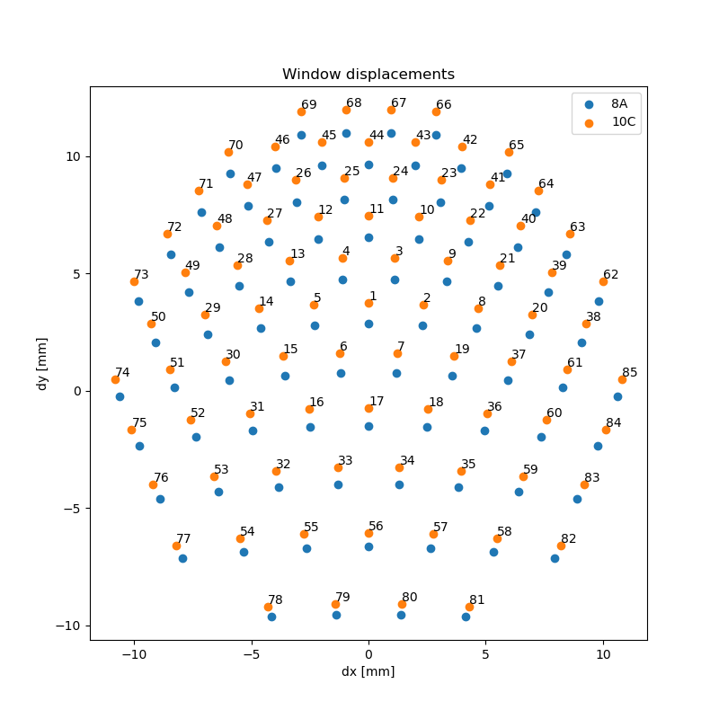

# Window offsets in TMPVar8A and 10C

Vignetting can be dealt with in the TMP by offsetting the camera entrance such
that the x/y position of the window coincides with the chief ray coordinate
at the window surface.

The plot below shows the magnitude of the offsets for the 8A and 10C models.
Numbers show the camera label.

