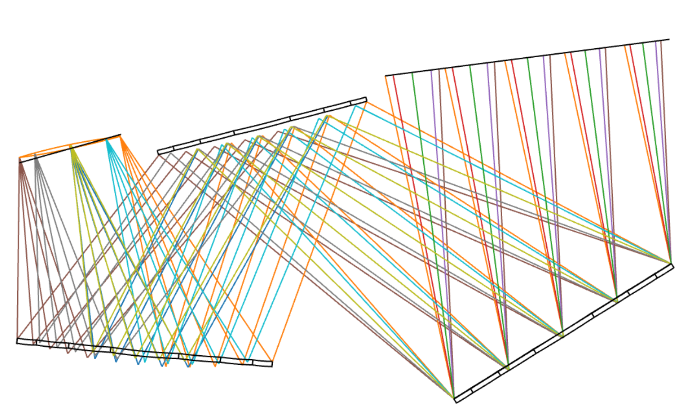
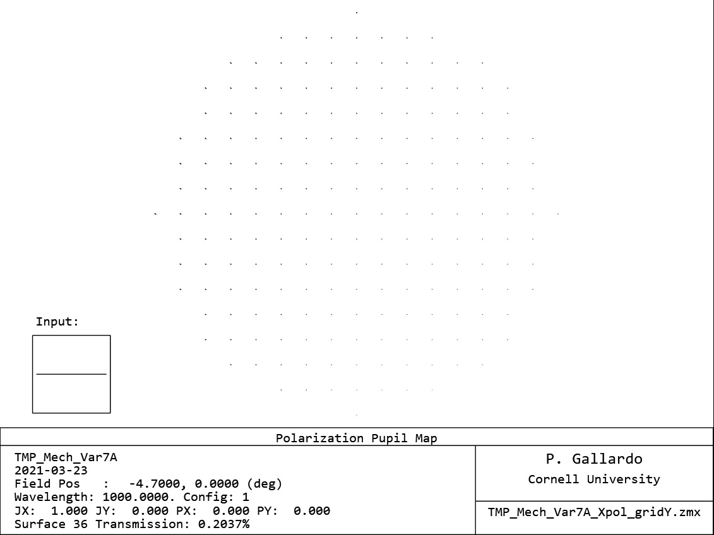
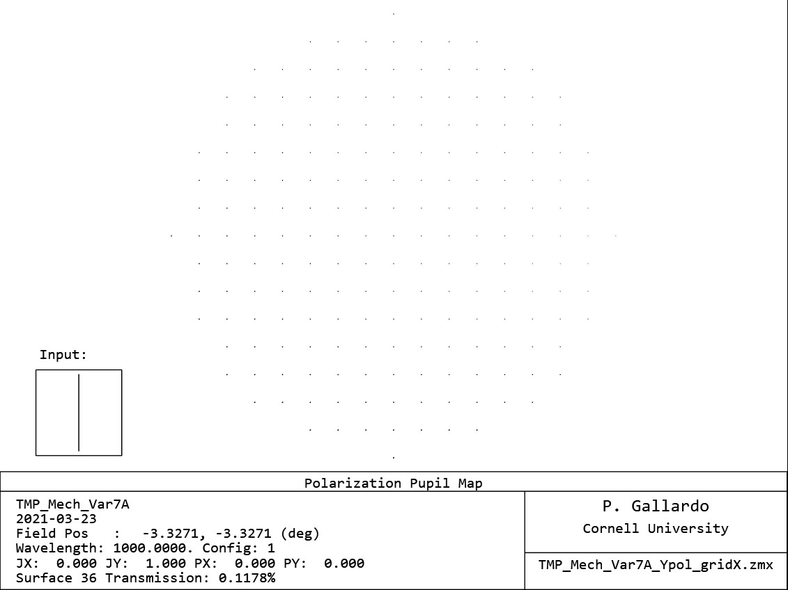

# Polarization

## Setup

Coat all mirrors with perfect reflectors: I.0

Place a jones matrix grid in front of the focal plane

Evaluate the total transmission while injecting a perpendicular polarization to the jones matrix.

1. Sky polarized in Y, grid in X: Max transmission = 0.1%
2. Sky polarized in X, grid in Y: Max transmission =  0.2%

### Input in X

### Input in Y

Cross pol is estimated to be ~ -27dB.
