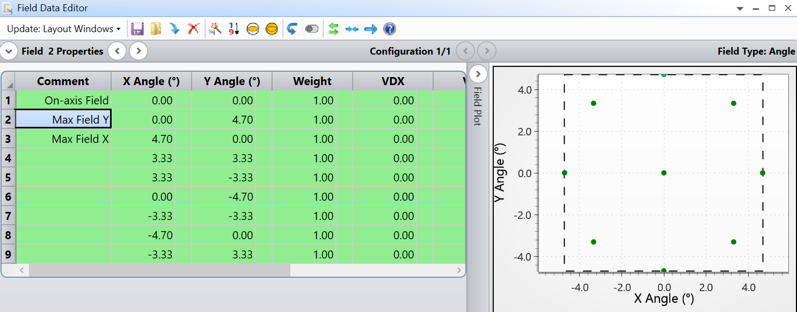
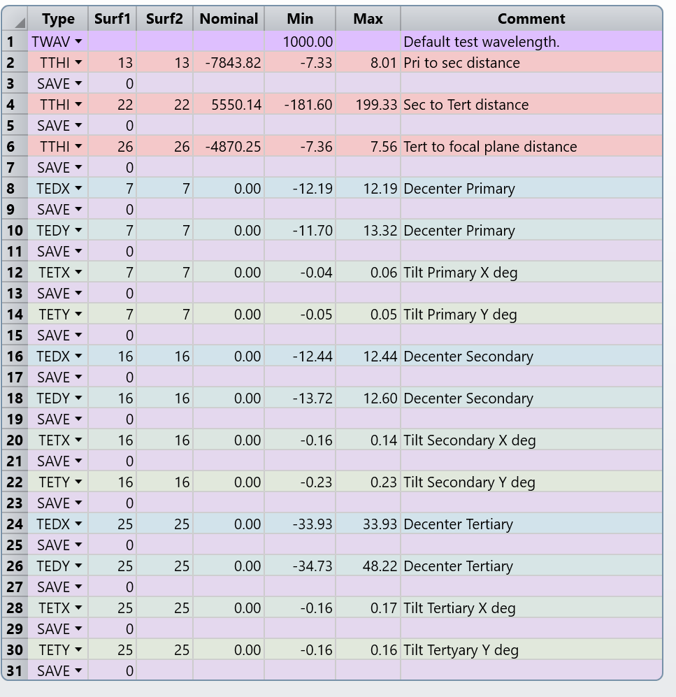
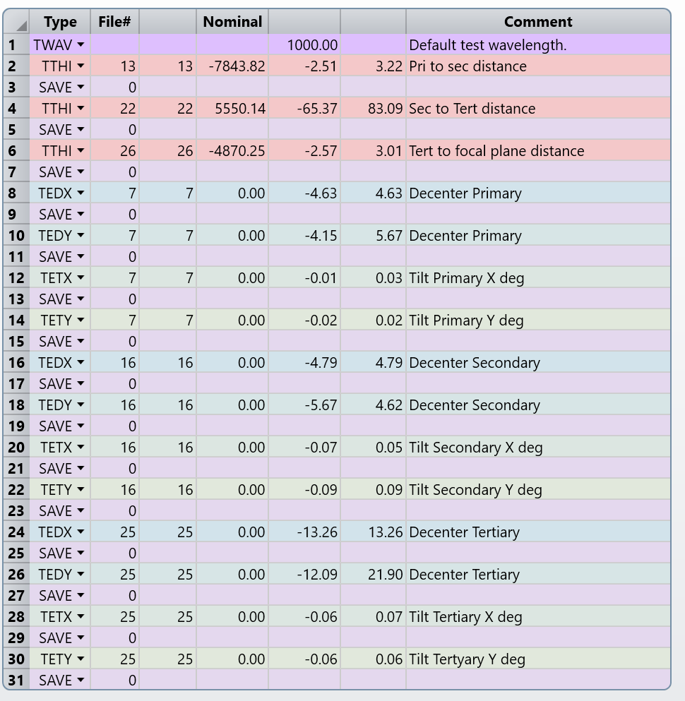
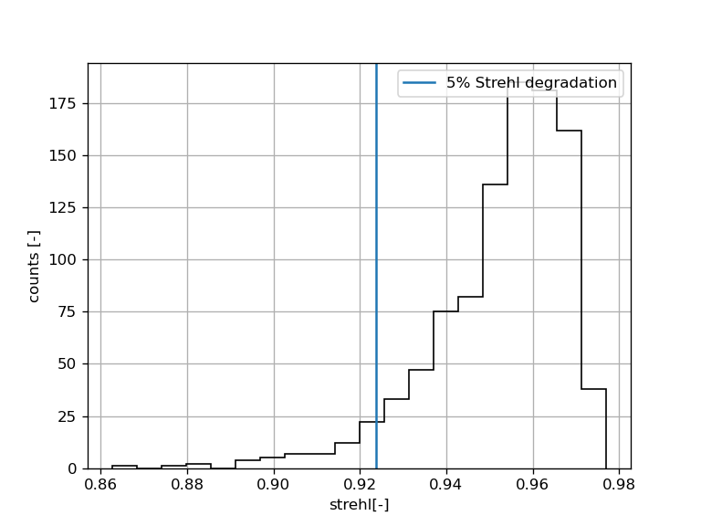

# Tolerancing

## Method:
All inter-mirror distances are varied, plus x/y decenters, plus x/y tilts totaling 15 variables, see zmx file tolerance data editor for more detail. Focal plane diameter was left free to avoid vignetting due to miscentering affecting the strehls.

The merit function is such that for the edge fields, evaluated in a circle of radius 4.7 deg in 8 points we compute the average Stehl. Fields used are the outermost points in the following figure:




## Sensitivity analysis
Requirement for sensitivity analysis:
1. Average Strehl change = 0.05
2. Evaluated in 8 points at the edge of the field of view 4.7 deg

Result:

* Mirror distances better than: 7 mm
* Decenters better than: 12 mm
* Tilts better than: 0.05 deg



```
Sensitivity Analysis:

            			   |-----------	---- Minimum ----	----------|	  |------------	---- Maximum ----	----------|
Type           			      Value   	    Criterion      	 Change       	  Value   	    Criterion    	  Change
TTHI 	 13 	 13 	   -7.32984857 	    0.07632998 	    0.05000000 	    8.00799970 	    0.07632997 	    0.04999999
TTHI 	 22 	 22 	 -181.60413921 	    0.07632997 	    0.04999999 	  199.33438083 	    0.07632997 	    0.04999999
TTHI 	 26 	 26 	   -7.35849059 	    0.07632996 	    0.04999998 	    7.56315157 	    0.07632997 	    0.05000000
TEDX 	  7 	  7 	  -12.19352493 	    0.07632997 	    0.04999999 	   12.19352493 	    0.07632997 	    0.04999999
TEDY 	  7 	  7 	  -11.70441155 	    0.07632998 	    0.05000000 	   13.31733541 	    0.07632997 	    0.04999999
TETX 	  7 	  7 	   -0.04225038 	    0.07632995 	    0.04999997 	    0.05628054 	    0.07632997 	    0.04999999
TETY 	  7 	  7 	   -0.05409580 	    0.07632997 	    0.04999999 	    0.05409580 	    0.07632997 	    0.04999999
TEDX 	 16 	 16 	  -12.43687521 	    0.07632996 	    0.04999999 	   12.43687521 	    0.07632996 	    0.04999999
TEDY 	 16 	 16 	  -13.72342508 	    0.07632996 	    0.04999998 	   12.60136385 	    0.07632996 	    0.04999998
TETX 	 16 	 16 	   -0.15804482 	    0.07632996 	    0.04999998 	    0.13502397 	    0.07632996 	    0.04999998
TETY 	 16 	 16 	   -0.23473850 	    0.07632995 	    0.04999997 	    0.23473850 	    0.07632995 	    0.04999997
TEDX 	 25 	 25 	  -33.93301545 	    0.07632996 	    0.04999998 	   33.93301545 	    0.07632996 	    0.04999998
TEDY 	 25 	 25 	  -34.73164204 	    0.07632997 	    0.05000000 	   48.22186444 	    0.07632994 	    0.04999996
TETX 	 25 	 25 	   -0.15916316 	    0.07632996 	    0.04999998 	    0.16784487 	    0.07632997 	    0.05000000
TETY 	 25 	 25 	   -0.16468879 	    0.07632998 	    0.05000000 	    0.16468879 	    0.07632998 	    0.05000000
```

## Monte Carlo analysis

Using these values, we can explore what values give a reasonable degradation if one varies all variables at once randomly (following a gaussian distribution). Here note that the tolerances are tighter than the sensitivity values, this is expected because if each variable gives a fixed deviation, the total deviation will grow by a factor of sqrt(15)=3.9, so we need at least a factor of 4 better tolerances than the computed in the sensitivity analysis.

To find this values, an inverse sensitivity analysis was run, with a target degradation of 0.008.

This criterion gives the following values:

* Mirror distances better than: 2.5 mm
* Decenters better than: 4 mm
* Tilts better than: 0.02 deg

This yields the following:
```Sensitivity Analysis:

            			   |-----------	---- Minimum ----	----------|	  |------------	---- Maximum ----	----------|
Type           			      Value   	    Criterion      	 Change       	  Value   	    Criterion    	  Change
TTHI 	 13 	 13 	   -2.50552766 	    0.03432997 	    0.00800000 	    3.21793591 	    0.03432997 	    0.00799999
TTHI 	 22 	 22 	  -65.36823340 	    0.03432997 	    0.00800000 	   83.09353706 	    0.03432997 	    0.00799999
TTHI 	 26 	 26 	   -2.56556288 	    0.03432997 	    0.00800000 	    3.00884140 	    0.03432997 	    0.00799999
TEDX 	  7 	  7 	   -4.63235873 	    0.03432998 	    0.00800000 	    4.63235873 	    0.03432998 	    0.00800000
TEDY 	  7 	  7 	   -4.15158705 	    0.03432997 	    0.00800000 	    5.66928626 	    0.03432997 	    0.00800000
TETX 	  7 	  7 	   -0.01368641 	    0.03432997 	    0.00800000 	    0.02513240 	    0.03432997 	    0.00799999
TETY 	  7 	  7 	   -0.02068101 	    0.03432998 	    0.00800000 	    0.02068101 	    0.03432998 	    0.00800000
TEDX 	 16 	 16 	   -4.78780701 	    0.03432998 	    0.00800000 	    4.78780701 	    0.03432998 	    0.00800000
TEDY 	 16 	 16 	   -5.66652117 	    0.03432997 	    0.00799999 	    4.61830160 	    0.03432997 	    0.00800000
TETX 	 16 	 16 	   -0.07139496 	    0.03432997 	    0.00799999 	    0.04997466 	    0.03432997 	    0.00800000
TETY 	 16 	 16 	   -0.09322065 	    0.03432996 	    0.00799998 	    0.09322065 	    0.03432996 	    0.00799998
TEDX 	 25 	 25 	  -13.26407760 	    0.03432998 	    0.00800000 	   13.26407760 	    0.03432998 	    0.00800000
TEDY 	 25 	 25 	  -12.08622967 	    0.03432997 	    0.00799999 	   21.90109637 	    0.03432998 	    0.00800000
TETX 	 25 	 25 	   -0.05804842 	    0.03432998 	    0.00800000 	    0.06661772 	    0.03432996 	    0.00799999
TETY 	 25 	 25 	   -0.06139764 	    0.03432998 	    0.00800000 	    0.06139764 	    0.03432998 	    0.00800000
```



## Stats
For 1000 MC realizations with these variations, we get a mean strehl = 1 - 0.047, which is ~2 % worse than the nominal. The worst run gives a Strehl of 1-0.13, which is roughly 10% worse than the nominal. 90% of the MC realizations are better than 1-0.067, or 4% degradation in Strehl.

```
Number of traceable Monte Carlo files generated: 1000

Nominal 	    0.02632998
Best    	    0.02295711 	 Trial 	   57
Worst   	    0.13733148 	 Trial 	   33
Mean    	    0.04712491
Std Dev 	    0.01561612

98% >	    0.09191260               
90% >	    0.06798553               
80% >	    0.05798424               
50% >	    0.04343433               
20% >	    0.03439128               
10% >	    0.03113294               
 2% > 	    0.02679543   
```

And the histogram looks like:


