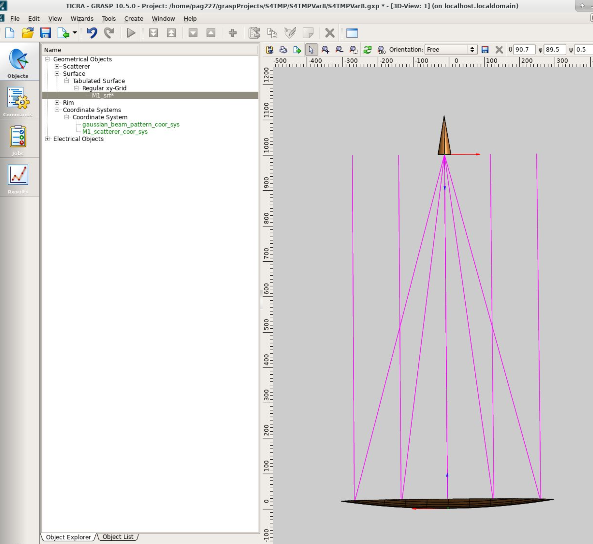

# Plan for GRASP analysis

1. Sample mirror shapes and make a grid of points.
2. Read these mirror shapes in grasp and run PO analyses for the three reflectors sequentially.
3. Evaluate main beam polarization properties.

To test the ability of generating a grid of points, I generated an example of
one reflector defined with a grid of points, the dummy shape I generated this
time is z = 1000 (x^2+y^2), which is of the kind z=r^2 with a scale of ~300, this grid was evaluated
in a grid of 5x5 points and is used as a proof of concept only.

## Next steps:

1. Use the Zemax API to export mirror shapes, coordinate system positions and
rotations
2. Build Grasp model.
